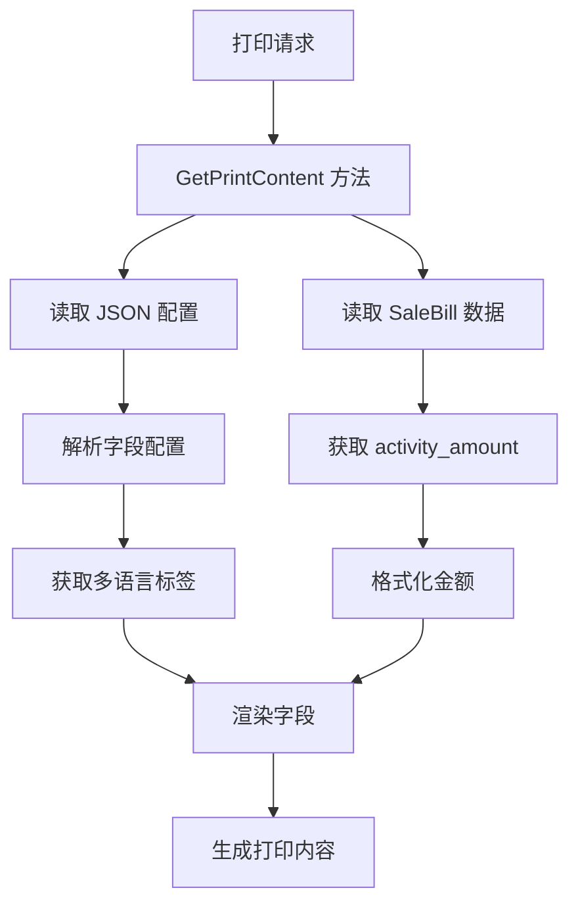

# 满减营销功能（打印相关）设计文档

> 本文档定义打印模板中新增"活动抵扣"字段的技术设计和实现方案。

## 📋 概述

在打印模板系统中新增"活动抵扣"字段显示功能，涉及两个核心部分：
1. **配置层**: 在 JSON 配置文件中添加字段定义和多语言支持
2. **渲染层**: 在 Go 渲染代码中读取 `activity_amount` 字段并格式化输出

该功能不涉及数据库变更，只需修改打印模板的配置和渲染逻辑。

---

## 🎯 规范对齐

### Go Main 规范 (go-main.mdc)

本设计遵循以下 Go Main 开发规范：

- 不使用 panic，返回 error
- 使用 `decimal` 类型处理金额，确保精度
- 金额格式化保留两位小数
- 遵循现有打印模板的代码风格和结构
- 使用 `logger.Logger` 记录错误日志

### 项目结构规范 (structs.mdc)

打印模板相关文件位置：

- 配置文件: `main/app/printer/pkg/template/*.json`
- 渲染代码: `main/app/printer/template/*.go`
- 模板结构: `main/app/printer/template_struct/*.go`
- 数据模型: `main/app/model/sale_bill.go`

---

## 🔄 代码复用分析

### 可复用的现有组件

- **打印模板配置**: `main/app/printer/pkg/template/statement_order_config.json` - 已有"优惠券抵扣"等字段配置，可参考其结构
- **渲染方法**: `main/app/printer/template/statement_order_img_custom.go` 和 `statement_order_img.go` - 已有金额格式化和字段渲染逻辑
- **数据模型**: `main/app/model/sale_bill.go` - 已存在 `activity_amount` 字段，可直接读取
- **金额处理**: 使用 `github.com/shopspring/decimal` - 项目中已广泛使用

### 集成点

- **JSON 配置**: 在 `"block_id": "amount_due_information"` 区块的 `data_rows` 数组中插入新字段配置
- **渲染逻辑**: 在 `GetPrintContent()` 方法中添加 `activity_amount` 的读取和占位符替换
- **数据读取**: 从 `saleBill` 或 `saleOrder` 模型中读取 `activity_amount` 字段

---

## 🏗️ 架构设计

### 分层设计原则

**打印模板两层架构**:

```
配置层 (JSON)
  ↓ 定义字段结构和多语言
渲染层 (Go)
  ↓ 读取配置，填充数据，格式化输出
打印输出 (图片/文本)
```

**依赖规则**:

- ✅ 渲染层读取配置层
- ✅ 渲染层访问数据模型层
- ❌ 配置层不依赖任何代码
- ✅ 配置变更不需要重新编译代码

### 架构图



### 模块划分

#### 配置层

- **文件**: `main/app/printer/pkg/template/statement_order_config.json`
- **职责**: 定义字段结构、多语言翻译、显示属性

#### 渲染层

- **文件**: 
  - `main/app/printer/template/statement_order_img_custom.go` (自定义模板)
  - `main/app/printer/template/statement_order_img.go` (标准模板)
- **职责**: 读取数据、格式化、生成打印内容

#### 数据层

- **文件**: `main/app/model/sale_bill.go`
- **职责**: 提供 `activity_amount` 字段数据

---

## 🗄️ 数据源设计

### 数据字段

本功能不需要创建新的数据库表或字段，直接使用现有字段：

**字段名**: `activity_amount`  
**所在表**: `ttpos_sale_bill` (或相关订单表)  
**字段类型**: `decimal(10,2)`  
**默认值**: `0.00`  
**说明**: 满减营销活动的抵扣金额

### 数据读取

从 `SaleBill` 模型读取：

```go
// 假设在 GetPrintContent() 方法中
activityAmount := saleBill.ActivityAmount  // decimal.Decimal 类型
```

### 数据格式化

```go
// 格式化为两位小数的字符串
activityAmountStr := activityAmount.StringFixed(2)

// 示例输出: "50.00"
```

---

## 📊 配置设计

### JSON 配置结构

在 `statement_order_config.json` 中的 `"block_id": "amount_due_information"` 区块添加新字段：

```json
{
  "group_block_id": "amount_due_information",
  "block_id": "activity_deduction",
  "block_type": "label_value",
  "block_label": {
    "zh": "活动抵扣",
    "zhtw": "活動抵扣",
    "en": "Activity Deduction",
    "th": "หักลดจากกิจกรรม",
    "tr": "Etkinlik indir",
    "ja": "活動控除",
    "ko": "활동 공제",
    "sv": "Aktivitetavdrag",
    "my": "လှုပ်ရှားမှုလျှော့"
  },
  "block_value": "{{activity_amount}}",
  "block_attr": {
    "font_size": 20,
    "align": "left",
    "font_bold": false,
    "dividing_line": false,
    "leading_blank_lines": 0,
    "trailing_blank_lines": 0,
    "not_show_empty": true
  },
  "conditions": []
}
```

**字段说明**:

| 字段           | 值                        | 说明                       |
| -------------- | ------------------------- | -------------------------- |
| block_id       | "activity_deduction"      | 唯一标识符                 |
| block_type     | "label_value"             | 标签-值对类型              |
| block_label    | 多语言对象                | 9 种语言的翻译             |
| block_value    | "{{activity_amount}}"     | 占位符，渲染时替换为实际值 |
| not_show_empty | true                      | 当金额为 0 时可选择隐藏    |

### 配置插入位置

在 `amount_due_information` 的 `data_rows` 数组中，找到"优惠券抵扣"（coupon_deduction）配置项，在其后插入"活动抵扣"配置。

**示例顺序**:
```
1. 商品总价 (product_total_amount)
2. 会员优惠 (member_discount)
3. 会员积分抵扣 (points_deduction)
4. 优惠券抵扣 (coupon_deduction)
5. 活动抵扣 (activity_deduction) ← 新增
6. 减免金额 (reduction_amount)
7. 应付金额 (payable_amount)
```

---

## 🧩 渲染逻辑设计

### 自定义模板渲染

**文件**: `main/app/printer/template/statement_order_img_custom.go`

#### 实现步骤

1. **读取数据**

```go
// 在 GetPrintContent() 方法中
activityAmount := saleBill.ActivityAmount  // 假设 SaleBill 包含该字段
```

2. **格式化金额**

```go
// 格式化为两位小数
activityAmountStr := activityAmount.StringFixed(2)
```

3. **判断是否显示**

```go
// 仅当金额大于 0 时才显示
if activityAmount.GreaterThan(decimal.Zero) {
    // 继续处理...
}
```

4. **替换占位符**

```go
// 在解析 JSON 配置后，替换 {{activity_amount}} 占位符
content := strings.ReplaceAll(content, "{{activity_amount}}", activityAmountStr)
```

5. **应用多语言**

```go
// 根据商家语言设置获取对应的 block_label
label := t.base.Translate("活动抵扣")  // 或从 JSON 配置读取
```

6. **生成渲染内容**

```go
// 组合标签和值
line := fmt.Sprintf("%s: ￥%s", label, activityAmountStr)
```

### 标准模板渲染

**文件**: `main/app/printer/template/statement_order_img.go`

#### 实现方式

在现有的"应付信息"渲染代码中，参考"优惠券抵扣"的实现，添加"活动抵扣"的渲染逻辑。

**伪代码**:

```go
// 假设在渲染应付信息的方法中

// 优惠券抵扣
if couponAmount.GreaterThan(decimal.Zero) {
    printLine(fmt.Sprintf("%s: ￥%s", t.base.Translate("优惠券抵扣"), couponAmount.StringFixed(2)))
}

// 活动抵扣 (新增 - 仅大于 0 时显示)
if activityAmount.GreaterThan(decimal.Zero) {
    printLine(fmt.Sprintf("%s: ￥%s", t.base.Translate("活动抵扣"), activityAmount.StringFixed(2)))
}

// 减免金额
if reductionAmount.GreaterThan(decimal.Zero) {
    printLine(fmt.Sprintf("%s: ￥%s", t.base.Translate("减免金额"), reductionAmount.StringFixed(2)))
}
```

**说明**: 所有优惠类字段都遵循"大于 0 才显示"的规则，保持一致性

---

## 🌐 多语言设计

### 翻译管理

所有翻译定义在 JSON 配置的 `block_label` 中：

```json
"block_label": {
  "zh": "活动抵扣",
  "zhtw": "活動抵扣",
  "en": "Activity Deduction",
  "th": "หักลดจากกิจกรรม",
  "tr": "Etkinlik indir",
  "ja": "活動控除",
  "ko": "활동 공제",
  "sv": "Aktivitetavdrag",
  "my": "လှုပ်ရှားမှုလျှော့"
}
```

### 翻译获取

在渲染时，根据商家设置的语言从 `block_label` 中读取对应的翻译：

```go
// 伪代码
lang := t.base.GetLanguage()  // 如 "zh", "en", "th"
label := blockConfig.BlockLabel[lang]
```

或者使用现有的翻译方法：

```go
label := t.base.Translate("活动抵扣")
```

---

## 📝 显示逻辑

### 显示格式

```text
商品总价:     ￥69.98
会员优惠:     ￥3.00
会员积分抵扣: ￥15.00
优惠券抵扣:   ￥3.00
活动抵扣:     ￥50.00    ← 新增（仅当金额 > 0 时显示）
减免金额:     ￥3.00
应付金额:     ￥0.00
```

### 零金额/负金额处理

**显示规则（简化）**：

- **IF** `activity_amount` > 0 **THEN** 显示"活动抵扣: ￥XX.XX"
- **IF** `activity_amount` ≤ 0 **THEN** 不显示该行

**说明**: 只有当活动抵扣金额大于 0 时才显示此字段，0 或负数时不显示

### 金额格式

- **货币符号**: 根据商家设置（通常为 ￥）
- **小数位数**: 固定 2 位小数
- **千分位**: 不使用千分位分隔符（保持简洁）
- **对齐方式**: 左对齐（标签）+ 右对齐（金额）

---

## 🚨 错误处理

### 错误场景

#### 场景 1: `activity_amount` 字段不存在或为 nil

- **处理方式**: 使用默认值 `decimal.Zero`
- **用户影响**: 不显示"活动抵扣"行（因为 0 不满足"大于 0"的条件）
- **代码示例**:
  ```go
  activityAmount := decimal.Zero
  if saleBill.ActivityAmount != nil {
      activityAmount = *saleBill.ActivityAmount
  }
  
  // 仅大于 0 时显示
  if activityAmount.GreaterThan(decimal.Zero) {
      // 渲染逻辑...
  }
  ```

#### 场景 2: 金额为 0 或负数

- **处理方式**: 判断金额是否大于 0，不满足条件时跳过渲染
- **用户影响**: 不显示"活动抵扣"行
- **代码示例**:
  ```go
  // 只有大于 0 才显示
  if activityAmount.GreaterThan(decimal.Zero) {
      activityAmountStr := activityAmount.StringFixed(2)
      printLine(fmt.Sprintf("%s: ￥%s", label, activityAmountStr))
  }
  ```

#### 场景 3: 多语言翻译缺失

- **处理方式**: 使用中文简体作为回退
- **用户影响**: 显示中文"活动抵扣"
- **代码示例**:
  ```go
  label := blockConfig.BlockLabel[lang]
  if label == "" {
      label = blockConfig.BlockLabel["zh"]  // 回退到中文
  }
  ```

---

## 🔒 安全设计

### 数据验证

- **金额范围**: 确保 `activity_amount` >= 0（不允许负数）
- **格式化安全**: 使用 `decimal` 类型避免浮点数精度问题

### 注入防护

- **JSON 配置**: 不包含用户输入，安全
- **金额显示**: 使用 `StringFixed()` 方法，只输出数字，无 SQL 注入风险
- **模板占位符**: 简单的字符串替换，无代码执行风险

---

## 🧪 测试策略

### 单元测试

**测试内容**:

1. **金额格式化测试**
   - 输入: `decimal.NewFromFloat(50.00)`
   - 期望输出: `"50.00"`

2. **零金额测试**
   - 输入: `decimal.Zero`
   - 期望: 根据 `not_show_empty` 配置决定是否显示

3. **Null 值测试**
   - 输入: `nil`
   - 期望输出: `"0.00"`

4. **多语言测试**
   - 输入语言: `"zh"`, `"en"`, `"th"`, 等
   - 期望: 返回对应的翻译

### 集成测试

**测试流程**:

1. 创建测试订单，设置 `activity_amount` = 50.00
2. 调用打印模板渲染方法
3. 验证生成的打印内容包含"活动抵扣: ￥50.00"
4. 验证字段位置在"优惠券抵扣"之后

### 手动测试

**测试步骤**:

1. 在测试环境创建满减营销活动
2. 下单并使用满减活动
3. 打印结账单、预结账单、发票
4. 检查打印输出中"活动抵扣"字段显示
5. 切换不同语言环境，验证多语言显示

---

## 📈 性能优化

### 优化策略

1. **配置缓存**: JSON 配置在首次加载后缓存，避免重复解析
2. **金额计算**: 使用 `decimal` 类型，避免浮点数计算开销
3. **字符串操作**: 使用 `strings.Builder` 或 `bytes.Buffer` 拼接字符串（如需优化）

### 性能指标

- 单次渲染增量时间: < 5ms
- 内存增量: < 1KB
- 无额外数据库查询

---

## 📚 实现清单

### Phase 1: 配置更新

- [ ] 1.1 定位 `statement_order_config.json` 中的 `amount_due_information` 区块
- [ ] 1.2 在"优惠券抵扣"后插入"activity_deduction"配置
- [ ] 1.3 添加完整的 9 种语言翻译
- [ ] 1.4 设置 `block_attr`（字体、对齐、显示属性）
- [ ] 1.5 验证 JSON 格式正确（使用 JSON 校验工具）

### Phase 2: 渲染实现

- [ ] 2.1 修改 `statement_order_img_custom.go`
  - [ ] 读取 `saleBill.ActivityAmount`
  - [ ] 格式化金额（保留两位小数）
  - [ ] 替换 `{{activity_amount}}` 占位符
  - [ ] 处理 Null 和零值情况
- [ ] 2.2 修改 `statement_order_img.go`
  - [ ] 在应付信息渲染部分添加"活动抵扣"行
  - [ ] 确保位置在"优惠券抵扣"之后
  - [ ] 应用多语言翻译
- [ ] 2.3 添加错误处理和日志记录

### Phase 3: 测试

- [ ] 3.1 编写单元测试（金额格式化、多语言）
- [ ] 3.2 编写集成测试（完整渲染流程）
- [ ] 3.3 手动测试（实际打印机输出）
- [ ] 3.4 多语言环境测试
- [ ] 3.5 回归测试（其他字段不受影响）

**详细任务**: 参见 `tasks.md`

---

## Graphiti & 活动日志

- Related Episode: `[待补充]`
- 模板：`docs/agent/templates/graphiti-episode.md`
- 活动日志：`docs/team/activities/weifashi/2025-11/2025-11-25.md`
- 在技术方案评审、关键架构决策或踩坑总结后，立即补充 Episode 并在设计文档尾部互链。

---

**版本**: v1.0.0  
**创建日期**: 2025-11-25  
**作者**: weifashi  
**审核者**: Tech Lead

