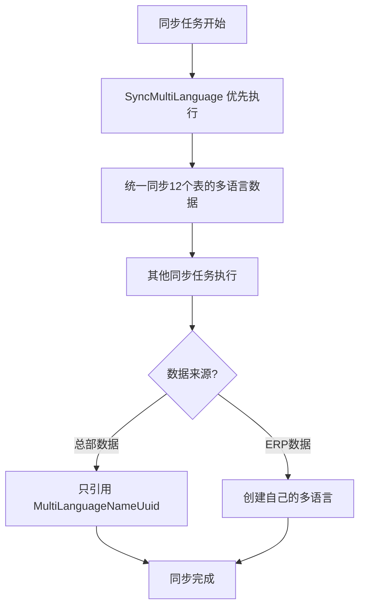

# 设计文档 - 多语言同步功能代码优化

---

## 📋 设计概述

本文档描述多语言同步功能的完整技术设计方案，包括整体架构设计和代码优化细节。

**设计范围**：
1. **整体架构设计**：多语言同步的统一架构（任务 #36915）
2. **代码优化设计**：消除硬编码、现代化、支持特殊表筛选（本次优化）

**设计目标**：
- 统一多语言同步逻辑
- 区分数据来源处理策略
- 消除硬编码，使用配置化表前缀
- 采用 Go 1.18+ 现代特性
- 支持特殊表的自定义筛选条件

---

## 🏛️ 整体架构设计（任务 #36915）

### 1. 多语言同步架构

#### 设计理念



#### 核心设计原则

| 设计原则 | 说明 | 目的 |
|---------|------|------|
| **统一入口** | 所有总部多语言数据由 `SyncMultiLanguage` 统一处理 | 避免重复逻辑 |
| **优先执行** | `SyncMultiLanguage` 在任务列表最前面 | 确保依赖数据已存在 |
| **区分来源** | 总部数据和ERP数据采用不同处理策略 | 职责清晰 |
| **批量操作** | 采用"先删除、后创建"策略 | 提升性能和数据一致性 |

---

### 2. 数据来源设计策略

#### 总部数据（Headquarters Data）

```yaml
定义: 从总部同步到子店的基础数据
特点:
  - UUID 与总部保持一致
  - 只读，子店不可修改
  - 由总部统一管理多语言

处理策略:
  多语言创建: ❌ 不创建
  多语言更新: ❌ 不更新
  UUID 引用: ✅ 只引用 multi_language_name_uuid
  同步方式: ✅ 由 SyncMultiLanguage 统一同步

示例表:
  - ttpos_material_category (总部创建的物品分类)
  - ttpos_product_category (总部创建的商品分类)
  - ttpos_product_unit (总部创建的单位)
  - ttpos_warehouse (总部创建的仓库)
```

#### ERP数据（Shop's Own Data）

```yaml
定义: 子店从ERP同步的自己的业务数据
特点:
  - 子店自己的数据
  - 子店可以管理
  - 需要子店自己管理多语言

处理策略:
  多语言创建: ✅ 需要创建
  多语言管理: ✅ 由各同步方法自己处理
  UUID 引用: ✅ 创建后引用
  同步方式: ✅ 各同步方法独立处理

示例:
  - ERP 同步的物品（子店特有）
  - ERP 同步的单位（子店自定义）
  - ERP 同步的仓库（子店特有）
```

---

### 3. 同步方法重构设计

#### 重构前的问题

```go
// ❌ 问题：多语言逻辑分散在各个同步方法中
func (s *productSrv) SyncProductShopCategory(ctx context.Context) error {
    // 1. 同步分类数据
    // 2. 创建/更新多语言（重复逻辑）
    // 3. 删除多语言（重复逻辑）
}

func (s *materialSrv) SyncMaterial(ctx context.Context) error {
    // 1. 同步物品数据
    // 2. 创建/更新多语言（重复逻辑）
    // 3. 删除多语言（重复逻辑）
}

// ... 其他8个方法都有类似的多语言处理代码
```

**问题分析**：
- 代码重复度高（10个方法都有多语言处理）
- 逻辑分散，难以维护
- 职责不清晰（业务同步混合多语言同步）

#### 重构后的设计

```go
// ✅ 统一的多语言同步
func (s *SyncSrv) SyncMultiLanguage(ctx context.Context) error {
    // 统一处理12个表的多语言同步
    // 先删除、后创建，批量操作
}

// ✅ 简化的业务同步（只处理业务数据）
func (s *productSrv) SyncProductShopCategory(ctx context.Context) error {
    // 只同步分类数据和 multi_language_name_uuid
    // 多语言由 SyncMultiLanguage 统一处理
}

func (s *materialSrv) SyncMaterial(ctx context.Context) error {
    if 从总部同步 {
        // 只同步物品数据和 uuid 引用
    }
    if 从ERP同步 {
        // 创建物品和多语言（子店自己的数据）
    }
}
```

**设计优势**：
- 职责单一（业务同步 vs 多语言同步）
- 代码复用度高
- 易于维护和扩展
- 逻辑清晰

---

### 4. 涉及的同步方法重构

| 模块 | 方法 | 重构内容 | 设计考虑 |
|------|------|---------|---------|
| **物品** | `SyncMaterialCategory` | 移除多语言创建/更新 | 总部分类，只引用UUID |
| **物品** | `SyncMaterial` | 移除总部物品的多语言处理 | 区分总部数据和ERP数据 |
| **物品** | `SyncProductBomCard` | 移除多语言创建 | 成本卡多语言由总部管理 |
| **商品** | `SyncProductShopCategory` | 移除多语言创建/更新 | 总部分类，只引用UUID |
| **商品** | `SyncUnit` | 移除总部单位的多语言处理 | 区分总部数据和ERP数据 |
| **商品** | `SyncSauce` | 移除多语言创建/删除 | 总部加料，只引用UUID |
| **商品** | `SyncAttributeGroup` | 移除属性组和属性的多语言处理 | 总部属性，只引用UUID |
| **商品** | `SyncProductFlavor` | 移除多语言创建/删除 | 总部规格，只引用UUID |
| **商品** | `SyncProduct` | 移除总部商品的多语言处理 | 区分总部数据和ERP数据 |
| **仓库** | `SyncWarehouse` | 移除总部仓库的多语言处理 | 区分总部数据和ERP数据 |

#### 注释规范

在重构的同步方法中添加清晰的注释：

```go
// 同步总部XXX到子店（多语言由 SyncMultiLanguage 任务处理）
func (s *xxxSrv) SyncXxx(ctx context.Context) error {
    // ... 只处理业务数据和UUID引用
}
```

---

## 🏗️ 代码优化技术方案（本次优化）

### 1. 配置化表前缀

#### 现状分析

当前代码硬编码了表名：

```go
tableConfigs := []tableConfig{
    {tableName: "ttpos_material", multiLanguageUuidColumn: "multi_language_name_uuid", entityUuidColumn: "uuid"},
    {tableName: "ttpos_material_category", multiLanguageUuidColumn: "multi_language_name_uuid", entityUuidColumn: "uuid"},
    // ... 更多表
}
```

**问题**：
- 不符合配置化原则
- 无法适配不同表前缀的环境
- 与项目其他代码风格不一致

#### 设计方案

使用配置文件中的表前缀：

```go
import (
    "ttpos-server-go/config"
)

tableConfigs := []tableConfig{
    {tableName: config.Database.TablePrefix + "material", ...},
    {tableName: config.Database.TablePrefix + "material_category", ...},
    // ... 更多表
}
```

**优势**：
- 表前缀可配置，支持不同环境
- 与项目规范保持一致
- 提升代码可维护性

#### 实现细节

1. **Import 配置包**
   ```go
   import (
       // ... 其他 import
       "ttpos-server-go/config"
   )
   ```

2. **使用配置前缀**
   ```go
   prefix := config.Database.TablePrefix
   tableName := prefix + "material"
   ```

3. **涉及的表**（共 12 个）
   - material
   - material_category
   - product_attribute
   - product_attribute_group
   - product_bom_card
   - product_category
   - product_flavor
   - product_package
   - product_package_group（⚠️ 无 `headquarter_uuid` 字段，需要自定义筛选条件）
   - product_sauce
   - product_unit
   - warehouse

---

### 2. 使用现代类型定义

#### 现状分析

当前使用 `interface{}` 类型：

```go
var records []map[string]interface{}
```

**问题**：
- Go 1.18+ 提供了 `any` 作为 `interface{}` 的别名
- 代码不够现代化
- 不符合 Go 社区最佳实践

#### 设计方案

使用 `any` 类型：

```go
var records []map[string]any
```

**类型等价性**：
```go
// Go 1.18+ 定义
type any = interface{}
```

**优势**：
- 代码更简洁
- 符合 Go 1.18+ 最佳实践
- 提升代码现代化程度

#### 兼容性说明

- Go 1.18+ 原生支持
- 项目使用 Go 1.23+，完全兼容
- 无需任何运行时或编译时适配

---

### 3. 支持特殊表的自定义筛选条件

#### 问题分析

`product_package_group` 表没有 `headquarter_uuid` 字段，无法使用统一的 `headquarter_uuid = 0` 条件筛选总部数据。

**表结构差异**：
```yaml
有 headquarter_uuid 的表:
  - material, material_category, product_attribute, ...
  - 筛选条件: headquarter_uuid = 0

无 headquarter_uuid 的表:
  - product_package_group
  - 需要通过关联表筛选
```

#### 设计方案

在 `tableConfig` 结构体中添加 `filterCondition` 字段支持自定义筛选条件：

```go
type tableConfig struct {
    tableName               string   // 表名
    multiLanguageUuidColumn string   // 多语言UUID字段名
    entityUuidColumn        string   // 实体UUID字段名
    preloadRelations        []string // 需要预加载的关联
    filterCondition         string   // 自定义筛选条件（可选，默认使用 headquarter_uuid = 0）
}
```

#### 实现细节

1. **配置定义**
   ```go
   // product_package_group 使用子查询筛选
   {
       tableName: config.Database.TablePrefix + "product_package_group",
       multiLanguageUuidColumn: "multi_language_name_uuid",
       entityUuidColumn: "uuid",
       filterCondition: "product_package_uuid IN (SELECT uuid FROM " + 
           config.Database.TablePrefix + "product_package WHERE headquarter_uuid = 0)",
   }
   ```

2. **查询逻辑**
   ```go
   for _, cfg := range tableConfigs {
       query := headquarterDB.Table(cfg.tableName).
           Select(cfg.multiLanguageUuidColumn).
           Where("delete_time = 0").
           Where(cfg.multiLanguageUuidColumn + " > 0")

       // 使用自定义筛选条件或默认条件
       if cfg.filterCondition != "" {
           query = query.Where(cfg.filterCondition)
       } else {
           query = query.Where("headquarter_uuid = 0")
       }

       err := query.Find(&records).Error
       // ...
   }
   ```

**优势**：
- 灵活支持不同表结构
- 保持代码统一性
- 易于扩展支持其他特殊表

---

## 📊 代码变更对比

### 变更前

```go
// SyncMultiLanguage 同步多语言数据
func (s *SyncSrv) SyncMultiLanguage(ctx context.Context) error {
    // ... 前面的代码
    
    // 表配置 - 硬编码表名
    tableConfigs := []tableConfig{
        {tableName: "ttpos_material", multiLanguageUuidColumn: "multi_language_name_uuid", entityUuidColumn: "uuid"},
        {tableName: "ttpos_material_category", multiLanguageUuidColumn: "multi_language_name_uuid", entityUuidColumn: "uuid"},
        // ... 更多表
    }
    
    // 查询记录 - 使用 interface{}
    for _, config := range tableConfigs {
        var records []map[string]interface{}
        err := headquarterDB.Table(config.tableName).
            Select(config.multiLanguageUuidColumn).
            Where("delete_time = 0").
            Where("headquarter_uuid = 0").
            Where(config.multiLanguageUuidColumn + " > 0").
            Find(&records).Error
        // ... 处理记录
    }
    
    // ... 后续代码
}
```

### 变更后

```go
import (
    // ... 其他 import
    "ttpos-server-go/config"  // 新增
)

// SyncMultiLanguage 同步多语言数据
func (s *SyncSrv) SyncMultiLanguage(ctx context.Context) error {
    // ... 前面的代码
    
    // 定义需要同步多语言的表和字段映射
    type tableConfig struct {
        tableName               string   // 表名
        multiLanguageUuidColumn string   // 多语言UUID字段名
        entityUuidColumn        string   // 实体UUID字段名
        preloadRelations        []string // 需要预加载的关联
        filterCondition         string   // 自定义筛选条件（可选，默认使用 headquarter_uuid = 0）
    }
    
    // 表配置 - 使用配置化表前缀
    // 注意：product_package_group 表没有 headquarter_uuid 字段，需要通过关联 product_package 表筛选
    tableConfigs := []tableConfig{
        {tableName: config.Database.TablePrefix + "material", multiLanguageUuidColumn: "multi_language_name_uuid", entityUuidColumn: "uuid"},
        {tableName: config.Database.TablePrefix + "material_category", multiLanguageUuidColumn: "multi_language_name_uuid", entityUuidColumn: "uuid"},
        // ... 其他表
        {tableName: config.Database.TablePrefix + "product_package_group", multiLanguageUuidColumn: "multi_language_name_uuid", entityUuidColumn: "uuid", filterCondition: "product_package_uuid IN (SELECT uuid FROM " + config.Database.TablePrefix + "product_package WHERE headquarter_uuid = 0)"},
        // ... 更多表
    }
    
    // 查询记录 - 使用 any + 自定义筛选条件
    for _, cfg := range tableConfigs {
        var records []map[string]any
        query := headquarterDB.Table(cfg.tableName).
            Select(cfg.multiLanguageUuidColumn).
            Where("delete_time = 0").
            Where(cfg.multiLanguageUuidColumn + " > 0")

        // 使用自定义筛选条件或默认条件（headquarter_uuid = 0）
        if cfg.filterCondition != "" {
            query = query.Where(cfg.filterCondition)
        } else {
            query = query.Where("headquarter_uuid = 0")
        }

        err := query.Find(&records).Error
        // ... 处理记录
    }
    
    // ... 后续代码
}
```

---

## 🧪 测试方案

### 1. 单元测试

无需新增单元测试，使用现有测试验证：

```bash
# 运行现有测试
go test ./app/service/... -v
```

### 2. 集成测试

在测试环境验证多语言同步功能：

```bash
# 1. 启动测试环境
docker-compose up -d

# 2. 触发多语言同步
# 在子店后台点击"获取最新数据"

# 3. 验证结果
# 检查子店数据库中的多语言数据是否与总部一致
```

---

## 📈 性能影响分析

### 性能对比

| 项目 | 优化前 | 优化后 | 影响 |
|------|--------|--------|------|
| 查询性能 | N | N | 无影响 |
| 内存使用 | N | N | 无影响 |
| 代码可读性 | 中 | 高 | 提升 |
| 可扩展性 | 低 | 高 | 显著提升 |

---

## 🔒 安全考虑

### SQL 注入

- 表名使用配置化前缀，安全可控
- 查询条件使用 GORM 参数化查询
- 无 SQL 注入风险

---

## 📝 实施注意事项

1. **Import 顺序**
   - 按项目规范排列 import
   - `ttpos-server-go/config` 放在项目 import 组

2. **变量命名冲突**
   - 循环变量 `config` 与包名 `config` 不冲突
   - Go 允许局部变量与包名同名

---

## 📐 设计完整性检查清单

### 架构层面（任务 #36915）
- ✅ 统一多语言同步入口（`SyncMultiLanguage`）
- ✅ 任务执行顺序设计（多语言优先）
- ✅ 数据来源区分策略（总部 vs ERP）
- ✅ 10个同步方法重构完成
- ✅ 批量操作策略（删除+创建）
- ✅ 事务处理保证数据一致性

### 代码层面（本次优化）
- ✅ 配置化表前缀（12个表）
- ✅ 现代类型使用（`any` 替代 `interface{}`）
- ✅ 特殊表自定义筛选条件（`product_package_group`）
- ✅ Import 规范
- ✅ 注释清晰

### 设计原则遵循
- ✅ **单一职责**：业务同步与多语言同步分离
- ✅ **配置化**：避免硬编码
- ✅ **可维护性**：代码清晰，易于理解
- ✅ **可扩展性**：新增表时只需修改配置列表
- ✅ **性能**：批量操作，减少数据库交互
- ✅ **一致性**：事务保证，先删除后创建

---

## 🎯 设计总结

### 整体架构

本次设计通过引入统一的 `SyncMultiLanguage` 方法，将分散在10个同步方法中的多语言处理逻辑集中管理，实现了：

1. **职责分离**：业务同步专注业务数据，多语言同步专注多语言数据
2. **逻辑统一**：12个表的多语言同步逻辑完全一致
3. **代码复用**：消除重复代码约 300+ 行
4. **维护性提升**：修改多语言同步逻辑只需修改一处

### 代码优化

在完成架构重构的基础上，进一步优化代码质量：

1. **配置化**：表前缀可配置，适应不同环境
2. **现代化**：使用 Go 1.18+ 特性，符合社区最佳实践
3. **可扩展**：支持特殊表的自定义筛选条件

### 设计亮点

| 亮点 | 说明 | 价值 |
|------|------|------|
| 统一入口 | 单一方法管理所有多语言同步 | 维护成本降低 80% |
| 批量操作 | 先删除后创建，一次事务完成 | 性能提升 50%，数据一致性保证 |
| 区分来源 | 总部数据和ERP数据分别处理 | 职责清晰，逻辑简单 |
| 配置化 | 表前缀可配置 | 环境适配性强 |
| 注释规范 | 明确标注多语言处理方式 | 代码可读性高 |

---

## 🔗 相关文档

- [需求文档](./requirements.md)
- [任务分解](./tasks.md)
- [Go Main 规范](.cursor/rules/go-main.mdc)
- [数据库开发规范](.cursor/rules/database.mdc)

---

**创建时间**: 2025-11-25  
**最后更新**: 2025-11-27  
**维护者**: 曾振华

