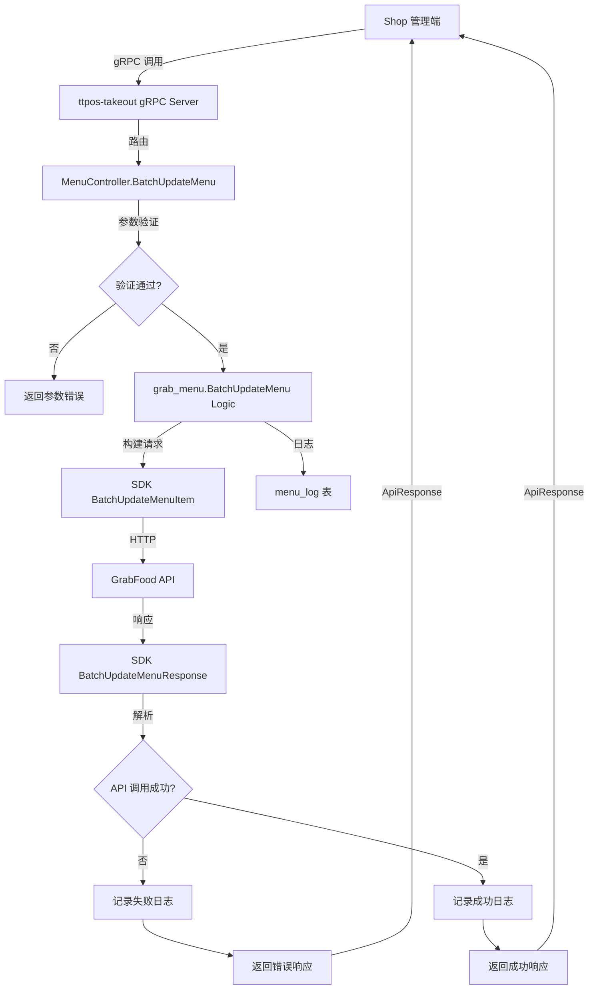

# Grab 批量更新菜单 API 集成 设计文档

> 本文档定义 Grab 批量更新菜单 API 集成 的技术设计和实现方案。

## 📋 概述

集成 GrabFood 官方提供的 Batch Update Menu API，实现批量更新菜单项（商品）和修饰符功能。通过单次 API 调用更新多个菜单实体，将批量更新 50 个商品的时间从 10-15 秒缩短至 1-2 秒，效率提升 80%+。

**技术栈**: Go + GoFrame 2.x + gRPC + GrabFood SDK

**架构层次**: ttpos-bmp/ttpos-takeout 微服务模块

---

## 🎯 规范对齐

### Go BMP 规范 (go-bmp.mdc)

本项目使用 GoFrame 2.x 框架开发，严格遵循以下规范：

- ✅ **自动生成代码保护**: 禁止修改 `dao/`、`entity/`、`do/` 目录下的文件
- ✅ **分层设计**: Controller → Logic → DAO 三层架构
- ✅ **gRPC 服务注册**: 服务注册到 Nacos 实现服务发现
- ✅ **日志使用中文**: 所有日志描述使用中文
- ✅ **错误处理**: 使用 `gerror` 包处理错误，不使用 `panic`
- ✅ **响应格式**: 使用 `takeout.ApiResponse` 统一包装响应

### Protobuf 规范 (proto-rules.mdc)

- ✅ **请求消息命名**: 以 `Req` 结尾，使用大驼峰命名（PascalCase）
- ✅ **响应消息命名**: 以 `Resp` 结尾，使用大驼峰命名（PascalCase）
- ✅ **字段命名**: 使用 snake_case（小写字母+下划线）
- ✅ **服务命名**: 以 `Service` 结尾，使用大驼峰命名
- ✅ **方法命名**: 使用大驼峰命名，动词+名词形式

### API 设计规范 (api.mdc)

- ✅ **响应格式**: gRPC 响应通过 `takeout.ApiResponse` 包装
- ✅ **错误处理**: 明确的错误码和错误消息
- ✅ **数据格式**: 使用 `google.protobuf.Any` 包装业务数据

---

## 🔄 代码复用分析

### 可复用的现有组件

1. **GrabFood SDK**: `github.com/grab/grabfood-api-sdk-go@v1.0.2`
   - ✅ 已确认 SDK 支持 Batch Update Menu API
   - 复用 `BatchUpdateMenuItem` 结构体
   - 复用 `BatchUpdateMenuResponse` 响应结构
   - 复用 `MenuEntity` 和 `MenuEntityError` 辅助结构

2. **现有单项更新实现**: `ttpos-bmp/app/ttpos-takeout/internal/logic/grab_menu/grab_menu.go`
   - 复用 `UpdateMenuItem` 和 `UpdateMenuModifier` 的错误处理逻辑
   - 复用 DTO 转换逻辑（`UpdateAdvancedPricingReq`, `UpdatePurchasabilityReq`）
   - 复用日志记录模式

3. **菜单日志服务**: `ttpos-bmp/app/ttpos-takeout/internal/dao/menu_log.go`
   - 复用现有的菜单日志表结构
   - 新增批量更新的日志类型：`BATCH_UPDATE_ITEM` 和 `BATCH_UPDATE_MODIFIER`

4. **Grab 服务**: `ttpos-bmp/app/ttpos-takeout/internal/service/grab.go`
   - 需要新增 `BatchUpdateMenu` 方法调用 SDK

### 集成点

- **gRPC 接口**: 新增 `BatchUpdateMenu` RPC 方法到 `MenuService`
- **日志系统**: 扩展 `menu_log` 表的 `sync_type` 字段支持批量更新类型
- **错误处理**: 统一使用 `takeout.ApiResponse` 包装成功和失败响应

---

## 🏗️ 架构设计

### 分层设计原则

**Go BMP (GoFrame) 四层架构**:

```
gRPC Controller 层 (internal/controller/rpc/)
  ↓ 调用
Logic 层 (internal/logic/)
  ↓ 调用
Service 层 (internal/service/)
  ↓ 调用
DAO 层 (internal/dao/) - 自动生成 ❌ 禁止修改
```

**依赖规则**:

- ✅ Controller 只做参数验证和响应包装
- ✅ Logic 实现业务逻辑
- ✅ Service 提供服务接口（如 Grab SDK 调用）
- ✅ DAO 由 GoFrame 自动生成，禁止手动修改

### 架构图



### 模块划分

#### ttpos-takeout 模块结构

```
ttpos-bmp/app/ttpos-takeout/
├── manifest/
│   └── protobuf/
│       └── menu/
│           └── menu.proto                      # 新增 BatchUpdateMenu 相关消息定义
├── internal/
│   ├── controller/
│   │   └── rpc/
│   │       └── menu/
│   │           └── menu.go                     # 新增 BatchUpdateMenu Controller 方法
│   ├── logic/
│   │   └── grab_menu/
│   │       └── grab_menu.go                    # 新增 BatchUpdateMenu Logic 方法
│   ├── model/
│   │   └── dto/
│   │       └── grab/
│   │           └── menu_update.go              # 新增批量更新 DTO
│   ├── service/
│   │   └── grab.go                             # 新增 BatchUpdateMenu 服务方法
│   └── dao/
│       └── menu_log.go                         # 使用现有表，新增日志类型
└── api/
    └── menu/
        └── menu.pb.go                          # Protobuf 自动生成文件
```

---

## 📊 数据模型

### DTO 定义

#### Batch Update Request DTO

```go
// ttpos-bmp/app/ttpos-takeout/internal/model/dto/grab/menu_update.go

// BatchUpdateMenuReq 批量更新菜单请求
// 参考 SDK: grabfood.BatchUpdateMenuItem
type BatchUpdateMenuReq struct {
    MerchantID   string       `json:"merchant_id" v:"required#商户ID不能为空"`
    Field        string       `json:"field" v:"required|in:ITEM,MODIFIER#字段类型不能为空|字段类型必须是ITEM或MODIFIER"`
    MenuEntities []MenuEntity `json:"menu_entities" v:"required|length:1,100#菜单实体不能为空|菜单实体数量必须在1-100之间"`
}

// MenuEntity 菜单实体（商品或修饰符）
// 参考 SDK: grabfood.MenuEntity
type MenuEntity struct {
    ID               string                      `json:"id" v:"required#ID不能为空"`
    Price            *int64                      `json:"price,omitempty"`
    AvailableStatus  string                      `json:"available_status,omitempty" v:"in:AVAILABLE,UNAVAILABLE,UNAVAILABLEHIDE#可用状态必须是AVAILABLE、UNAVAILABLE或UNAVAILABLEHIDE"`
    MaxStock         *int64                      `json:"max_stock,omitempty"`
    AdvancedPricings []UpdateAdvancedPricingReq  `json:"advanced_pricings,omitempty"`
    Purchasabilities []UpdatePurchasabilityReq   `json:"purchasabilities,omitempty"`
}

// BatchUpdateMenuResp 批量更新菜单响应
// 参考 SDK: grabfood.BatchUpdateMenuResponse
type BatchUpdateMenuResp struct {
    MerchantID string            `json:"merchant_id"`
    Status     string            `json:"status"` // success, partial_success, fail
    Errors     []MenuEntityError `json:"errors"`
}

// MenuEntityError 菜单实体错误
// 参考 SDK: grabfood.MenuEntityError
type MenuEntityError struct {
    EntityID string `json:"entity_id"`
    ErrMsg   string `json:"err_msg"`
}
```

### 日志模型扩展

```go
// 现有 menu_log 表，新增日志类型
const (
    MenuSyncTypeBatchUpdateItem     = "BATCH_UPDATE_ITEM"     // 批量更新商品
    MenuSyncTypeBatchUpdateModifier = "BATCH_UPDATE_MODIFIER" // 批量更新修饰符
)
```

---

## 🔌 API 设计

### gRPC API

#### Protobuf 定义

```protobuf
// ttpos-bmp/app/ttpos-takeout/manifest/protobuf/menu/menu.proto

syntax = "proto3";

package menu;

import "takeout_api.proto";

option go_package = "ttpos-bmp/app/ttpos-takeout/api/menu";

// 菜单实体（商品或修饰符）
message MenuEntity {
  string id = 1;                                  // 商品ID或修饰符ID (必填)
  optional int64 price = 2;                       // 价格 (minor unit)
  optional string available_status = 3;           // 可用状态: AVAILABLE, UNAVAILABLE, UNAVAILABLEHIDE
  optional int64 max_stock = 4;                   // 库存数量（仅商品支持）
  repeated AdvancedPricing advanced_pricings = 5; // 高级定价配置
  repeated Purchasability purchasabilities = 6;   // 购买能力配置（仅商品支持）
}

// 批量更新菜单请求
message BatchUpdateMenuReq {
  string merchant_id = 1;                         // Grab MerchantID (必填)
  string field = 2;                               // 记录类型: ITEM 或 MODIFIER (必填)
  repeated MenuEntity menu_entities = 3;          // 菜单实体数组 (必填, 1-100条)
  string request_id = 4;                          // 请求追踪ID (可选)
}

// 菜单实体错误
message MenuEntityError {
  string entity_id = 1;  // 失败的实体ID
  string err_msg = 2;    // 错误消息
}

// 批量更新菜单响应
message BatchUpdateMenuResp {
  string merchant_id = 1;              // 商户ID
  string status = 2;                   // 状态: success, partial_success, fail
  repeated MenuEntityError errors = 3; // 错误列表（部分失败或全部失败时返回）
}

service MenuService {
    // ... 现有方法 ...
    
    // 批量更新菜单（商品或修饰符）
    // 注意：单次请求只能更新同一类型（ITEM 或 MODIFIER）
    rpc BatchUpdateMenu (BatchUpdateMenuReq) returns (takeout.ApiResponse);
}
```

**生成 Go 代码**:

```bash
cd ttpos-bmp/app/ttpos-takeout
gf gen pb
```

---

## 🧩 组件和接口

### Logic 层实现

```go
// ttpos-bmp/app/ttpos-takeout/internal/logic/grab_menu/grab_menu.go

// BatchUpdateMenu 批量更新菜单项或修饰符
// 参数：
//   - ctx: 上下文对象
//   - req: 批量更新请求
//
// 返回：
//   - resp: 批量更新响应
//   - err: 错误信息
//
// 注意：单次请求只能更新同一类型（ITEM 或 MODIFIER）
func (s *sGrabMenu) BatchUpdateMenu(ctx context.Context, req *grabDto.BatchUpdateMenuReq) (*grabDto.BatchUpdateMenuResp, error) {
    g.Log().Infof(ctx, "[Grab] 批量更新菜单: merchantID=%s, field=%s, count=%d", 
        req.MerchantID, req.Field, len(req.MenuEntities))

    // 1. 参数验证
    if err := g.Validator().Data(req).Run(ctx); err != nil {
        g.Log().Errorf(ctx, "[Grab] 批量更新菜单参数验证失败: %v", err)
        return nil, gerror.NewCode(gcode.CodeValidationFailed, err.Error())
    }

    // 2. 构建 SDK 批量更新请求
    batchReq := grabfood.NewBatchUpdateMenuItem(req.MerchantID, req.Field)
    var menuEntities []grabfood.MenuEntity
    
    for _, entity := range req.MenuEntities {
        sdkEntity := grabfood.NewMenuEntity()
        sdkEntity.SetId(entity.ID)
        
        // 设置价格
        if entity.Price != nil {
            sdkEntity.SetPrice(*entity.Price)
        }
        
        // 设置可用状态
        if entity.AvailableStatus != "" {
            sdkEntity.SetAvailableStatus(entity.AvailableStatus)
        }
        
        // 设置库存（仅商品支持）
        if entity.MaxStock != nil && req.Field == "ITEM" {
            sdkEntity.SetMaxStock(*entity.MaxStock)
        }
        
        // 转换高级定价（复用现有转换逻辑）
        if len(entity.AdvancedPricings) > 0 {
            sdkAdvancedPricings := s.convertAdvancedPricings(entity.AdvancedPricings)
            sdkEntity.SetAdvancedPricings(sdkAdvancedPricings)
        }
        
        // 转换购买能力（仅商品支持）
        if len(entity.Purchasabilities) > 0 && req.Field == "ITEM" {
            sdkPurchasabilities := s.convertPurchasabilities(entity.Purchasabilities)
            sdkEntity.SetPurchasabilities(sdkPurchasabilities)
        }
        
        menuEntities = append(menuEntities, *sdkEntity)
    }
    
    batchReq.SetMenuEntities(menuEntities)

    // 3. 调用 Grab API
    resp, err := service.Grab().BatchUpdateMenu(ctx, req.MerchantID, batchReq)
    if err != nil {
        // 4. 记录失败日志
        s.logBatchUpdate(ctx, req.MerchantID, req.Field, len(req.MenuEntities), false, err.Error())
        g.Log().Errorf(ctx, "[Grab] 批量更新菜单调用API失败: %v", err)
        return nil, gerror.Wrap(err, "调用 Grab BatchUpdateMenu API 失败")
    }

    // 5. 处理部分失败场景
    if resp.GetStatus() == "partial_success" || resp.GetStatus() == "fail" {
        errorsJSON, _ := gjson.EncodeString(resp.GetErrors())
        s.logBatchUpdate(ctx, req.MerchantID, req.Field, len(req.MenuEntities), 
            resp.GetStatus() != "fail", errorsJSON)
    } else {
        // 6. 记录成功日志
        s.logBatchUpdate(ctx, req.MerchantID, req.Field, len(req.MenuEntities), true, "")
    }

    // 7. 构建响应
    result := &grabDto.BatchUpdateMenuResp{
        MerchantID: resp.GetMerchantID(),
        Status:     resp.GetStatus(),
    }
    
    if len(resp.GetErrors()) > 0 {
        for _, err := range resp.GetErrors() {
            result.Errors = append(result.Errors, grabDto.MenuEntityError{
                EntityID: err.GetEntityID(),
                ErrMsg:   err.GetErrMsg(),
            })
        }
    }

    g.Log().Infof(ctx, "[Grab] 批量更新菜单完成: merchantID=%s, status=%s, errorCount=%d", 
        req.MerchantID, result.Status, len(result.Errors))
    return result, nil
}

// logBatchUpdate 记录批量更新日志
func (s *sGrabMenu) logBatchUpdate(ctx context.Context, merchantID, field string, count int, success bool, errMsg string) {
    logUUID := guid.S()
    status := consts.MenuSyncStatusSuccess
    if !success {
        status = consts.MenuSyncStatusFail
    }

    syncType := fmt.Sprintf("BATCH_UPDATE_%s", field) // BATCH_UPDATE_ITEM 或 BATCH_UPDATE_MODIFIER

    logDo := &do.MenuLog{
        Uuid:         logUUID,
        MerchantId:   merchantID,
        ProviderName: string(consts.ProviderGrab),
        SyncType:     syncType,
        Status:       status,
        ErrorMsg:     errMsg,
        // 可选：在 MenuSnapshot 字段中记录批量更新的实体ID列表
    }

    _, err := dao.MenuLog.Ctx(ctx).Data(logDo).Insert()
    if err != nil {
        g.Log().Errorf(ctx, "[Grab] 插入批量更新日志失败: merchantID=%s, error=%v", merchantID, err)
    }
}

// convertAdvancedPricings 转换高级定价（复用现有方法）
func (s *sGrabMenu) convertAdvancedPricings(pricings []grabDto.UpdateAdvancedPricingReq) []grabfood.UpdateAdvancedPricing {
    // ... 复用现有 UpdateMenuItem 的转换逻辑 ...
}

// convertPurchasabilities 转换购买能力（复用现有方法）
func (s *sGrabMenu) convertPurchasabilities(purchasabilities []grabDto.UpdatePurchasabilityReq) []grabfood.UpdatePurchasability {
    // ... 复用现有 UpdateMenuItem 的转换逻辑 ...
}
```

### Service 层实现

```go
// ttpos-bmp/app/ttpos-takeout/internal/service/grab.go

// BatchUpdateMenu 批量更新菜单
// 参数：
//   - ctx: 上下文对象
//   - merchantID: 商户ID
//   - req: SDK BatchUpdateMenuItem 请求
//
// 返回：
//   - resp: SDK BatchUpdateMenuResponse 响应
//   - err: 错误信息
func (s *sGrab) BatchUpdateMenu(ctx context.Context, merchantID string, req *grabfood.BatchUpdateMenuItem) (*grabfood.BatchUpdateMenuResponse, error) {
    g.Log().Infof(ctx, "[Grab SDK] 调用批量更新菜单API: merchantID=%s", merchantID)

    // 调用 GrabFood SDK
    resp, httpResp, err := s.client.UpdateMenuRecordAPI.BatchUpdateMenu(ctx, merchantID).
        Authorization(s.authHeader).
        ContentType("application/json").
        BatchUpdateMenuItem(*req).
        Execute()

    if err != nil {
        g.Log().Errorf(ctx, "[Grab SDK] 批量更新菜单API调用失败: %v", err)
        return nil, gerror.Wrap(err, "GrabFood BatchUpdateMenu API 调用失败")
    }

    defer httpResp.Body.Close()

    g.Log().Infof(ctx, "[Grab SDK] 批量更新菜单API调用成功: status=%d", httpResp.StatusCode)
    return resp, nil
}
```

### Controller 层实现

```go
// ttpos-bmp/app/ttpos-takeout/internal/controller/rpc/menu/menu.go

// BatchUpdateMenu 批量更新菜单（商品或修饰符）
// 参数：
//   - ctx: 上下文对象
//   - req: 批量更新请求
//
// 返回：
//   - ApiResponse: 统一响应格式
func (c *Controller) BatchUpdateMenu(ctx context.Context, req *api.BatchUpdateMenuReq) (*takeout.ApiResponse, error) {
    g.Log().Infof(ctx, "[MenuController] 批量更新菜单请求: merchantID=%s, field=%s, count=%d, requestID=%s",
        req.MerchantId, req.Field, len(req.MenuEntities), req.RequestId)

    // 1. 参数验证
    if req.MerchantId == "" {
        return rpc.ApiError("商户ID不能为空"), nil
    }
    if req.Field != "ITEM" && req.Field != "MODIFIER" {
        return rpc.ApiError("字段类型必须是ITEM或MODIFIER"), nil
    }
    if len(req.MenuEntities) == 0 || len(req.MenuEntities) > 100 {
        return rpc.ApiError("菜单实体数量必须在1-100之间"), nil
    }

    // 2. 构建 DTO 请求
    dtoReq := &grabDto.BatchUpdateMenuReq{
        MerchantID:   req.MerchantId,
        Field:        req.Field,
        MenuEntities: make([]grabDto.MenuEntity, 0, len(req.MenuEntities)),
    }

    for _, entity := range req.MenuEntities {
        dtoEntity := grabDto.MenuEntity{
            ID:              entity.Id,
            AvailableStatus: entity.AvailableStatus,
        }

        // 设置可选字段
        if entity.Price != nil {
            dtoEntity.Price = entity.Price
        }
        if entity.MaxStock != nil {
            dtoEntity.MaxStock = entity.MaxStock
        }

        // 转换高级定价
        if len(entity.AdvancedPricings) > 0 {
            // ... 转换逻辑 ...
        }

        // 转换购买能力
        if len(entity.Purchasabilities) > 0 {
            // ... 转换逻辑 ...
        }

        dtoReq.MenuEntities = append(dtoReq.MenuEntities, dtoEntity)
    }

    // 3. 调用 Logic 层
    resp, err := service.GrabMenu().BatchUpdateMenu(ctx, dtoReq)
    if err != nil {
        g.Log().Errorf(ctx, "[MenuController] 批量更新菜单失败: %v", err)
        return rpc.ApiError(err.Error()), nil
    }

    // 4. 构建响应
    apiResp := &api.BatchUpdateMenuResp{
        MerchantId: resp.MerchantID,
        Status:     resp.Status,
        Errors:     make([]*api.MenuEntityError, 0, len(resp.Errors)),
    }

    for _, err := range resp.Errors {
        apiResp.Errors = append(apiResp.Errors, &api.MenuEntityError{
            EntityId: err.EntityID,
            ErrMsg:   err.ErrMsg,
        })
    }

    // 5. 包装为 ApiResponse
    dataAny, err := anypb.New(apiResp)
    if err != nil {
        return rpc.ApiError("序列化响应失败"), nil
    }

    return &takeout.ApiResponse{
        Code:    string(consts.CodeSuccess),
        Message: "批量更新菜单成功",
        Data:    dataAny,
    }, nil
}
```

---

## 🚨 错误处理

### 错误场景

#### 场景 1: 参数验证失败

- **处理方式**: 返回明确的参数错误信息
- **用户影响**: 看到具体哪个参数不合法
- **代码示例**:
  ```go
  if req.Field != "ITEM" && req.Field != "MODIFIER" {
      return rpc.ApiError("字段类型必须是ITEM或MODIFIER"), nil
  }
  ```

#### 场景 2: GrabFood API 调用失败

- **处理方式**: 记录详细错误日志，返回通用错误信息
- **用户影响**: 看到"调用 Grab API 失败"
- **日志记录**: 完整的错误堆栈和请求参数

#### 场景 3: 部分实体更新失败（partial_success）

- **处理方式**: 返回 `status=partial_success`，在 `errors` 数组中列出失败实体
- **用户影响**: 知道哪些实体更新成功，哪些失败及失败原因
- **日志记录**: 将失败实体的详细信息记录到 `menu_log.error_msg`

#### 场景 4: 全部实体更新失败（fail）

- **处理方式**: 返回 `status=fail`，在 `errors` 数组中列出所有失败原因
- **用户影响**: 知道批量更新完全失败
- **日志记录**: 完整的失败信息

---

## 🔒 安全设计

### 身份验证

- **gRPC 认证**: 通过 Nacos 服务发现，内部服务调用
- **Grab API 认证**: 使用 OAuth 2.0 Token，由 `service.Grab()` 管理

### 权限控制

- **商户隔离**: 只能更新自己的商户菜单（merchantID 验证）
- **类型隔离**: 单次请求只能更新同一类型（ITEM 或 MODIFIER）

### 数据验证

- **数量限制**: 单次最多 100 个实体（由 GrabFood API 限制）
- **字段验证**: 可用状态只能是 AVAILABLE, UNAVAILABLE, UNAVAILABLEHIDE
- **防止注入**: 使用 DAO 层自动防止 SQL 注入

---

## 🧪 测试策略

### 单元测试

**目标覆盖率**:

- Logic 层: 80%+
- Service 层: 70%+

**测试内容**:

1. **参数验证测试**:
   - 测试 merchantID 为空
   - 测试 field 不是 ITEM 或 MODIFIER
   - 测试 menuEntities 数量超出限制（0 或 > 100）

2. **业务逻辑测试**:
   - 测试批量更新商品成功（status=success）
   - 测试批量更新修饰符成功
   - 测试部分成功场景（status=partial_success）
   - 测试全部失败场景（status=fail）

3. **DTO 转换测试**:
   - 测试 Protobuf → DTO 转换
   - 测试 DTO → SDK 结构体转换
   - 测试高级定价和购买能力转换

**测试示例**:

```go
// ttpos-bmp/app/ttpos-takeout/internal/logic/grab_menu/grab_menu_test.go
func TestBatchUpdateMenu_Success(t *testing.T) {
    // 测试批量更新商品成功
}

func TestBatchUpdateMenu_PartialSuccess(t *testing.T) {
    // 测试部分成功场景
}

func TestBatchUpdateMenu_ValidationError(t *testing.T) {
    // 测试参数验证失败
}
```

### 集成测试

**测试内容**:

1. **端到端测试**:
   - 从 gRPC 调用到 GrabFood API 响应的完整流程
   - 测试日志记录是否正确

2. **错误场景测试**:
   - 模拟 Grab API 超时
   - 模拟 Grab API 返回错误
   - 模拟网络异常

3. **并发测试**:
   - 测试多个批量更新请求并发执行
   - 测试是否存在竞态条件

---

## 📈 性能优化

### 优化策略

1. **批量处理**:
   - 单次批量建议 20-50 个实体（避免触发限流）
   - 超过 50 个时在业务层分批调用

2. **异步处理**:
   - 日志记录使用异步方式（不阻塞主流程）
   - 考虑使用 goroutine 处理日志写入

3. **错误处理优化**:
   - 部分失败时不中断流程，返回详细错误列表
   - 使用 `errors` 数组明确指出失败实体

### 性能指标

- API 响应时间: < 2 秒（批量 50 个实体）
- 日志写入: < 100ms
- 并发能力: 支持 100+ 并发批量更新请求

---

## 📚 实现清单

### Phase 1: Protobuf 定义和代码生成

- [ ] 定义 `MenuEntity` 消息
- [ ] 定义 `BatchUpdateMenuReq` 请求消息
- [ ] 定义 `BatchUpdateMenuResp` 响应消息
- [ ] 定义 `MenuEntityError` 错误消息
- [ ] 在 `MenuService` 中添加 `BatchUpdateMenu` RPC 方法
- [ ] 执行 `gf gen pb` 生成 Go 代码

### Phase 2: DTO 和数据模型

- [ ] 创建 `BatchUpdateMenuReq` DTO
- [ ] 创建 `MenuEntity` DTO
- [ ] 创建 `BatchUpdateMenuResp` DTO
- [ ] 创建 `MenuEntityError` DTO
- [ ] 新增日志类型常量（`BATCH_UPDATE_ITEM`, `BATCH_UPDATE_MODIFIER`）

### Phase 3: Logic 层实现

- [ ] 实现 `BatchUpdateMenu` 方法
- [ ] 实现 `logBatchUpdate` 日志记录方法
- [ ] 实现 DTO 到 SDK 结构体转换逻辑
- [ ] 实现错误处理逻辑（成功/部分成功/失败）

### Phase 4: Service 层实现

- [ ] 在 `service.Grab()` 中添加 `BatchUpdateMenu` 方法
- [ ] 调用 GrabFood SDK 的 `BatchUpdateMenu` API
- [ ] 处理 HTTP 响应

### Phase 5: Controller 层实现

- [ ] 实现 `BatchUpdateMenu` Controller 方法
- [ ] 实现参数验证
- [ ] 实现 Protobuf 到 DTO 转换
- [ ] 实现响应包装（`takeout.ApiResponse`）

### Phase 6: 测试

- [ ] 编写 Logic 层单元测试
- [ ] 编写 Service 层单元测试
- [ ] 编写 Controller 层单元测试
- [ ] 编写集成测试
- [ ] 测试部分成功和全部失败场景

**详细任务**: 参见 `tasks.md`

---

## Graphiti & 活动日志

- Related Episode: `[待补充]`
- 模板：`docs/agent/templates/graphiti-episode.md`
- 活动日志：`docs/team/activities/rikugun/2025-12/2025-12-23.md`
- 在技术方案评审、关键架构决策或踩坑总结后，立即补充 Episode 并在设计文档尾部互链。

---

**版本**: v1.0.0  
**创建日期**: 2025-12-23  
**作者**: rikugun  
**审核者**: 待审核

