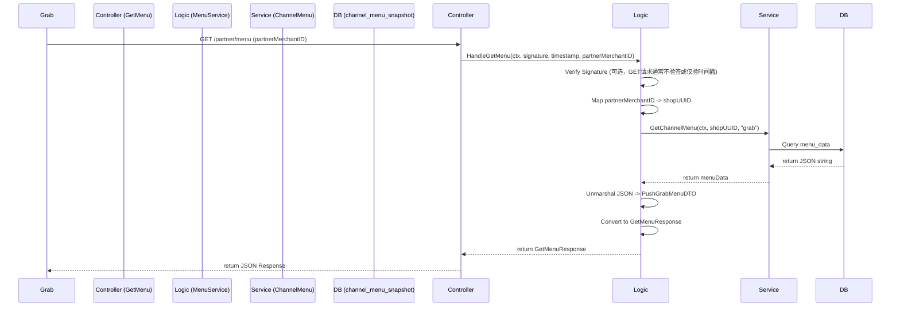

# Grab Get Menu Webhook 设计文档

> 本文档定义 Grab Get Menu Webhook 的技术设计和实现方案。

## 📋 概述

本功能实现 Grab 平台的 Get Menu Webhook 接口，允许 Grab 主动拉取商户菜单数据。系统将从 `channel_menu_snapshot` 数据库表中读取最新的菜单快照，并将其转换为符合 Grab API v1.1.3 规范的 JSON 格式返回。

---

## 🎯 规范对齐

### Go BMP 规范 (go-bmp.mdc)

- **目录结构**: 遵循 `ttpos-bmp` 项目结构
- **代码生成**: 使用 GoFrame CLI 生成 DAO/DO/Entity
- **分层设计**: Controller -> Logic -> DAO
- **错误处理**: 使用 `gerror` 包

### API 设计规范 (api.mdc)

- **URL**: `/partner/menu` (Grab 指定)
- **Method**: GET
- **响应格式**: 直接返回 Grab 定义的 JSON 结构 (非标准 `{code, message, data}` 格式，因为是 Webhook 回调)

---

## 🏗️ 架构设计

### 模块划分

#### Go BMP 模块 (ttpos-takeout)

- **Controller 层**: `ttpos-bmp/app/ttpos-takeout/internal/controller/grab/`
  - `grab_v1_get_menu.go`: 处理 HTTP 请求，参数解析，调用 Logic
- **Logic 层**: `ttpos-bmp/app/ttpos-takeout/internal/logic/grab/`
  - `menu_service.go`: 实现 `HandleGetMenu` 方法，包含核心业务逻辑
- **Service 层**: `ttpos-bmp/app/ttpos-takeout/internal/service/`
  - `channel_menu.go`: 提供菜单快照读取接口 (已存在)
- **DAO 层**: `ttpos-bmp/app/ttpos-takeout/internal/dao/`
  - `channel_menu_snapshot.go`: 数据库访问 (已存在)

### 流程图



---

## 🗄️ 数据库设计

本功能复用现有的 `channel_menu_snapshot` 表，无需新增表。

### 现有表结构

```sql
CREATE TABLE `channel_menu_snapshot` (
  `uuid` bigint(20) unsigned NOT NULL COMMENT '主键',
  `shop_uuid` bigint(20) unsigned NOT NULL COMMENT '店铺UUID',
  `provider_name` varchar(32) NOT NULL COMMENT '渠道名称',
  `menu_data` longtext COMMENT '菜单数据(JSON)',
  `create_time` int(11) DEFAULT NULL COMMENT '创建时间',
  `update_time` int(11) DEFAULT NULL COMMENT '更新时间',
  PRIMARY KEY (`uuid`),
  UNIQUE KEY `uk_shop_provider` (`shop_uuid`,`provider_name`)
) ENGINE=InnoDB DEFAULT CHARSET=utf8mb4 COMMENT='渠道菜单快照';
```

---

## 📊 数据模型

### DTO 定义

#### GetMenuResponse

已在 `ttpos-bmp/app/ttpos-takeout/internal/model/dto/grab/menu.go` 中定义。

```go
type GetMenuResponse struct {
    MerchantID        string        `json:"merchantID"`
    PartnerMerchantID string        `json:"partnerMerchantID"`
    Currency          Currency      `json:"currency"`
    SellingTimes      []SellingTime `json:"sellingTimes"`
    Categories        []Category    `json:"categories"`
}
```

---

## 🧩 组件和接口

### Logic 层

#### MenuService.HandleGetMenu

```go
// ttpos-bmp/app/ttpos-takeout/internal/logic/grab/menu_service.go

func (s *MenuService) HandleGetMenu(ctx context.Context, signature, timestamp string, partnerMerchantID string) (*grabDto.GetMenuResponse, error) {
    // 1. 商户映射 (PartnerMerchantID -> ShopUUID)
    // 暂时假设 PartnerMerchantID 即为 ShopUUID 或通过配置查询
    // 实际实现需查询商户配置表

    // 2. 读取菜单快照
    menuJSON, err := service.ChannelMenu().GetChannelMenu(ctx, shopUUID, "grab")
    if err != nil {
        return nil, err
    }
    if menuJSON == "" {
        return nil, gerror.NewCode(gcode.CodeNotFound, "menu not found")
    }

    // 3. 解析并转换
    var pushDTO grabDto.PushGrabMenuDTO
    if err := json.Unmarshal([]byte(menuJSON), &pushDTO); err != nil {
        return nil, err
    }

    // 4. 构建响应
    resp := &grabDto.GetMenuResponse{
        MerchantID:        pushDTO.MerchantID,
        PartnerMerchantID: pushDTO.PartnerMerchantID,
        Currency:          pushDTO.Currency,
        SellingTimes:      pushDTO.SellingTimes,
        Categories:        pushDTO.Categories, // 注意：PushDTO 和 GetResponse 的 Categories 结构可能略有不同，需确认 SDK
    }

    return resp, nil
}
```

### 商户映射策略

由于 `GetMenu` 请求只带 `partnerMerchantID`，我们需要将其映射回系统的 `shopUUID`。
方案：
1. 假设 `partnerMerchantID` 格式为 `shop_uuid` (简单方案)
2. 或者查询 `store_config` 表，根据 `provider="grab"` 和 `partner_merchant_id` 查询 `shop_uuid`

建议采用方案 2，但在 MVP 阶段如果 `PushGrabMenu` 保存时使用了 `shopUUID` 作为 Key，则需要能够反向查找。
考虑到 `PushGrabMenu` 中 `PartnerMerchantID` 是由我们系统生成的（通常是 ShopID），所以可以直接解析。

---

## 🚨 错误处理

### 错误场景

1. **菜单不存在**
   - 处理：返回 404 Not Found 或 空菜单结构（需参考 Grab 文档，通常是 404 或空）
   - 代码：`gerror.NewCode(gcode.CodeNotFound)`

2. **JSON 解析失败**
   - 处理：记录错误日志，返回 500
   - 代码：`gerror.NewCode(gcode.CodeInternalError)`

3. **商户未找到**
   - 处理：返回 404
   - 代码：`gerror.NewCode(gcode.CodeNotFound)`

---

## 🧪 测试策略

### 单元测试

- **MenuService_HandleGetMenu**:
  - Mock `ChannelMenu` 服务
  - 测试正常读取和转换
  - 测试菜单不存在的情况
  - 测试 JSON 格式错误的情况

### 集成测试

- 模拟 Grab 发送 GET 请求
- 验证响应数据是否符合 Grab 规范

---

## 📚 实现清单

### Phase 1: 核心实现

- [ ] 实现 `HandleGetMenu` 逻辑 (Logic)
  - 商户 ID 解析
  - 调用 `ChannelMenu` 读取
  - 数据转换
- [ ] 更新 `GetMenu` Controller
  - 调用 Logic
  - 处理错误响应

### Phase 2: 测试

- [ ] 编写 Logic 单元测试
- [ ] 编写 Controller 集成测试

---

## Graphiti & 活动日志

- Related Episode: `[待补充]`
- 模板：`docs/agent/templates/graphiti-episode.md`
- 活动日志：`docs/team/activities/rikugun/2025-12/2025-12-09.md`

---

**版本**: v1.0.0
**创建日期**: 2025-12-09
**作者**: rikugun
