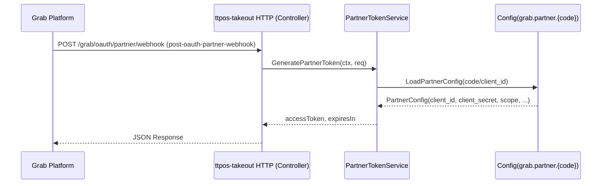

# Takeout Grab OAuth Partner Webhook 简单 Token 实现 设计文档

> 本文档定义 Grab 调用 `ttpos-takeout` 获取 Partner Token（Get partner OAuth access token webhook）的技术设计和实现方案。

## 📋 概述

本功能在 `ttpos-bmp/app/ttpos-takeout` 模块中新增一个供 Grab 调用的 **OAuth Partner Webhook 接口**：  
Grab 通过该接口获取访问 `ttpos-takeout` 其他 Partner API（如订单、菜单 Webhook）的 Partner Token。  

核心点：
- 统一在 `config.yaml` 的 `grab.partner.{code}` 段配置 Partner 凭据（`client_id`、`client_secret`、`scope`、`environment`、`timeout` 等）。
- 在 `internal/logic/grab` 中实现 `PartnerConfig` 加载与 `PartnerTokenService`，封装 Token 生成和配置解析逻辑。
- 在 `internal/controller/grab` + `api/grab/v1` 中实现 `post-oauth-partner-webhook` HTTP 接口，对接 Grab 官方文档。  

> 参考文档：[GrabFood API - Get partner OAuth access token webhook](https://developer.grab.com/docs/grabfood/api/v1-1-3/#tag/get-oauth-partner-webhook/operation/post-oauth-partner-webhook)

---

## 🎯 规范对齐

### Go BMP 规范 (go-bmp.mdc)

- 代码落点遵循 GoFrame 目录结构：`internal/controller/grab/`、`internal/logic/grab/`、`internal/model/conf/`。
- 不修改 `dao/entity/do/service` 自动生成目录。
- 使用 `g.Cfg()` 读取配置，`g.Log()` 输出日志，`gerror` 处理错误。

### API 设计规范 (api.mdc)

- 本接口为对 Grab 暴露的 **Webhook**，不走统一 `code/message/data` 包装，而是严格按 Grab 文档定义的结构返回。
- 如果需要内部管理端查询/调试 Token，则另行设计内部 API，遵循统一响应规范。

### 安全规范 (security.mdc)

- 所有 Partner 密钥仅保存在配置中，通过环境变量注入，不写入普通日志。
- 对错误响应进行脱敏处理，日志记录详细错误栈但不包含敏感字段。

---

## 🔄 代码复用分析

### 可复用的现有组件

- **Grab 配置加载**: `internal/logic/grab/config.go` 中已有 `MustConfig()` 和 `conf.Grab` 定义，可复用配置读取模式。
- **日志与上下文**: 复用 GoFrame 的 `g.Log()`、`gctx.New()` 以及现有 Grab 逻辑中使用的日志风格。

### 新增组件

- 新增 `conf.GrabPartner` / `conf.GrabPartnerMap` 结构，承载 `grab.partner.{code}` 段配置。
- 新增 `PartnerConfigLoader` 和 `PartnerTokenService`，与现有 `APIClient`/`SignatureVerifier` 并列。

---

## 🏗️ 架构设计

### 调用链路（时序）



### 模块划分（ttpos-bmp / ttpos-takeout）

- **API 定义层**：`api/grab/v1/oauth_partner_webhook.go`
  - 定义请求/响应 DTO，与 Grab 文档字段对齐。
- **Controller 层**：`internal/controller/grab/grab_v1_oauth_partner_webhook.go`
  - 负责参数解析、调用 `service.Grab()` 暴露的新方法，返回 DTO。
- **Logic 层**：`internal/logic/grab/partner_token_service.go`
  - 实现 Partner 配置解析、Token 生成与错误处理。
- **Config 模型层**：`internal/model/conf/provider_partner.go`
  - 定义 `GrabPartner` 相关配置结构，供 `g.Cfg()` Scan 使用。

---

## 🗄️ 配置设计（grab.partner.{code}）

### config.tpl.yaml / config.yaml 结构

示例：

```yaml
grab:
  partner:
    default:
      client_id: "${GRAB_PARTNER_DEFAULT_CLIENT_ID}"
      client_secret: "${GRAB_PARTNER_DEFAULT_CLIENT_SECRET}"
      scope: "food.partner_api"         # 可配置，默认 food.partner_api
      environment: "staging"            # production / staging
      timeout: "60s"
    brand_x:
      client_id: "${GRAB_PARTNER_BRAND_X_CLIENT_ID}"
      client_secret: "${GRAB_PARTNER_BRAND_X_CLIENT_SECRET}"
      # scope 未配置时，代码中默认 food.partner_api
      environment: "production"
      timeout: "60s"
```

> 注意：这里使用独立的 `grab.partner` 段，不影响现有 `app.provider.grab` 的使用场景。

### Go 配置结构

新增 `internal/model/conf/provider_partner.go`：

- `type GrabPartner struct { ClientID string; ClientSecret string; Scope string; Environment string; Timeout time.Duration }`
- `type GrabPartnerMap map[string]*GrabPartner`

逻辑层读取方式：

- `g.Cfg().MustGet(ctx, "grab.partner").Scan(&map[string]*GrabPartner)`。
- 若 `Scope` 为空，则在逻辑中默认赋值为 `"food.partner_api"`。

---

## 📊 数据模型

本需求不新增数据库表，仅使用配置和内存计算 Token。  
如未来需要持久化 Token 或审计日志，将在新的任务中单独设计。

---

## 🔌 API 设计（对 Grab 暴露）

### Webhook：Get partner OAuth access token webhook

- **URL**：`/grab/oauth/partner/webhook`（最终在 `api/grab/v1` 中配置 path，需与 Grab Portal 的配置一致）
- **Method**：`POST`
- **Content-Type**：`application/json`

#### 请求结构（对照 Grab 官方文档）

```json
{
  "client_id": "string",
  "client_secret": "string",
  "scope": "string"
}
```

> 注意：这是标准的 OAuth 2.0 Client Credentials Flow，Grab 在请求中提供 `client_id` 和 `client_secret` 进行身份验证，并指定所需的 `scope`。

#### 响应结构（示意）

```json
{
  "access_token": "string",
  "expires_in": 900,
  "token_type": "Bearer"
}
```

错误响应示意（不强行套用内部 `code/message/data` 模式，但可以附加自定义 error 字段）：

```json
{
  "error": "invalid_client",
  "errorDescription": "client_id not found"
}
```

---

## 🧩 组件和接口设计

### 1. Config Loader（Partner 配置加载）

- 文件：`internal/logic/grab/partner_config.go`

职责：
- 从 `grab.partner` 段一次性加载所有 Partner 配置，缓存在内存中（`map[string]*GrabPartner`）。
- 提供按 `client_id` 或 `code` 查询 Partner 的方法：
  - `GetPartnerByCode(ctx, code string) (*GrabPartner, error)`
  - `GetPartnerByClientID(ctx, clientID string) (*GrabPartner, error)`
- 若 `Scope` 为空时，返回时自动填充为 `"food.partner_api"`。

### 2. PartnerTokenService

- 文件：`internal/logic/grab/partner_token_service.go`

接口（内部）：

```go
type PartnerTokenService struct {
    cfgLoader *PartnerConfigLoader
    secretKey string // 可复用现有 app.provider.grab.secretKey 或单独配置
}
```

核心方法：

- `GeneratePartnerToken(ctx context.Context, clientID string, partnerCode string) (token string, expiresIn int, err error)`

实现建议（简单版）：

- Token 不必为 JWT，可采用简单的 HMAC 签名串，例如：
  - 原始串：`clientID + ":" + scope + ":" + timestamp`
  - 使用 `secretKey` 做 HMAC-SHA256，输出 hex 字符串。
- `expiresIn` 统一配置（例如 900 秒），在 `PartnerTokenService` 中常量定义。
- 未来若切换为 JWT 或其他形式，仅需修改 Service 内部实现。

### 3. Service.Grab() 新方法

在 `internal/service/grab.go` 对应接口 `IGrab` 中新增：

- `GetPartnerToken(ctx context.Context, clientID string, partnerCode string) (accessToken string, expiresIn int, err error)`

在 `internal/logic/grab/grab.go` 中由 `sGrab` 实现：

- 内部调用 `PartnerTokenService`，并根据需要初始化/缓存该 Service。

### 4. Controller + API 层

- 新增 API 定义文件：`app/ttpos-takeout/api/grab/v1/oauth_partner_webhook.go`
- 新增 Controller 文件：`app/ttpos-takeout/internal/controller/grab/grab_v1_oauth_partner_webhook.go`

Controller 流程：

1. 从 `req` 中解析 `clientId`、`partnerMerchantID`/partner code 等字段。
2. 通过 `service.Grab().GetPartnerToken(ctx, clientID, partnerCode)` 获取 Token。
3. 按 Grab 文档要求构造成功/失败响应。
4. 使用 `g.Log().Infof/Errorf` 记录调用情况与错误。

---

## 🚨 错误处理与日志

主要错误场景：

1. **配置缺失/解析失败**
   - 日志：`[grab-oauth-webhook] load config failed: ...`
   - 响应：`500` 或 Grab 约定的错误格式，`error=internal_error`。
2. **client_id 或 partner code 未匹配到配置**
   - 日志：`[grab-oauth-webhook] partner not found, client_id=xxx`
   - 响应：`400`，`error=invalid_client`。
3. **Token 生成失败**
   - 日志：`[grab-oauth-webhook] generate token failed: ...`
   - 响应：`500`，`error=internal_error`。

敏感信息处理：

- 日志中不输出 `client_secret`、内部 `secretKey` 等字段。

---

## 🔒 安全设计

- Partner 配置中的 `client_secret`、`scope` 仅由服务端使用，不回显给调用方（除了 Token 和 expiresIn）。
- 如 Grab 文档支持额外的签名机制或 IP 白名单，可在后续扩展：
  - 在 requirements 中增加新的安全需求。
  - 在 Controller 入口层做来源 IP 校验或额外 Header 校验。

---

## 🧪 测试策略

### 单元测试

重点覆盖：

- `PartnerConfigLoader`：配置加载、默认 scope 行为。
- `PartnerTokenService`：Token 生成、expiresIn 正确、异常路径。

### 集成测试

通过模拟 HTTP 请求：

- 成功获取 Token：提供有效 client_id / partner code。
- Partner 不存在：返回 `invalid_client`。
- 配置缺失或内部 panic：返回 `internal_error`。

---

## 📈 性能与扩展性

- 当前实现每次请求可直接生成 Token（HMAC 计算开销极低），不依赖外部服务，性能充足。
- 如后续需要减少 Token 生成次数，可在 `PartnerTokenService` 内部加入基于内存/Redis 的短期缓存。

---

## 📚 实现清单（高层）

- [ ] 更新 `config.tpl.yaml` / 示例 `config.yaml`，新增 `grab.partner.{code}` 结构及 scope。
- [ ] 新增 `conf.GrabPartner`/`GrabPartnerMap` 配置结构与加载逻辑。
- [ ] 新增 `PartnerConfigLoader` 与 `PartnerTokenService`。
- [ ] 在 `IGrab` 接口中新增 `GetPartnerToken`，并由 `sGrab` 实现。
- [ ] 新增 `api/grab/v1` 的 OAuth Partner Webhook 请求/响应定义。
- [ ] 新增 `internal/controller/grab` 中对应 Controller，串起 HTTP → Service → Logic。
- [ ] 编写单元测试与集成测试，确保主要分支覆盖。

> 具体任务分解与执行顺序详见同目录下的 `tasks.md`。


