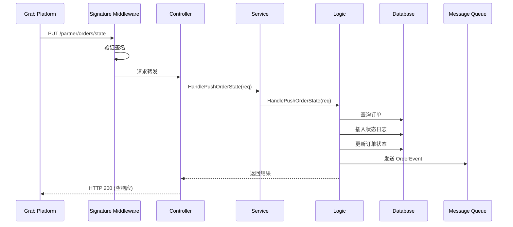

# Grab 订单状态推送 Webhook 实现 设计文档

> 本文档定义 Grab 订单状态推送 Webhook 控制器的技术设计和实现方案。

## 📋 概述

实现 `grab_v1_push_order_state.go` 控制器，接收 Grab 平台推送的订单状态变更通知（PUT /partner/orders/state）。主要包含：

1. **接口统一化**：将 `HandlePushOrderState` 方法签名从 `[]byte` 改为类型化 `*grabfood.OrderStateRequest`
2. **结构体扩展**：`OrderEvent` 增加 `ShopUUID` 字段
3. **控制器实现**：调用 Service 层处理 Webhook

---

## 🎯 规范对齐

### Go BMP 规范 (go-bmp.mdc)

- ✅ 禁止修改 `dao/entity/do/` 目录（自动生成）
- ✅ 修改 Logic 后执行 `gf gen service` 重新生成 Service 接口
- ✅ 遵循 GoFrame 项目结构：Controller → Service → Logic

### API 设计规范

- ✅ Webhook 端点：`PUT /partner/orders/state`
- ✅ 响应格式：空响应体（符合 Grab API 规范）
- ✅ 签名验证：由 `grab_signature_auth` 中间件处理

---

## 🔄 代码复用分析

### 可复用的现有组件

| 组件 | 路径 | 用途 |
|------|------|------|
| **SubmitOrder 控制器** | `internal/controller/grab/grab_v1_submit_order.go` | 参考实现模式 |
| **HandleSubmitOrder** | `internal/logic/grab_order/grab_order.go` | 参考类型化请求处理 |
| **OrderEvent** | `internal/logic/grab_order/grab_order.go` | 扩展结构体 |
| **签名中间件** | `internal/middleware/grab_signature_auth.go` | Webhook 验证 |

### 集成点

- **Order 表**：查询订单，更新状态
- **OrderStatusLog 表**：记录状态变更日志
- **MQ Topic**：`takeout_grab_order` - 发送状态更新事件

---

## 🏗️ 架构设计

### 分层设计

```
HTTP Request (Grab Webhook)
    ↓
Middleware (grab_signature_auth) - 签名验证
    ↓
Controller (grab_v1_push_order_state.go)
    ↓
Service (IGrab.HandlePushOrderState)
    ↓
Logic (sGrabOrder.HandlePushOrderState)
    ↓
DAO (Order, OrderStatusLog)
    ↓
MQ (takeout_grab_order)
```

### 数据流



---

## 📊 数据模型

### OrderEvent 结构体（扩展）

```go
// OrderEvent 订单事件
type OrderEvent struct {
    Action       string `json:"action"`       // create, status_update, cancel
    ProviderName string `json:"providerName"` // grab
    ShopUUID     string `json:"shopUuid"`     // TTPOS 店铺 UUID (新增)
    OrderUUID    string `json:"orderUuid"`    // 订单 UUID
    OrderID      string `json:"orderId"`      // 平台订单 ID
    MerchantID   string `json:"merchantId"`   // 商户 ID
    Status       string `json:"status"`       // 当前状态
    Timestamp    int64  `json:"timestamp"`    // 事件时间戳
}
```

### 使用的数据库表

| 表名 | 用途 |
|------|------|
| `order` | 查询订单、更新状态 |
| `order_status_log` | 记录状态变更日志 |

---

## 🔌 API 设计

### Webhook 端点

**请求**:

- **URL**: `PUT /partner/orders/state`
- **Headers**:
  ```
  X-Grab-Signature: {signature}
  X-Grab-Timestamp: {timestamp}
  Content-Type: application/json
  ```
- **Body**: `grabfood.OrderStateRequest`
  ```json
  {
    "orderID": "string",
    "merchantID": "string",
    "partnerMerchantID": "string",
    "state": "string",
    "message": "string",
    "driverETA": 0
  }
  ```

**响应**:

- **成功**: HTTP 200，空响应体 `{}`
- **失败**: HTTP 4xx/5xx，错误信息

---

## 🧩 组件和接口

### 1. 修改 HandlePushOrderState 方法签名

**文件**: `internal/logic/grab_order/grab_order.go`

```go
// HandlePushOrderState 处理订单状态变更 Webhook
// 签名验证已由中间件完成，此处只处理业务逻辑
// 使用 SDK grabfood.OrderStateRequest
func (s *sGrabOrder) HandlePushOrderState(ctx context.Context, req *grabfood.OrderStateRequest) error {
    // 1. 查询订单
    var order entity.Order
    err := dao.Order.Ctx(ctx).
        Where(dao.Order.Columns().ProviderName, string(consts.ProviderGrab)).
        Where(dao.Order.Columns().ProviderOrderId, req.GetOrderID()).
        Scan(&order)
    if err != nil {
        g.Log().Errorf(ctx, "订单不存在: %s", req.GetOrderID())
        return gerror.Newf("订单不存在: %s", req.GetOrderID())
    }

    // 2. 序列化用于保存原始数据
    rawData, _ := gjson.EncodeString(req)

    // 3. 记录状态变更日志
    logUUID := guid.S()
    var driverEta int
    if req.HasDriverETA() {
        driverEta = int(req.GetDriverETA())
    }

    logDo := &do.OrderStatusLog{
        Uuid:         logUUID,
        OrderUuid:    order.Uuid,
        ProviderName: string(consts.ProviderGrab),
        StatusBefore: order.OrderStatus,
        StatusAfter:  req.GetState(),
        ChangeSource: "WEBHOOK",
        DriverEta:    driverEta,
        Remark:       req.GetMessage(),
        RawData:      rawData,
    }

    _, err = dao.OrderStatusLog.Ctx(ctx).Data(logDo).Insert()
    if err != nil {
        g.Log().Errorf(ctx, "插入状态日志失败: %v", err)
        return gerror.Wrap(err, "插入状态日志失败")
    }

    // 4. 更新订单状态
    _, err = dao.Order.Ctx(ctx).
        Where(dao.Order.Columns().Uuid, order.Uuid).
        Data(g.Map{
            dao.Order.Columns().OrderStatus: req.GetState(),
            dao.Order.Columns().UpdatedAt:   gtime.Now(),
        }).Update()
    if err != nil {
        g.Log().Errorf(ctx, "更新订单状态失败: %v", err)
        return gerror.Wrap(err, "更新订单状态失败")
    }

    // 5. 发送 MQ 消息
    event := &OrderEvent{
        Action:       "status_update",
        ProviderName: string(consts.ProviderGrab),
        ShopUUID:     order.ShopUuid,
        OrderUUID:    order.Uuid,
        OrderID:      req.GetOrderID(),
        MerchantID:   req.GetMerchantID(),
        Status:       req.GetState(),
        Timestamp:    gtime.Now().Unix(),
    }
    if err := queue.PushWithContext(ctx, TopicGrabOrder, event); err != nil {
        g.Log().Warningf(ctx, "发送订单状态更新 MQ 事件失败 %s: %v", order.Uuid, err)
    }

    g.Log().Infof(ctx, "订单状态已更新: %s -> %s (订单ID: %s)", order.OrderStatus, req.GetState(), req.GetOrderID())
    return nil
}
```

### 2. 修改代理方法

**文件**: `internal/logic/grab/grab.go`

```go
// HandlePushOrderState 处理订单状态变更 Webhook
// 签名验证已由中间件完成
func (s *sGrab) HandlePushOrderState(ctx context.Context, req *grabfood.OrderStateRequest) error {
    return service.GrabOrder().HandlePushOrderState(ctx, req)
}
```

### 3. 实现控制器

**文件**: `internal/controller/grab/grab_v1_push_order_state.go`

```go
package grab

import (
    "context"

    v1 "ttpos-bmp/app/ttpos-takeout/api/grab/v1"
    "ttpos-bmp/app/ttpos-takeout/internal/service"
)

// PushOrderState 处理 Grab 订单状态变更 Webhook
// GrabFood 在订单状态变更时调用此端点推送状态通知
func (c *ControllerV1) PushOrderState(ctx context.Context, req *v1.PushOrderStateReq) (res *v1.PushOrderStateRes, err error) {
    // 调用 Service 层处理订单状态变更
    // 签名验证已由中间件完成
    err = service.Grab().HandlePushOrderState(ctx, req.OrderStateRequest)
    if err != nil {
        return nil, err
    }

    // Webhook 成功处理，返回空的响应体
    return &v1.PushOrderStateRes{}, nil
}
```

---

## 🚨 错误处理

### 错误场景

| 场景 | 处理方式 | 返回 |
|------|----------|------|
| 订单不存在 | 记录日志，返回错误 | HTTP 400 |
| 状态日志插入失败 | 记录日志，返回错误 | HTTP 500 |
| 订单状态更新失败 | 记录日志，返回错误 | HTTP 500 |
| MQ 发送失败 | 仅记录警告日志，不影响主流程 | HTTP 200 |

---

## 🧪 测试策略

### 单元测试

- 测试 `HandlePushOrderState` 正常流程
- 测试订单不存在场景
- 测试状态流转（ACCEPTED → READY → COLLECTED 等）

### 集成测试

- 模拟 Grab Webhook 请求
- 验证数据库状态更新
- 验证 MQ 消息发送

---

## 📚 实现清单

### Phase 1: 接口修改

- [ ] 修改 `OrderEvent` 结构体，增加 `ShopUUID` 字段
- [ ] 修改 `HandlePushOrderState` 方法签名
- [ ] 修改 `grab.go` 代理方法
- [ ] 执行 `gf gen service` 重新生成接口

### Phase 2: 控制器实现

- [ ] 实现 `grab_v1_push_order_state.go` 控制器
- [ ] 验证 Webhook 调用流程

### Phase 3: 测试

- [ ] 单元测试
- [ ] 集成测试

**详细任务**: 参见 `tasks.md`

---

**版本**: v1.0.0  
**创建日期**: 2025-12-19  
**作者**: AI Assistant  
**审核者**: -

