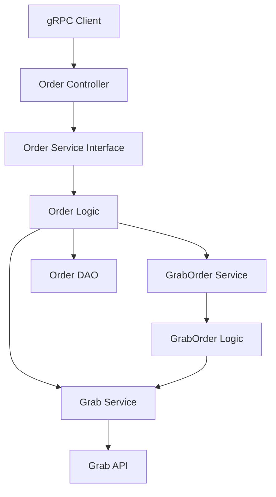

# 外卖订单取消功能 设计文档

> 本文档定义外卖订单取消功能的技术设计和实现方案。

## 📋 概述

在 `ttpos-takeout` 模块的 `order.proto` 中新增两个独立的 gRPC 方法：

1. **`CheckOrderCancelable`**: 检查外卖订单是否可取消
2. **`CancelOrder`**: 执行取消外卖订单操作（不再包含预检查逻辑）

前端调用流程：先调用 `CheckOrderCancelable` 确认订单可取消，再调用 `CancelOrder` 执行取消操作。

---

## 🎯 规范对齐

### Go BMP 规范 (go-rules.mdc)

- ✅ 禁止修改 `dao/entity/do/` 目录（自动生成）
- ✅ 遵循 GoFrame 项目结构
- ✅ Logic 层实现业务逻辑
- ✅ Controller 层负责参数验证和响应包装
- ✅ 使用 `gerror` 进行错误处理
- ✅ 日志使用中文描述

### Protobuf 规范 (proto-rules.mdc)

- ✅ 消息命名以 `Req`/`Resp` 结尾
- ✅ 字段命名使用 snake_case
- ✅ 服务方法使用大驼峰命名
- ✅ 必须添加中文注释

### ttpos-takeout 模块规范 (go-ttpos-takeout.mdc)

- ✅ Controller 层返回 `takeout.ApiResponse`
- ✅ Logic/Service 层返回具体业务数据类型，不返回 `takeout.ApiResponse`
- ✅ 复用已有逻辑，避免重复实现

---

## 🔄 代码复用分析

### 可复用的现有组件

- **`grab.CancelOrder`**: `ttpos-bmp/app/ttpos-takeout/internal/logic/grab/grab.go:362-390` - 已实现的 Grab 取消订单逻辑
- **`grab.CheckOrderCancelable`**: `ttpos-bmp/app/ttpos-takeout/internal/logic/grab/grab.go:479-508` - 已实现的订单可取消性检查逻辑
- **`order.MarkOrderReady`**: `ttpos-bmp/app/ttpos-takeout/internal/logic/order/order.go:109-150` - 参考实现模式（查询订单 → 路由到平台 → 调用平台逻辑）
- **`order.PrepareOrder`**: `ttpos-bmp/app/ttpos-takeout/internal/logic/order/order.go:63-107` - 参考实现模式（查询订单 → 路由到平台）

### 集成点

- **GrabOrder Service**: 通过 `service.GrabOrder()` 调用 Grab 订单相关逻辑
- **Grab Service**: 通过 `service.Grab()` 调用 Grab API（`CancelOrder`, `CheckOrderCancelable`）
- **Order Entity**: 通过 `dao.Order` 查询订单信息

---

## 🏗️ 架构设计

### 分层设计原则

**GoFrame 三层架构**:

```
Controller 层 (gRPC)
  ↓ 依赖
Service 层 (接口定义)
  ↓ 依赖
Logic 层 (业务逻辑实现)
  ↓ 依赖
Grab Logic (第三方集成)
```

**依赖规则**:

- ✅ Controller 依赖 Service 接口
- ✅ Logic 实现 Service 接口
- ✅ Logic 可以调用其他 Service（如 `service.Grab()`, `service.GrabOrder()`）
- ✅ Logic 可以调用 DAO 查询数据

### 架构图



### 模块划分

#### ttpos-takeout 模块

- **Protobuf 定义**: `ttpos-bmp/app/ttpos-takeout/manifest/protobuf/order/order.proto`
- **Controller 层**: `ttpos-bmp/app/ttpos-takeout/internal/controller/rpc/order/order.go`
- **Service 层**: `ttpos-bmp/app/ttpos-takeout/internal/service/order.go`（自动生成）
- **Logic 层**: `ttpos-bmp/app/ttpos-takeout/internal/logic/order/order.go`
- **Grab Logic**: `ttpos-bmp/app/ttpos-takeout/internal/logic/grab/grab.go`

---

## 📊 数据模型

### Protobuf 消息定义

```protobuf
// 检查订单是否可取消请求
message CheckOrderCancelableReq {
  string takeout_order_uuid = 1; // 外卖订单UUID
  string request_id = 2;         // 请求追踪ID (可选)
}

// 检查订单是否可取消响应
message CheckOrderCancelableResp {
  string order_uuid = 1;             // 订单UUID
  bool can_cancel = 2;               // 是否可以取消（true=可取消, false=不可取消）
  string non_cancellation_reason = 3; // 不可取消原因（当 can_cancel=false 时返回）
}

// 取消订单请求
message CancelOrderReq {
  string takeout_order_uuid = 1; // 外卖订单UUID
  int32 cancel_code = 2;         // 取消原因码（Grab API 规范）
  string request_id = 3;         // 请求追踪ID (可选)
}

// 取消订单响应
message CancelOrderResp {
  string order_uuid = 1; // 订单UUID
}
```

### Order Entity

使用现有的 `entity.Order` 结构，包含：
- `Uuid`: 订单 UUID
- `ShopUuid`: 店铺 UUID
- `ProviderName`: 平台名称（"grab"）
- `OrderStatus`: 订单状态
- `RawData`: 原始 JSON 数据（包含 Grab orderID 和 merchantID）

---

## 🔌 API 设计

### gRPC API

#### API: CheckOrderCancelable

**Protobuf 定义**:

```protobuf
// 订单服务
service OrderService {
  // ... 现有方法 ...

  // 检查订单是否可取消
  rpc CheckOrderCancelable(CheckOrderCancelableReq) returns (takeout.ApiResponse);
}
```

**请求参数**:

| 字段 | 类型 | 必填 | 说明 |
|------|------|------|------|
| takeout_order_uuid | string | 是 | 外卖订单 UUID |
| request_id | string | 否 | 请求追踪 ID |

**响应格式**:

**可取消响应**:
```json
{
  "code": "SUCCESS",
  "message": "订单可取消",
  "data": {
    "@type": "type.googleapis.com/order.CheckOrderCancelableResp",
    "order_uuid": "123456",
    "can_cancel": true
  }
}
```

**不可取消响应**:
```json
{
  "code": "SUCCESS",
  "message": "订单不可取消",
  "data": {
    "@type": "type.googleapis.com/order.CheckOrderCancelableResp",
    "order_uuid": "123456",
    "can_cancel": false,
    "non_cancellation_reason": "Order is already delivered",
    "merchant_id": "M-001",
    "order_id": "G-123456",
    "raw_response": "{\"canCancel\":false,\"nonCancellationReason\":\"Order is already delivered\",\"merchantId\":\"M-001\",\"orderId\":\"G-123456\"}"
  }
}
```

---

#### API: CancelOrder

**Protobuf 定义**:

```protobuf
// 订单服务
service OrderService {
  // ... 现有方法 ...

  // 取消订单
  rpc CancelOrder(CancelOrderReq) returns (takeout.ApiResponse);
}
```

**请求参数**:

| 字段 | 类型 | 必填 | 说明 |
|------|------|------|------|
| takeout_order_uuid | string | 是 | 外卖订单 UUID |
| cancel_code | int32 | 是 | 取消原因码（Grab API 规范） |
| request_id | string | 否 | 请求追踪 ID |

**响应格式**:

```json
{
  "code": "SUCCESS",
  "message": "订单已成功取消",
  "data": {
    "@type": "type.googleapis.com/order.CancelOrderResp",
    "order_uuid": "123456"
  }
}
```

**生成代码**:

```bash
cd ttpos-bmp/app/ttpos-takeout
gf gen pb
```

---

## 🧩 组件和接口

### Service 层

#### Service 接口（自动生成）

```go
// ttpos-bmp/app/ttpos-takeout/internal/service/order.go
type IOrder interface {
    // ... 现有方法 ...

    // CheckOrderCancelable 检查订单是否可取消
    CheckOrderCancelable(ctx context.Context, req *api.CheckOrderCancelableReq) (res *api.CheckOrderCancelableResp, err error)

    // CancelOrder 取消订单
    CancelOrder(ctx context.Context, req *api.CancelOrderReq) (res *api.CancelOrderResp, err error)
}
```

**生成命令**:

```bash
cd ttpos-bmp/app/ttpos-takeout
gf gen service
```

### Logic 层

#### CheckOrderCancelable 实现

```go
// ttpos-bmp/app/ttpos-takeout/internal/logic/order/order.go
func (s *sOrder) CheckOrderCancelable(ctx context.Context, req *api.CheckOrderCancelableReq) (res *api.CheckOrderCancelableResp, err error) {
    // 1. 参数验证
    if req.TakeoutOrderUuid == "" {
        return nil, gerror.New("订单UUID不能为空")
    }

    // 2. 查询订单信息
    var orderEntity *entity.Order
    err = dao.Order.Ctx(ctx).
        Where(dao.Order.Columns().Uuid, req.TakeoutOrderUuid).
        Scan(&orderEntity)
    if err != nil {
        return nil, gerror.Wrap(err, "查询订单失败")
    }
    if orderEntity == nil {
        return nil, gerror.New("订单不存在")
    }

    // 3. 根据 provider_name 路由到不同平台
    switch orderEntity.ProviderName {
    case "grab":
        // 调用 Grab 检查订单可取消性逻辑
        return service.GrabOrder().CheckOrderCancelable(ctx, orderEntity)
    default:
        return nil, gerror.Newf("不支持的平台: %s", orderEntity.ProviderName)
    }
}
```

#### CancelOrder 实现

```go
// ttpos-bmp/app/ttpos-takeout/internal/logic/order/order.go
func (s *sOrder) CancelOrder(ctx context.Context, req *api.CancelOrderReq) (res *api.CancelOrderResp, err error) {
    // 1. 参数验证
    if req.TakeoutOrderUuid == "" {
        return nil, gerror.New("订单UUID不能为空")
    }

    // 2. 查询订单信息
    var orderEntity *entity.Order
    err = dao.Order.Ctx(ctx).
        Where(dao.Order.Columns().Uuid, req.TakeoutOrderUuid).
        Scan(&orderEntity)
    if err != nil {
        return nil, gerror.Wrap(err, "查询订单失败")
    }
    if orderEntity == nil {
        return nil, gerror.New("订单不存在")
    }

    // 3. 根据 provider_name 路由到不同平台
    switch orderEntity.ProviderName {
    case "grab":
        // 调用 Grab 取消订单逻辑（不再包含预检查）
        return service.GrabOrder().CancelOrder(ctx, orderEntity, req.CancelCode)
    default:
        return nil, gerror.Newf("不支持的平台: %s", orderEntity.ProviderName)
    }
}
```

### GrabOrder Service

#### CheckOrderCancelable 实现（新增）

```go
// ttpos-bmp/app/ttpos-takeout/internal/logic/grab_order/grab_order.go
func (s *sGrabOrder) CheckOrderCancelable(ctx context.Context, orderEntity *entity.Order) (*api.CheckOrderCancelableResp, error) {
    // 1. 参数验证
    if orderEntity == nil {
        return nil, gerror.New("订单实体不能为空")
    }
    if orderEntity.ProviderName != ProviderNameGrab {
        return nil, gerror.Newf("订单渠道错误，期望 grab，实际 %s", orderEntity.ProviderName)
    }

    // 2. 从 RawData 解析 Grab orderID 和 merchantID
    orderID, merchantID, err := s.parseOrderData(orderEntity.RawData)
    if err != nil {
        return nil, gerror.Wrap(err, "解析订单数据失败")
    }

    // 3. 调用 Grab API 检查订单是否可取消
    canCancel, nonCancelReason, err := service.Grab().CheckOrderCancelable(ctx, merchantID, orderID)
    if err != nil {
        g.Log().Errorf(ctx, "检查订单可取消性失败: order_id=%s, merchant_id=%s, error=%v",
            orderID, merchantID, err)
        return nil, gerror.Wrap(err, "检查订单可取消性失败")
    }

    // 4. 序列化原始响应数据（包含SDK返回的所有字段）
    rawResponse := gjson.Map{
        "canCancel":             canCancel,
        "nonCancellationReason": nonCancelReason,
        "merchantId":            merchantID,
        "orderId":               orderID,
    }
    rawResponseJSON, _ := gjson.EncodeString(rawResponse)

    // 5. 返回完整响应（包含SDK返回的所有字段）
    g.Log().Infof(ctx, "订单可取消性检查完成: order_uuid=%s, can_cancel=%v, reason=%s",
        orderEntity.Uuid, canCancel, nonCancelReason)
    return &api.CheckOrderCancelableResp{
        OrderUuid:             orderEntity.Uuid,
        CanCancel:             canCancel,
        NonCancellationReason: nonCancelReason,
        MerchantId:            merchantID,
        OrderId:               orderID,
        RawResponse:           rawResponseJSON,
    }, nil
}
```

#### CancelOrder 实现（修改）

```go
// ttpos-bmp/app/ttpos-takeout/internal/logic/grab_order/cancel_order.go
func (s *sGrabOrder) CancelOrder(ctx context.Context, orderEntity *entity.Order, cancelCode int32) (*api.CancelOrderResp, error) {
    // 1. 参数验证
    if orderEntity == nil {
        return nil, gerror.New("订单实体不能为空")
    }
    if orderEntity.ProviderName != ProviderNameGrab {
        return nil, gerror.Newf("订单渠道错误，期望 grab，实际 %s", orderEntity.ProviderName)
    }

    // 2. 从 RawData 解析 Grab orderID 和 merchantID
    orderID, merchantID, err := s.parseOrderData(orderEntity.RawData)
    if err != nil {
        return nil, gerror.Wrap(err, "解析订单数据失败")
    }

    // 3. 执行取消操作（不再包含预检查逻辑）
    err = service.Grab().CancelOrder(ctx, orderID, int(cancelCode))
    if err != nil {
        g.Log().Errorf(ctx, "取消订单失败: order_id=%s, cancel_code=%d, error=%v",
            orderID, cancelCode, err)
        return nil, gerror.Wrap(err, "取消订单失败")
    }

    // 4. 返回成功响应
    g.Log().Infof(ctx, "订单取消成功: order_uuid=%s, order_id=%s", orderEntity.Uuid, orderID)
    return &api.CancelOrderResp{
        OrderUuid: orderEntity.Uuid,
    }, nil
}
```

### Controller 层

#### CheckOrderCancelable 实现

```go
// ttpos-bmp/app/ttpos-takeout/internal/controller/rpc/order/order.go
func (c *Controller) CheckOrderCancelable(ctx context.Context, req *api.CheckOrderCancelableReq) (*takeout.ApiResponse, error) {
    // 1. 参数验证
    if req.TakeoutOrderUuid == "" {
        return &takeout.ApiResponse{
            Code:    string(consts.CodeInvalidParam),
            Message: "订单UUID不能为空",
        }, nil
    }

    // 2. 记录请求日志
    g.Log().Infof(ctx, "接收到 CheckOrderCancelable 请求: order_uuid=%s, request_id=%s",
        req.TakeoutOrderUuid, req.RequestId)

    // 3. 调用 Service 层
    res, err := service.Order().CheckOrderCancelable(ctx, req)
    if err != nil {
        g.Log().Errorf(ctx, "CheckOrderCancelable 失败: %v", err)
        return &takeout.ApiResponse{
            Code:    string(consts.CodeServiceError),
            Message: err.Error(),
        }, nil
    }

    // 4. 构建响应
    dataAny, err := anypb.New(res)
    if err != nil {
        g.Log().Errorf(ctx, "序列化响应失败: %v", err)
        return &takeout.ApiResponse{
            Code:    string(consts.CodeSerializeError),
            Message: consts.MsgSerializeFailed,
        }, nil
    }

    // 5. 返回成功响应（无论是否可取消，都返回成功状态码，前端根据can_cancel字段判断）
    message := "订单可取消"
    if !res.CanCancel {
        message = "订单不可取消"
    }

    g.Log().Infof(ctx, "CheckOrderCancelable 成功: order_uuid=%s, can_cancel=%v", res.OrderUuid, res.CanCancel)
    return &takeout.ApiResponse{
        Code:    string(consts.CodeSuccess),
        Message: message,
        Data:    dataAny,
    }, nil
}
```

#### CancelOrder 实现

```go
// ttpos-bmp/app/ttpos-takeout/internal/controller/rpc/order/order.go
func (c *Controller) CancelOrder(ctx context.Context, req *api.CancelOrderReq) (*takeout.ApiResponse, error) {
    // 1. 参数验证
    if req.TakeoutOrderUuid == "" {
        return &takeout.ApiResponse{
            Code:    string(consts.CodeInvalidParam),
            Message: "订单UUID不能为空",
        }, nil
    }

    // 2. 记录请求日志
    g.Log().Infof(ctx, "接收到 CancelOrder 请求: order_uuid=%s, cancel_code=%d, request_id=%s",
        req.TakeoutOrderUuid, req.CancelCode, req.RequestId)

    // 3. 调用 Service 层
    res, err := service.Order().CancelOrder(ctx, req)
    if err != nil {
        g.Log().Errorf(ctx, "CancelOrder 失败: %v", err)
        return &takeout.ApiResponse{
            Code:    string(consts.CodeServiceError),
            Message: err.Error(),
        }, nil
    }

    // 4. 构建响应
    dataAny, err := anypb.New(res)
    if err != nil {
        g.Log().Errorf(ctx, "序列化响应失败: %v", err)
        return &takeout.ApiResponse{
            Code:    string(consts.CodeSerializeError),
            Message: consts.MsgSerializeFailed,
        }, nil
    }

    // 5. 返回成功响应
    g.Log().Infof(ctx, "CancelOrder 成功: order_uuid=%s", res.OrderUuid)
    return &takeout.ApiResponse{
        Code:    string(consts.CodeSuccess),
        Message: "订单已成功取消",
        Data:    dataAny,
    }, nil
}
```

---

## 🚨 错误处理

### 错误场景

#### 场景 1: 订单不存在

- **处理方式**: 返回 `CodeServiceError`，错误信息 "订单不存在"
- **用户影响**: 前端显示错误提示
- **代码示例**:
  ```go
  if orderEntity == nil {
      return nil, gerror.New("订单不存在")
  }
  ```

#### 场景 2: Grab API 调用失败（检查可取消性）

- **处理方式**: 使用 `gerror.Wrap` 包装错误，记录详细日志
- **用户影响**: 前端显示错误提示
- **代码示例**:
  ```go
  if err != nil {
      g.Log().Errorf(ctx, "Grab API 调用失败: %v", err)
      return nil, gerror.Wrap(err, "检查订单可取消性失败")
  }
  ```

#### 场景 3: Grab API 调用失败（取消订单）

- **处理方式**: 使用 `gerror.Wrap` 包装错误，记录详细日志
- **用户影响**: 前端显示错误提示
- **代码示例**:
  ```go
  if err != nil {
      g.Log().Errorf(ctx, "Grab API 调用失败: %v", err)
      return nil, gerror.Wrap(err, "取消订单失败")
  }
  ```

---

## 🔒 安全设计

### 参数验证

- **订单 UUID 验证**: 非空验证
- **取消原因码验证**: 使用 Grab SDK 的 `CancelCode` 枚举
- **订单存在性验证**: 查询订单是否存在

### 权限控制

- **gRPC 认证**: 通过 gRPC 中间件进行认证
- **订单归属验证**: 验证订单属于指定店铺（通过 `ShopUuid`）

---

## 🧪 测试策略

### 单元测试

**目标覆盖率**:

- `logic/order`: 70%+
- `logic/grab_order`: 70%+

**测试内容**:

- 正常取消流程（预检查通过 → 取消成功）
- 订单不可取消场景（预检查失败 → 返回原因）
- 订单不存在场景
- Grab API 调用失败场景

### 集成测试

**测试流程**:

- 在 Grab Staging 环境创建测试订单
- 场景1：订单可取消 → 调用 `CancelOrder` → 验证取消成功
- 场景2：订单不可取消（如已配送） → 调用 `CancelOrder` → 验证返回 `nonCancellationReason`

---

## 📈 性能优化

### 优化策略

1. **预检查优化**:
   - 预检查 API 调用时间 < 500ms
   - 取消订单 API 调用时间 < 500ms
   - 总响应时间 < 1s

2. **错误处理优化**:
   - 快速失败：订单不存在时立即返回
   - 避免不必要的 API 调用

---

## 📚 实现清单

### Phase 1: Protobuf 定义

- [ ] 修改 `order.proto`，新增 `CheckOrderCancelableReq` 和 `CheckOrderCancelableResp`
- [ ] 修改 `order.proto`，新增 `CancelOrderReq` 和 `CancelOrderResp`
- [ ] 在 `OrderService` 中添加 `CheckOrderCancelable` RPC 方法
- [ ] 在 `OrderService` 中添加 `CancelOrder` RPC 方法
- [ ] 执行 `gf gen pb` 生成 Go 代码

### Phase 2: Logic 层实现

- [ ] 在 `logic/order/order.go` 中实现 `CheckOrderCancelable` 方法
- [ ] 在 `logic/order/order.go` 中实现 `CancelOrder` 方法
- [ ] 在 `logic/grab_order/` 中实现 `CheckOrderCancelable` 方法（新增文件）
- [ ] 在 `logic/grab_order/` 中实现 `CancelOrder` 方法（修改现有文件，移除预检查逻辑）
- [ ] 实现订单数据解析逻辑（从 RawData 提取 orderID 和 merchantID）

### Phase 3: Controller 层实现

- [ ] 在 `controller/rpc/order/order.go` 中实现 `CheckOrderCancelable` 方法
- [ ] 在 `controller/rpc/order/order.go` 中实现 `CancelOrder` 方法
- [ ] 执行 `gf gen service` 重新生成 service 接口

### Phase 4: 测试

- [ ] 编写单元测试
- [ ] 编写集成测试
- [ ] 在 Grab Staging 环境测试

**详细任务**: 参见 `tasks.md`

---

## Graphiti & 活动日志

- Related Episode: `[待补充]`
- 模板：`docs/agent/templates/graphiti-episode.md`
- 活动日志：`docs/team/activities/{YYYY-MM}/{YYYY-MM-DD}.md`
- 在技术方案评审、关键架构决策或踩坑总结后，立即补充 Episode 并在设计文档尾部互链。

---

**版本**: v1.0.0  
**创建日期**: 2025-12-24  
**作者**: rikugun  
**审核者**: -

