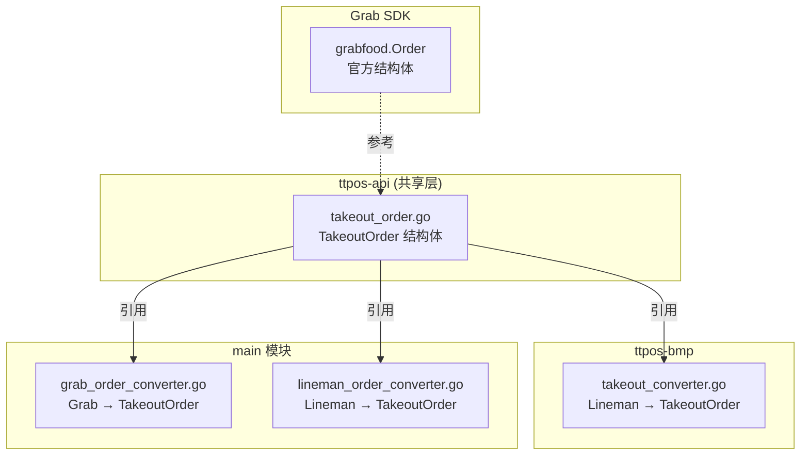

# task-takeout-order-model-refactor 技术设计

## 📋 概述

| 项目       | 内容                              |
| ---------- | --------------------------------- |
| Spec ID    | task-takeout-order-model-refactor |
| 设计人     | rikugun                           |
| 设计日期   | 2026-01-23                        |
| 总 SP      | 3                                 |

## 🔄 代码复用分析

### 可复用代码

| 文件                                                    | 说明                   | 复用方式 |
| ------------------------------------------------------- | ---------------------- | -------- |
| `github.com/grab/grabfood-api-sdk-go@v1.0.2/model_*.go` | Grab SDK 结构体定义    | 参考     |
| `ttpos-bmp/app/ttpos-takeout/utility/takeout_converter.go` | BMP 订单转换器      | 重构     |

### 需要修改

| 文件                                               | 说明                     |
| -------------------------------------------------- | ------------------------ |
| `ttpos-api/ttpos-takeout/message/takeout_order.go` | 共享 TakeoutOrder 结构体 |
| `ttpos-bmp/app/ttpos-takeout/utility/takeout_converter.go` | BMP 转换器适配     |
| `ttpos-bmp/app/ttpos-takeout/utility/takeout_converter_test.go` | 转换器单元测试  |

---

## 🏗️ 架构设计

### 架构图



### 重构策略

1. **TakeoutOrder 完全对齐 Grab SDK Order**
   - 字段名、类型、必选/可选与 Grab SDK 一致
   - 保持 `Takeout` 前缀以区分

2. **Nullable 类型处理**
   - 完全复制 Grab SDK 的 Nullable 类型定义
   - 包括 `NullableDineIn`、`NullableReceiver`、`NullableOutOfStockInstruction`

3. **AdditionalProperties 扩展**
   - 使用 `map[string]interface{}` 支持平台特有字段
   - Lineman 无法映射的字段存入此 map

---

## 🧩 结构体对照表

### TakeoutOrder vs Grab SDK Order

| 字段               | Grab SDK 类型              | 当前类型              | 重构后类型                |
| ------------------ | -------------------------- | --------------------- | ------------------------- |
| OrderID            | `string`                   | `string`              | `string` ✅               |
| ShortOrderNumber   | `string`                   | `string`              | `string` ✅               |
| MerchantID         | `string`                   | `string`              | `string` ✅               |
| PartnerMerchantID  | `*string`                  | `string`              | `*string`                 |
| PaymentType        | `string`                   | `string`              | `string` ✅               |
| **Cutlery**        | `bool`                     | `*bool`               | `bool`                    |
| OrderTime          | `string`                   | `string`              | `string` ✅               |
| **SubmitTime**     | `*time.Time`               | `*string`             | `*time.Time`              |
| **CompleteTime**   | `*time.Time`               | `*string`             | `*time.Time`              |
| ScheduledTime      | `*string`                  | `*string`             | `*string` ✅              |
| OrderState         | `*string`                  | `*string`             | `*string` ✅              |
| **Currency**       | `Currency` (必需)          | `*TakeoutCurrency`    | `TakeoutCurrency`         |
| **FeatureFlags**   | `OrderFeatureFlags` (必需) | `*TakeoutFeatureFlags`| `TakeoutFeatureFlags`     |
| Items              | `[]OrderItem`              | `[]TakeoutOrderItem`  | `[]TakeoutOrderItem` ✅   |
| Campaigns          | `[]OrderCampaign`          | `[]TakeoutCampaign`   | `[]TakeoutCampaign` ✅    |
| Promos             | `[]OrderPromo`             | `[]TakeoutPromo`      | `[]TakeoutPromo` ✅       |
| Price              | `OrderPrice` (必需)        | `TakeoutOrderPrice`   | `TakeoutOrderPrice` ✅    |
| **DineIn**         | `NullableDineIn`           | `*TakeoutDineIn`      | `NullableTakeoutDineIn`   |
| **Receiver**       | `NullableReceiver`         | `*TakeoutReceiver`    | `NullableTakeoutReceiver` |
| OrderReadyEstimation | `*OrderReadyEstimation`  | `*TakeoutOrderReadyEstimation` | `*TakeoutOrderReadyEstimation` ✅ |
| MembershipID       | `*string`                  | `*string`             | `*string` ✅              |
| **AdditionalProperties** | `map[string]interface{}` | 无               | `map[string]interface{}`  |

### TakeoutOrderItem vs Grab SDK OrderItem

| 字段                   | Grab SDK 类型                   | 当前类型             | 重构后类型                      |
| ---------------------- | ------------------------------- | -------------------- | ------------------------------- |
| Id                     | `string`                        | `string`             | `string` ✅                     |
| GrabItemID             | `string`                        | `*string`            | `string`                        |
| **Quantity**           | `int32`                         | `int`                | `int32`                         |
| **Price**              | `int64`                         | `float64`            | `int64`                         |
| **Tax**                | `*int64`                        | `*float64`           | `*int64`                        |
| Specifications         | `*string`                       | `*string`            | `*string` ✅                    |
| OutOfStockInstruction  | `NullableOutOfStockInstruction` | `*TakeoutOutOfStockInstruction` | `NullableTakeoutOutOfStockInstruction` |
| Modifiers              | `[]OrderItemModifier`           | `[]TakeoutModifier`  | `[]TakeoutModifier` ✅          |
| **AdditionalProperties** | `map[string]interface{}`      | 无                   | `map[string]interface{}`        |

### TakeoutOrderPrice vs Grab SDK OrderPrice

| 字段              | Grab SDK 类型 | 当前类型   | 重构后类型 |
| ----------------- | ------------- | ---------- | ---------- |
| **Subtotal**      | `int64`       | `float64`  | `int64`    |
| **Tax**           | `*int64`      | `*float64` | `*int64`   |
| **MerchantChargeFee** | `*int64`  | `*float64` | `*int64`   |
| **GrabFundPromo** | `*int64`      | `*float64` | `*int64`   |
| **MerchantFundPromo** | `*int64`  | `*float64` | `*int64`   |
| **BasketPromo**   | `*int64`      | 无         | `*int64` (新增) |
| **DeliveryFee**   | `*int64`      | `*float64` | `*int64`   |
| **SmallOrderFee** | `*int64`      | 无         | `*int64` (新增) |
| **EaterPayment**  | `*int64`      | `*float64` | `*int64`   |
| Total             | 无            | `*float64` | 删除 (Grab SDK 无此字段) |
| **AdditionalProperties** | `map[string]interface{}` | 无 | `map[string]interface{}` |

---

## 📊 Nullable 类型设计

参考 Grab SDK 实现 Nullable 包装类型：

```go
// NullableTakeoutDineIn 可空堂食信息
type NullableTakeoutDineIn struct {
    value *TakeoutDineIn
    isSet bool
}

func (v NullableTakeoutDineIn) Get() *TakeoutDineIn { return v.value }
func (v *NullableTakeoutDineIn) Set(val *TakeoutDineIn) { v.value = val; v.isSet = true }
func (v NullableTakeoutDineIn) IsSet() bool { return v.isSet }
func (v *NullableTakeoutDineIn) Unset() { v.value = nil; v.isSet = false }
```

需要创建的 Nullable 类型：
- `NullableTakeoutDineIn`
- `NullableTakeoutReceiver`
- `NullableTakeoutOutOfStockInstruction`

---

## ⚠️ 风险识别

| 风险                 | 影响 | 缓解措施                                     |
| -------------------- | ---- | -------------------------------------------- |
| BMP 转换器适配遗漏   | 高   | 编写完整单元测试覆盖 Grab/Lineman 转换场景   |
| 类型变更导致编译错误 | 中   | 逐个文件修改，确保编译通过后再继续           |
| int64 精度问题       | 低   | 价格单位统一为最小货币单位（分），无精度损失 |

---

## 🧪 测试策略

### 测试范围

1. **结构体 JSON 序列化/反序列化**
   - Grab 订单 JSON → TakeoutOrder
   - Lineman 订单 JSON → TakeoutOrder

2. **BMP 转换器测试**
   - `takeout_converter_test.go` 覆盖率 ≥ 80%

### 测试命令

```bash
# BMP 转换器测试
cd ttpos-bmp && go test -v ./app/ttpos-takeout/utility/...

# 覆盖率报告
cd ttpos-bmp && go test -coverprofile=coverage.out ./app/ttpos-takeout/utility/...
cd ttpos-bmp && go tool cover -html=coverage.out
```

---

**版本**: v1.0.0
**创建日期**: 2026-01-23
