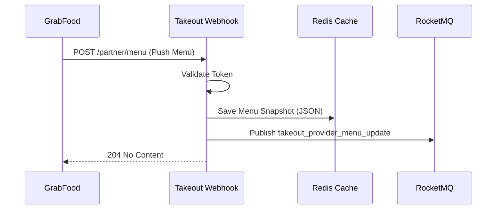

# Push Grab Menu Webhook 技术设计文档

> 对应需求: [task-takeout-push-grab-menu-webhook](requirements.md)

## 1. 总体架构

本功能主要涉及 `ttpos-takeout` 服务，作为 Grab Partner 接收 GrabFood 推送的菜单数据。



---

## 2. 详细设计

### 2.1 API 接口设计

复用已定义的 API 结构 `ttpos-bmp/app/ttpos-takeout/api/grab/v1/push_grab_menu_webhook.go`。

- **Path**: `/grab/v1/pushGrabMenu` (需确认路由注册)
- **Method**: `POST`
- **Request Body**: `PushGrabMenuWebhookReq` (基于 SDK 类型)
- **Response**: `PushGrabMenuWebhookRes` (Empty, HTTP 204)

### 2.2 存储设计 (Redis)

采用 Redis 暂存菜单快照，解耦接收与处理逻辑。

- **Key Pattern**: `ttpos:takeout:grab:menu_push:{partner_merchant_id}`
- **Value**: JSON String (Request Body)
- **TTL**: 3600 秒 (1小时)

### 2.3 消息通知设计 (RocketMQ)

- **Topic**: `provider_menu_update`
- **Message Payload**:

```go
type ProviderMenuUpdateEvent struct {
    ProviderName      string `json:"provider_name"`       // "grab"
    MerchantID        string `json:"merchant_id"`         // Grab MerchantID
    PartnerMerchantID string `json:"partner_merchant_id"` // POS ShopID
    StorageKey        string `json:"storage_key"`         // Redis Key
    ReceivedAt        int64  `json:"received_at"`         // Timestamp
}
```

### 2.4 业务逻辑层 (Logic)

在 `internal/logic/grab` 下新增 `menu_service.go` (或扩展现有文件)，实现以下方法：

1. `SaveMenuSnapshot(ctx, req *PushGrabMenuWebhookReq) (string, error)`
   - 将 `req` 序列化为 JSON
   - 存入 Redis
   - 返回 Storage Key

2. `NotifyMenuUpdate(ctx, event *ProviderMenuUpdateEvent) error`
   - 发送 MQ 消息

---

## 3. 模块交互

1. **Controller**: `internal/controller/grab/grab_v1_push_grab_menu_webhook.go`
   - 解析请求
   - 调用 `service.Grab().SaveMenuSnapshot`
   - 调用 `service.Grab().NotifyMenuUpdate`
   - 返回响应

2. **Service**: `internal/service/grab.go`
   - 定义接口方法

3. **Logic**: `internal/logic/grab`
   - 实现具体逻辑

---

## 4. 安全与错误处理

- **鉴权**: 依赖现有的 Partner OAuth 中间件或逻辑验证 `Authorization` 头。
- **错误处理**:
  - Redis 写入失败: 记录 Error 日志，返回 500 (Grab 会重试)。
  - MQ 发送失败: 记录 Error 日志，但如果 Redis 写入成功，可考虑返回 204 并通过日志告警（或者严格一点返回 500）。建议返回 500 让 Grab 重试。

---

## 5. 测试计划

1. **单元测试**:
   - `logic/grab/menu_service_test.go`: 测试 Redis 读写和 MQ 消息构造。
2. **集成测试**:
   - `controller/grab/grab_v1_push_grab_menu_webhook_test.go`: 模拟 HTTP 请求，验证完整流程。
