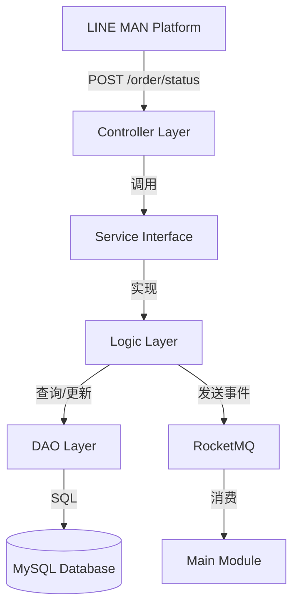

# Lineman 订单状态更新 Webhook 设计文档

> 本文档定义 LINE MAN 订单状态更新 Webhook 的技术设计和实现方案。

## 📋 概述

实现 LINE MAN 订单状态更新 Webhook 接口，接收 LINE MAN 平台发送的订单完成（`FINISH`）或取消（`CANCELED`）通知，将状态映射为 TTPOS 内部状态（`FINISH` → `COMPLETED`），更新到 TTPOS 数据库，并通过 RocketMQ 消息队列通知下游系统（Main 模块）处理订单状态变更。

该功能是 LINE MAN 订单生命周期管理的最后一环，完善订单从创建（PlaceOrder）→ 内容更新（OrderUpdate）→ 状态更新（OrderStatusUpdate）的完整流程。

---

## 🎯 规范对齐

### Go BMP 规范 (go-bmp.mdc)

本设计完全遵循 GoFrame 微服务架构规范：

- **禁止修改自动生成的目录**：`dao/`, `entity/`, `do/` 目录禁止修改
- **分层架构**：Controller → Service → Logic → DAO
- **Service 接口定义**：在 `service/` 目录定义接口，在 `logic/` 目录实现
- **gRPC 集成**：本功能为 HTTP Webhook，不涉及 gRPC
- **遵循 GoFrame 项目结构**：严格按照 GoFrame 推荐的目录结构组织代码
- **参考规范**：`ttpos-bmp/.cursor/rules/go-rules.mdc`

### API 设计规范 (api.mdc)

- **端点设计**：`POST /v1/partners/{partnerId}/stores/{storeId}/order/status`
- **响应格式**：符合 LINE MAN API 规范
  ```json
  {
    "status": "ok/fail",
    "code": "200/404/500",
    "message": "..."
  }
  ```
- **参数验证**：使用 GoFrame 的 `v` 标签自动验证
- **错误处理**：返回标准错误码和描述

### 数据库规范 (database.mdc)

- **无需修改表结构**：复用现有 `takeout_order` 表的 `order_status` 字段
- **时间字段**：`updated_at` 使用 int 类型存储 Unix 时间戳
- **软删除**：查询时过滤 `deleted_at IS NULL`（使用 GoFrame 的 `WhereNull`）
- **索引使用**：使用 `provider_order_id` + `provider_name` 组合查询

---

## 🔄 代码复用分析

### 可复用的现有组件

1. **API 定义（已完成）**
   - 文件：`ttpos-bmp/app/ttpos-takeout/api/lineman/v1/order.go`
   - 结构体：`OrderStatusUpdateReq` / `OrderStatusUpdateRes`
   - 状态：✅ 已定义，无需修改

2. **Controller 骨架（已存在）**
   - 文件：`ttpos-bmp/app/ttpos-takeout/internal/controller/lineman/lineman_v1_order_status_update.go`
   - 状态：⏳ 只有方法签名，需要实现逻辑

3. **Service 接口（已部分定义）**
   - 文件：`ttpos-bmp/app/ttpos-takeout/internal/service/lineman.go`
   - 接口：`ILinemanOrder`（已有 `HandlePlaceOrder`、`HandleOrderUpdate`）
   - 状态：⏳ 需要添加 `HandleOrderStatusUpdate` 方法

4. **Logic 实现参考**
   - 文件：`ttpos-bmp/app/ttpos-takeout/internal/logic/lineman/lineman_order.go`
   - 方法：`HandlePlaceOrder()` - 可参考订单查询、RocketMQ 发送逻辑
   - 方法：`HandleOrderUpdate()` - 可参考订单更新逻辑
   - 状态：✅ 可直接复用查询和 MQ 发送代码

5. **DAO 层（自动生成，复用）**
   - 文件：`ttpos-bmp/app/ttpos-takeout/internal/dao/order.go`
   - 方法：`dao.Order.Ctx(ctx).Where(...).One()` / `Update()`
   - 状态：✅ 直接使用，无需修改

6. **OrderEvent 结构体（复用）**
   - 文件：`ttpos-bmp/app/ttpos-takeout/internal/model/dto/grab/event.go`
   - 结构体：`grab.OrderEvent`
   - 状态：✅ 直接复用，设置不同的 `action` 和 `status`

7. **RocketMQ 发送逻辑（复用）**
   - 包：`ttpos-bmp/internal/pkg/queue`
   - 方法：`queue.PushWithContext(ctx, topic, event)`
   - Topic：`takeout_grab_order`（复用现有 Topic）
   - 状态：✅ 直接使用

### 集成点

1. **HTTP Webhook 接收**
   - 端点：`POST /v1/partners/{partnerId}/stores/{storeId}/order/status`
   - 中间件：复用 Lineman 认证中间件（已实现）
   - 路由注册：在 `router/router.go` 中注册（或由 GoFrame 自动扫描）

2. **数据库更新**
   - 表：`takeout_order`
   - 字段：`status`（订单状态）、`updated_at`（更新时间）
   - 条件：`provider_name = "lineman"` AND `provider_order_id = {orderId}`

3. **RocketMQ 消息**
   - Topic：`takeout_grab_order`（复用 Grab Topic）
   - Consumer：Main 模块的订单状态监听器
   - Action：`status_update`
   - Status：映射后的 TTPOS 状态（`COMPLETED` / `CANCELED`）

---

## 🏗️ 架构设计

### 分层设计原则

**Go BMP 四层架构**（GoFrame 推荐）：

```
Controller 层
  ↓ 调用
Service 接口层
  ↓ 实现
Logic 层（业务逻辑）
  ↓ 调用
DAO 层（数据访问）
```

**依赖规则**：

- ✅ Controller 只依赖 Service 接口
- ✅ Logic 层实现 Service 接口
- ✅ Logic 层依赖 DAO 层
- ❌ 禁止跨层调用
- ❌ 禁止修改 DAO/Entity/DO（自动生成）

### 架构图



### 数据流

```
1. LINE MAN → TTPOS BMP (Webhook)
   - 请求：{"orderId": "LMF-260113-12345", "orderStatus": "FINISH"}

2. Controller 层
   - 接收请求，调用 service.LinemanOrder().HandleOrderStatusUpdate()

3. Logic 层
   - 状态映射：FINISH → COMPLETED
   - 查询订单：dao.Order.Where("provider_order_id = ?").One()
   - 幂等性检查：currentStatus == targetStatus ? skip : update
   - 更新订单：dao.Order.Update({status: "COMPLETED", updated_at: now})

4. MQ 发送
   - 构造 OrderEvent：{action: "status_update", status: "COMPLETED", ...}
   - 发送到 RocketMQ：queue.PushWithContext(ctx, "takeout_grab_order", event)

5. Controller 响应
   - 成功：{"status": "ok", "code": "200"}
   - 失败：{"status": "fail", "code": "404/500", "message": "..."}
```

### 模块划分

#### Go BMP 模块（ttpos-takeout）

- **HTTP Controller**: `internal/controller/lineman/lineman_v1_order_status_update.go`
  - 接收 Webhook 请求
  - 调用 Service 层
  - 封装响应格式

- **Service 接口**: `internal/service/lineman.go`
  - 定义 `ILinemanOrder` 接口
  - 添加 `HandleOrderStatusUpdate(ctx, req) error` 方法

- **Logic 层**: `internal/logic/lineman/lineman_order.go`
  - 实现状态映射函数
  - 实现订单状态更新逻辑
  - 实现 RocketMQ 事件发送

- **DAO 层**: `internal/dao/order.go`（自动生成，❌ 禁止修改）
  - 使用 `dao.Order` 查询和更新订单

- **API 定义**: `api/lineman/v1/order.go`
  - 定义 `OrderStatusUpdateReq`（✅ 已完成）
  - 定义 `OrderStatusUpdateRes`（✅ 已完成）

- **常量定义**: `internal/consts/consts.go`
  - 添加 `OrderActionStatusUpdate` 常量
  - 添加 LINE MAN 状态映射常量

---

## 🗄️ 数据库设计

### 数据表设计

**无需新增表或字段**，复用现有的 `takeout_order` 表。

#### 表：takeout_order（现有表）

**涉及字段**：

| 字段 | 类型 | 说明 | 本次变更 |
|------|------|------|----------|
| uuid | string | 订单 UUID | 🔍 查询条件 |
| provider_name | string | 供应商名称（"lineman"） | 🔍 查询条件 |
| provider_order_id | string | LINE MAN 订单 ID | 🔍 查询条件 |
| status | string | 订单状态 | ✏️ 更新目标 |
| updated_at | int | 更新时间（Unix 时间戳） | ✏️ 更新目标 |

**查询条件**：
```sql
SELECT * FROM takeout_order
WHERE provider_name = 'lineman'
  AND provider_order_id = 'LMF-260113-12345'
  AND deleted_at IS NULL
LIMIT 1;
```

**更新操作**：
```sql
UPDATE takeout_order
SET status = 'COMPLETED',
    updated_at = 1736751234
WHERE uuid = '{order_uuid}';
```

**索引使用**：
- 使用现有的 `provider_order_id` 索引
- 使用现有的 `provider_name` 索引（如有）

**迁移文件**：**无需创建**（无表结构变更）

---

## 📊 数据模型

### DTO 定义

#### Request DTO（✅ 已完成）

```go
// api/lineman/v1/order.go
type OrderStatusUpdateReq struct {
    g.Meta      `path:"/partners/:partnerId/stores/:storeId/order/status" method:"post" tags:"LINE MAN Order" summary:"接收订单状态更新通知"`
    PartnerId   string `json:"partnerId" v:"required#合作伙伴ID不能为空" dc:"合作伙伴唯一 ID（路径参数）"`
    StoreId     string `json:"storeId" v:"required#门店ID不能为空" dc:"门店唯一 ID（路径参数）"`
    OrderId     string `json:"orderId" v:"required|length:1,20#订单ID不能为空|订单ID长度为1-20个字符" dc:"订单唯一 ID，格式：LMF-yyMMdd-{generated number}"`
    OrderStatus string `json:"orderStatus" v:"required|in:FINISH,CANCELED#订单状态不能为空|订单状态必须为FINISH或CANCELED" dc:"订单状态（FINISH=完成, CANCELED=取消）"`
}
```

#### Response DTO（✅ 已完成）

```go
// api/lineman/v1/order.go
type OrderStatusUpdateRes struct {
    LinemanCommonResData
}

type LinemanCommonResData struct {
    Status  string `json:"status" v:"required|in:ok,fail" dc:"响应状态（ok=成功, fail=失败）"`
    Code    string `json:"code" dc:"响应代码（200=成功, 404=订单不存在, 500=服务器错误）"`
    Message string `json:"message" dc:"响应消息"`
}
```

### OrderEvent 结构体（复用）

```go
// internal/model/dto/grab/event.go
type OrderEvent struct {
    Action       string `json:"action"`         // "status_update"
    ProviderName string `json:"provider_name"`  // "lineman"
    ShopUUID     string `json:"shop_uuid"`      // 门店 UUID
    OrderUUID    string `json:"order_uuid"`     // 订单 UUID
    OrderID      string `json:"order_id"`       // LINE MAN 订单 ID
    Status       string `json:"status"`         // TTPOS 状态（COMPLETED/CANCELED）
    Timestamp    int64  `json:"timestamp"`      // 事件时间戳
}
```

---

## 🔌 API 设计

### RESTful API

#### API: 订单状态更新 Webhook

**请求**:

- **URL**: `POST /v1/partners/{partnerId}/stores/{storeId}/order/status`
- **Headers**:
  ```json
  {
    "Authorization": "Bearer {access_token}",
    "Content-Type": "application/json"
  }
  ```
- **Body**:
  ```json
  {
    "orderId": "LMF-260113-338798091",
    "orderStatus": "FINISH"
  }
  ```

**响应（成功）**:

```json
{
  "status": "ok",
  "code": "200",
  "message": "Order status updated successfully"
}
```

**响应（订单不存在）**:

```json
{
  "status": "fail",
  "code": "404",
  "message": "订单不存在"
}
```

**响应（服务器错误）**:

```json
{
  "status": "fail",
  "code": "500",
  "message": "更新订单状态失败: {error details}"
}
```

**HTTP 状态码**:

| 状态码 | 说明 |
|--------|------|
| 200 | 请求成功（业务状态由 `status` 字段判断） |
| 400 | 请求参数错误 |
| 401 | 未授权（Token 无效） |

**参考文档**: [LINE MAN API 规范](https://docs.google.com/spreadsheets/d/1CKRl7tRLtp6dCAcXQqWhPvS_0M378-vdKpucR6ZtNbg/edit?gid=102046225#gid=102046225)

---

## 🧩 组件和接口

### Service 层

#### Service 接口（需添加）

```go
// internal/service/lineman.go
type ILinemanOrder interface {
    HandlePlaceOrder(ctx context.Context, req *v1.PlaceOrderReq) error
    HandleOrderUpdate(ctx context.Context, req *v1.OrderUpdateReq) error
    HandleOrderStatusUpdate(ctx context.Context, req *v1.OrderStatusUpdateReq) error // ⏳ 新增
}
```

### Logic 层

#### Logic 实现

```go
// internal/logic/lineman/lineman_order.go

// LINE MAN 状态常量
const (
    LinemanStatusFinish   = "FINISH"
    LinemanStatusCanceled = "CANCELED"
)

// HandleOrderStatusUpdate 处理 LINE MAN 订单状态更新 Webhook
func (s *sLinemanOrder) HandleOrderStatusUpdate(ctx context.Context, req *v1.OrderStatusUpdateReq) error {
    // 1. 状态映射
    ttposStatus := mapLinemanStatusToTTPOS(req.OrderStatus)
    
    // 2. 查询现有订单
    existingOrder, err := dao.Order.Ctx(ctx).
        Where(dao.Order.Columns().ProviderName, consts.ProviderLineman).
        Where(dao.Order.Columns().ProviderOrderId, req.OrderId).
        WhereNull(dao.Order.Columns().DeletedAt). // 软删除过滤
        One()
    if err != nil || existingOrder.IsEmpty() {
        return gerror.New("订单不存在")
    }
    
    // 3. 幂等性检查
    currentStatus := existingOrder[dao.Order.Columns().OrderStatus].String()
    if currentStatus == ttposStatus {
        g.Log().Infof(ctx, "订单状态未变化，跳过: orderId=%s, status=%s", req.OrderId, ttposStatus)
        return nil
    }
    
    // 4. 更新订单状态
    orderUUID := existingOrder[dao.Order.Columns().Uuid].String()
    _, err = dao.Order.Ctx(ctx).Where("uuid", orderUUID).Update(&do.Order{
        OrderStatus: ttposStatus, // 注意字段名是 OrderStatus 不是 Status
        UpdatedAt:   gtime.Now().Unix(),
    })
    if err != nil {
        return gerror.Wrap(err, "更新订单状态失败")
    }
    
    // 5. 发送 RocketMQ 事件
    event := &grab.OrderEvent{
        Action:       "status_update",
        ProviderName: consts.ProviderLineman,
        ShopUUID:     existingOrder[dao.Order.Columns().ShopUuid].String(),
        OrderUUID:    orderUUID,
        OrderID:      req.OrderId,
        Status:       ttposStatus,
        Timestamp:    gtime.Now().Unix(),
    }
    if err := queue.PushWithContext(ctx, TopicLinemanOrder, event); err != nil {
        // RocketMQ 发送失败只记录日志，不影响主流程（订单状态已更新）
        g.Log().Warningf(ctx, "发送订单状态更新 MQ 事件失败 %s: %v", orderUUID, err)
    }
    
    g.Log().Infof(ctx, "成功更新 LINE MAN 订单状态: %s (UUID: %s) -> %s", 
        req.OrderId, orderUUID, ttposStatus)
    return nil
}

// mapLinemanStatusToTTPOS 将 LINE MAN 状态映射为 TTPOS 内部状态
func mapLinemanStatusToTTPOS(linemanStatus string) string {
    switch linemanStatus {
    case LinemanStatusFinish:
        return string(consts.OrderStatusCompleted) // "COMPLETED"
    case LinemanStatusCanceled:
        return string(consts.OrderStatusCanceled)  // "CANCELED"
    default:
        g.Log().Warningf(context.Background(), "未知的 LINE MAN 状态: %s", linemanStatus)
        return linemanStatus // 未知状态保持原样
    }
}
```

### Controller 层

```go
// internal/controller/lineman/lineman_v1_order_status_update.go
func (c *ControllerV1) OrderStatusUpdate(ctx context.Context, req *v1.OrderStatusUpdateReq) (res *v1.OrderStatusUpdateRes, err error) {
    // 调用 Logic 层处理订单状态更新
    err = service.LinemanOrder().HandleOrderStatusUpdate(ctx, req)
    if err != nil {
        // 返回失败响应
        return &v1.OrderStatusUpdateRes{
            LinemanCommonResData: v1.LinemanCommonResData{
                Status:  "fail",
                Code:    "500",
                Message: err.Error(),
            },
        }, nil // 返回 nil error，让 GoFrame 返回 HTTP 200
    }

    // 返回成功响应
    return &v1.OrderStatusUpdateRes{
        LinemanCommonResData: v1.LinemanCommonResData{
            Status:  "ok",
            Code:    "200",
            Message: "Order status updated successfully",
        },
    }, nil
}
```

---

## 🚨 错误处理

### 错误场景

#### 场景 1: 订单不存在

- **触发条件**: LINE MAN 发送的 `orderId` 在 TTPOS 中不存在
- **处理方式**: 返回 `404` 错误码和 `"订单不存在"` 消息
- **用户影响**: LINE MAN 收到 404 响应，可能重试或标记为失败
- **代码示例**:
  ```go
  if err != nil || existingOrder.IsEmpty() {
      return gerror.New("订单不存在")
  }
  ```

#### 场景 2: 数据库更新失败

- **触发条件**: 数据库连接失败、事务冲突等
- **处理方式**: 返回 `500` 错误码和错误详情
- **用户影响**: LINE MAN 收到 500 响应，会重试
- **代码示例**:
  ```go
  if err != nil {
      return gerror.Wrap(err, "更新订单状态失败")
  }
  ```

#### 场景 3: RocketMQ 发送失败

- **触发条件**: RocketMQ 连接失败、Topic 不存在等
- **处理方式**: 只记录警告日志，不影响主流程（订单状态已更新）
- **用户影响**: 订单状态在 BMP 已更新，但 Main 模块可能延迟收到通知
- **代码示例**:
  ```go
  if err := queue.PushWithContext(ctx, TopicLinemanOrder, event); err != nil {
      g.Log().Warningf(ctx, "发送订单状态更新 MQ 事件失败 %s: %v", orderUUID, err)
  }
  ```

#### 场景 4: 幂等性处理（状态未变化）

- **触发条件**: 收到重复的状态通知（状态与数据库中的状态相同）
- **处理方式**: 跳过更新，直接返回成功
- **用户影响**: 无影响，避免不必要的数据库写入
- **代码示例**:
  ```go
  if currentStatus == ttposStatus {
      g.Log().Infof(ctx, "订单状态未变化，跳过: orderId=%s, status=%s", req.OrderId, ttposStatus)
      return nil
  }
  ```

---

## 🔒 安全设计

### 身份验证

- **JWT Token**: 复用 Lineman 认证中间件（已实现）
- **Token 验证**: 每个请求都需要有效的 Bearer Token

### 数据验证

- **参数验证**: GoFrame 自动验证（`v` 标签）
  - `orderId`: 必填，长度 1-20 字符
  - `orderStatus`: 必填，只能是 `FINISH` 或 `CANCELED`
- **状态映射验证**: 未知状态记录警告日志

### 日志记录

- **Info 级别**: 成功处理订单状态更新
- **Warning 级别**: RocketMQ 发送失败、幂等性跳过、未知状态
- **Error 级别**: 数据库更新失败、订单不存在

---

## 🧪 测试策略

### 单元测试

**目标覆盖率**: Logic 层 ≥ 70%

**测试内容**:

1. **状态映射测试**
   ```go
   func TestMapLinemanStatusToTTPOS(t *testing.T) {
       assert.Equal(t, consts.OrderStatusCompleted, mapLinemanStatusToTTPOS("FINISH"))
       assert.Equal(t, consts.OrderStatusCanceled, mapLinemanStatusToTTPOS("CANCELED"))
       assert.Equal(t, "UNKNOWN", mapLinemanStatusToTTPOS("UNKNOWN"))
   }
   ```

2. **订单状态更新测试**
   ```go
   func TestHandleOrderStatusUpdate_Success(t *testing.T) {
       // 测试正常更新流程
   }

   func TestHandleOrderStatusUpdate_OrderNotFound(t *testing.T) {
       // 测试订单不存在场景
   }

   func TestHandleOrderStatusUpdate_Idempotent(t *testing.T) {
       // 测试幂等性：相同状态应跳过
   }
   ```

### 集成测试

**测试流程**:

1. 准备测试数据（创建初始订单，状态为 `ACCEPTED`）
2. 模拟 LINE MAN Webhook 请求（状态为 `FINISH`）
3. 验证数据库订单状态已更新为 `COMPLETED`
4. 验证 RocketMQ 事件已发送
5. 验证 Main 模块接收到消息

**测试工具**:

- Postman / curl：模拟 LINE MAN Webhook 请求
- MySQL 客户端：验证数据库变化
- RocketMQ 控制台：验证消息已发送

### 手动测试

**测试用例**:

| 用例 ID | 测试场景 | 输入 | 预期输出 |
|---------|----------|------|----------|
| TC-1 | 订单完成 | `{"orderId": "LMF-260113-12345", "orderStatus": "FINISH"}` | 状态更新为 `COMPLETED`，返回 200 |
| TC-2 | 订单取消 | `{"orderId": "LMF-260113-12345", "orderStatus": "CANCELED"}` | 状态更新为 `CANCELED`，返回 200 |
| TC-3 | 订单不存在 | `{"orderId": "INVALID", "orderStatus": "FINISH"}` | 返回 404 错误 |
| TC-4 | 重复请求 | 相同的 `orderId` 和 `orderStatus` | 幂等性跳过，返回 200 |

---

## 📈 性能优化

### 优化策略

1. **数据库优化**:
   - 使用现有索引（`provider_order_id`）
   - 查询条件明确（`provider_name` + `provider_order_id`）
   - 单表更新，无联表查询

2. **幂等性优化**:
   - 在内存中比较状态（避免额外数据库查询）
   - 状态未变化时直接返回（不执行 UPDATE）

3. **RocketMQ 优化**:
   - 异步发送（不阻塞主流程）
   - 发送失败只记录日志（不影响响应时间）

4. **接口优化**:
   - 无复杂业务逻辑
   - 单次数据库查询 + 单次更新
   - 响应时间预期 < 100ms

### 性能指标

- 本地响应时间: < 200ms（符合需求）
- 数据库查询: < 50ms
- RocketMQ 发送: < 100ms（异步，不影响主流程）

---

## 📚 实现清单

### Phase 1: 常量和接口定义

- [ ] 1.1 添加常量定义（`OrderActionStatusUpdate` 等）
- [ ] 1.2 添加 Service 接口方法（`HandleOrderStatusUpdate`）

### Phase 2: Logic 层实现

- [ ] 2.1 实现状态映射函数（`mapLinemanStatusToTTPOS`）
- [ ] 2.2 实现订单查询逻辑
- [ ] 2.3 实现幂等性检查
- [ ] 2.4 实现订单状态更新
- [ ] 2.5 实现 RocketMQ 事件发送
- [ ] 2.6 实现完整的 `HandleOrderStatusUpdate` 方法

### Phase 3: Controller 层实现

- [ ] 3.1 实现 `OrderStatusUpdate()` 方法
- [ ] 3.2 调用 Service 层
- [ ] 3.3 封装响应格式

### Phase 4: 测试

- [ ] 4.1 单元测试（Logic 层）
- [ ] 4.2 集成测试（完整流程）
- [ ] 4.3 手动测试（Postman）

**详细任务**: 参见 `tasks.md`

---

## Graphiti & 活动日志

- Related Episode: `[待补充]`
- 模板：`docs/agent/templates/graphiti-episode.md`
- 活动日志：`docs/team/activities/rikugun/2026-01/2026-01-13.md`
- 在技术方案评审、关键架构决策或踩坑总结后，立即补充 Episode 并在设计文档尾部互链。

---

**版本**: v1.0.0  
**创建日期**: 2026-01-13  
**作者**: rikugun  
**审核者**: 待指定
