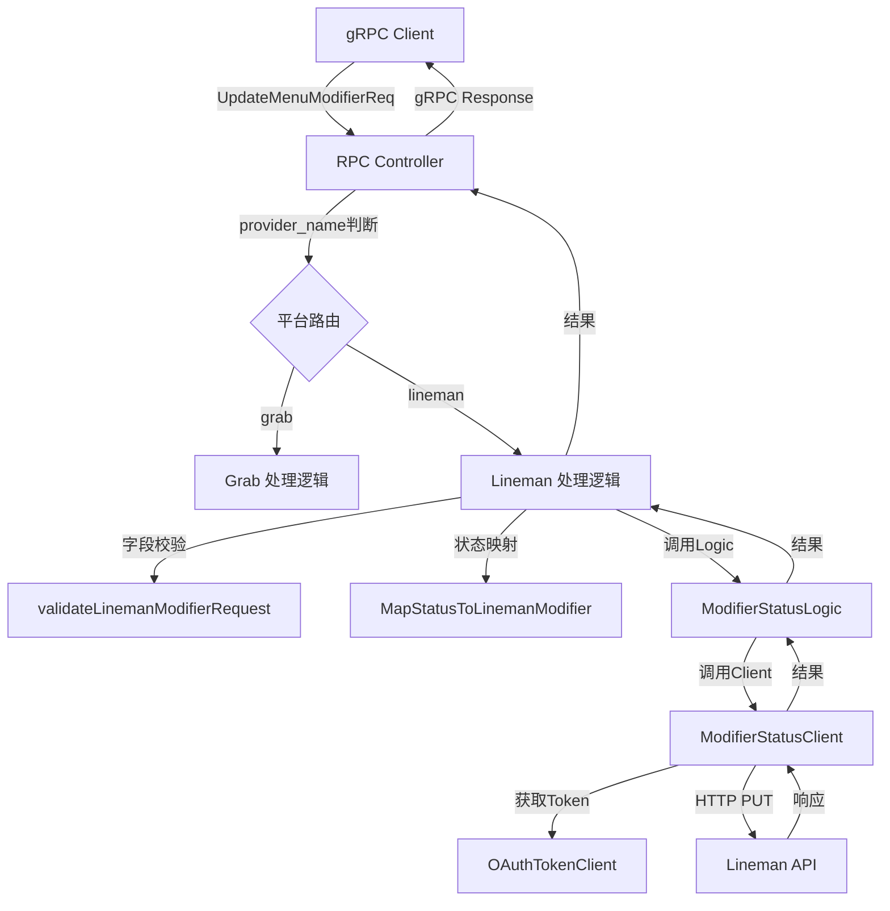

# Menu Modifier Provider 多平台支持与 Lineman 状态同步 - 设计文档

> 本文档定义 Menu Modifier Provider 多平台支持的技术设计和实现方案。

## 📋 概述

在 `UpdateMenuModifierReq` 中增加 `provider_name` 字段，实现多平台支持。当 `provider_name=lineman` 时，系统将：
1. 校验字段白名单（仅允许 `available_status`）
2. 将 TTPOS 状态（string）转换为 Lineman 状态（int）
3. 调用 Lineman 专用的修饰符状态更新 API

**核心挑战**：TTPOS 使用 `string` 类型状态，Lineman API 使用 `int` 类型状态，需要建立严格的映射关系。

---

## 🎯 规范对齐

### Go BMP 规范 (go-bmp.mdc)

**遵循 GoFrame 2.x 项目结构**：
- ✅ **禁止修改 dao/entity/do/ 目录**（自动生成）
- ✅ **DTO 手动编写**：在 `internal/model/dto/lineman/` 中创建
- ✅ **客户端集成**：在 `internal/client/lineman/` 中实现
- ✅ **业务逻辑**：在 `internal/logic/lineman/` 中实现
- ✅ **gRPC Controller**：在 `internal/controller/rpc/menu/` 中实现

### Protobuf 规范 (proto-rules.mdc)

**字段编号规则**：
- ✅ 新增字段使用下一个可用编号（`provider_name` 使用字段编号 9）
- ✅ 字段类型：`optional string`
- ✅ 字段注释：说明默认值和可选值

### API 设计规范 (api.mdc)

**Lineman API 集成**：
- ✅ 使用 GoFrame 的 `ghttp.Client`
- ✅ 实现重试机制（复用 `WithRetry`）
- ✅ 记录请求/响应日志
- ✅ 使用 Bearer Token 认证

---

## 🔄 代码复用分析

### 可复用的现有组件

1. **Lineman 认证客户端**
   - 路径: `internal/client/lineman/token_client.go`
   - 复用: `OAuthTokenClient.GetAuthorizationHeader(ctx)` 获取 Bearer Token

2. **Lineman 配置加载**
   - 路径: `internal/client/lineman/config.go`
   - 复用: `MustConfig(ctx)` 获取 `partnerId`, `endpoint`

3. **重试机制**
   - 路径: `internal/client/lineman/retry.go`
   - 复用: `WithRetry(ctx, func)` 实现自动重试（3次，指数退避）

4. **菜单状态映射逻辑（参考）**
   - 路径: `internal/logic/lineman/menu_status.go`
   - 参考: `MapStatusToLineman(ttposStatus string)` 的实现模式
   - 区别: 菜单商品状态映射为 `string → string`，修饰符状态映射为 `string → int`

5. **菜单状态更新客户端（参考）**
   - 路径: `internal/client/lineman/menu_status_client.go`
   - 参考: `MenuStatusClient` 的实现模式（API 调用、错误处理、重试逻辑）

### 集成点

1. **Protobuf 协议**
   - 文件: `manifest/protobuf/menu/menu.proto`
   - 集成: 在 `UpdateMenuModifierReq` 中新增 `provider_name` 字段

2. **RPC Controller**
   - 文件: `internal/controller/rpc/menu/menu.go`
   - 集成: 在 `UpdateMenuModifier` 方法中根据 `provider_name` 路由到不同处理逻辑

3. **Lineman Client 目录**
   - 目录: `internal/client/lineman/`
   - 集成: 新增 `modifier_status_client.go` 实现修饰符状态更新

4. **Lineman Logic 目录**
   - 目录: `internal/logic/lineman/`
   - 集成: 新增 `modifier_status.go` 实现修饰符状态业务逻辑

---

## 🏗️ 架构设计

### 分层设计原则

**GoFrame 分层架构**:

```
gRPC Controller (internal/controller/rpc/menu/)
  ↓ 调用
Business Logic (internal/logic/lineman/)
  ↓ 调用
API Client (internal/client/lineman/)
  ↓ 调用
External API (Lineman REST API)
```

**依赖规则**:

- ✅ Controller 依赖 Logic
- ✅ Logic 依赖 Client
- ✅ Client 依赖认证客户端（`OAuthTokenClient`）
- ❌ 禁止 Client 直接依赖 DAO/Entity
- ❌ 禁止修改 dao/entity/do/ 目录

### 架构图



### 模块划分

#### 1. Protobuf 协议

- **文件**: `manifest/protobuf/menu/menu.proto`
- **修改**: 在 `UpdateMenuModifierReq` 中新增 `provider_name` 字段（字段编号 9）

#### 2. DTO 层

- **目录**: `internal/model/dto/lineman/`
- **新增文件**: `modifier_status.go`
- **定义**: `ModifierStatusUpdateReq`, `ModifierPropertyValue`, `ModifierStatusUpdateResp`

#### 3. Client 层

- **目录**: `internal/client/lineman/`
- **新增文件**: `modifier_status_client.go`
- **实现**: `ModifierStatusClient` 调用 Lineman API

#### 4. Logic 层

- **目录**: `internal/logic/lineman/`
- **新增文件**: `modifier_status.go`
- **实现**: `ModifierStatusLogic` 业务逻辑、`MapStatusToLinemanModifier` 状态映射函数

#### 5. Controller 层

- **文件**: `internal/controller/rpc/menu/menu.go`
- **修改**: 在 `UpdateMenuModifier` 方法中增加平台路由逻辑和字段校验

---

## 📊 数据模型

### DTO 定义

#### Lineman 修饰符状态更新 DTO

```go
// internal/model/dto/lineman/modifier_status.go

package lineman

// ModifierStatusUpdateReq Lineman 修饰符状态更新请求
// API: PUT /v1/partners/{partnerId}/stores/{storeId}/menu/property/values/status
type ModifierStatusUpdateReq struct {
	PropertyValues []ModifierPropertyValue `json:"propertyValues"`
}

// ModifierPropertyValue 修饰符属性值
type ModifierPropertyValue struct {
	ID     string `json:"id"`     // Partner Modifier ID
	Status int    `json:"status"` // 1=AVAILABLE, 2=SOLD_OUT_TODAY, 3=SUSPENDED
}

// ModifierStatusUpdateResp Lineman 修饰符状态更新响应
type ModifierStatusUpdateResp struct {
	Status  string `json:"status"`  // ok, fail
	Code    string `json:"code"`    // SUCCESS, ERROR_*
	Message string `json:"message"` // 响应消息
}
```

---

## 🔌 API 设计

### Lineman REST API

#### API: 更新修饰符状态

**Endpoint**: `PUT /v1/partners/{partnerId}/stores/{storeId}/menu/property/values/status`

**Headers**:
```
Authorization: Bearer {access_token}
Content-Type: application/json
```

**Request Body**:
```json
{
  "propertyValues": [
    {
      "id": "partner-modifier-id",
      "status": 3
    }
  ]
}
```

**Response Body**:
```json
{
  "status": "ok",
  "code": "SUCCESS",
  "message": "Property values status updated"
}
```

**错误响应**:
```json
{
  "status": "fail",
  "code": "ERROR_INVALID_STATUS",
  "message": "Invalid status value"
}
```

**参考文档**: [Google Sheets - Update Menu Property Values Status API](https://docs.google.com/spreadsheets/d/1CKRl7tRLtp6dCAcXQqWhPvS_0M378-vdKpucR6ZtNbg/edit?gid=1934684079#gid=1934684079)

---

### gRPC API

#### Protobuf 修改

```protobuf
// manifest/protobuf/menu/menu.proto

// 更新菜单修饰符请求
message UpdateMenuModifierReq {
  string merchant_id = 1;                         // Grab MerchantID (必填)
  string modifier_id = 2;                         // 修饰符ID (partner modifier id, 必填)
  string modifier_name = 3;                       // 修饰符名称 (用于定位记录, 必填)
  optional int64 price = 4;                       // 价格 (minor unit，单位：分)
  optional string available_status = 5;           // 可用状态: AVAILABLE, UNAVAILABLE, SOLD_OUT_TODAY
  optional bool is_free = 6;                      // 是否免费
  repeated AdvancedPricing advanced_pricings = 7; // 高级定价配置
  string request_id = 8;                          // 请求 ID (可选，用于追踪)
  optional string provider_name = 9;              // 平台名称: grab (默认), lineman
}
```

**生成代码**:

```bash
cd ttpos-bmp/app/ttpos-takeout
make dao
```

---

## 🧩 组件和接口

### 状态映射函数

```go
// internal/logic/lineman/modifier_status.go

// MapStatusToLinemanModifier 将 TTPOS 状态（string）映射为 Lineman 状态（int）
//
// 映射规则:
//   - "AVAILABLE" → 1 (AVAILABLE)
//   - "UNAVAILABLE" → 3 (SUSPENDED)
//   - "SOLD_OUT_TODAY" → 2 (SOLD_OUT_TODAY)
//   - 其他值 → 返回错误
//
// 参数:
//   - ttposStatus: TTPOS 状态（string）
//
// 返回:
//   - int: Lineman 状态（1, 2, 3）
//   - error: 错误信息（不支持的状态）
func MapStatusToLinemanModifier(ttposStatus string) (int, error) {
	switch ttposStatus {
	case "AVAILABLE":
		return 1, nil // AVAILABLE
	case "UNAVAILABLE":
		return 3, nil // SUSPENDED
	case "SOLD_OUT_TODAY":
		return 2, nil // SOLD_OUT_TODAY
	case "":
		return 0, gerror.New("available_status 不能为空")
	default:
		return 0, gerror.Newf("不支持的状态: %s", ttposStatus)
	}
}
```

### Client 层

#### ModifierStatusClient 接口

```go
// internal/client/lineman/modifier_status_client.go

// IModifierStatusClient 修饰符状态客户端接口（用于测试 Mock）
type IModifierStatusClient interface {
	UpdateModifierStatusWithRetry(
		ctx context.Context,
		storeId string,
		req *lineman_dto.ModifierStatusUpdateReq,
	) (*lineman_dto.ModifierStatusUpdateResp, error)
}
```

#### ModifierStatusClient 实现

```go
// ModifierStatusClient Lineman 修饰符状态更新客户端
type ModifierStatusClient struct {
	endpoint string        // API Endpoint
	timeout  time.Duration // 请求超时时间
}

// NewModifierStatusClient 创建修饰符状态客户端
func NewModifierStatusClient() *ModifierStatusClient {
	cfg := MustConfig(context.Background())
	return &ModifierStatusClient{
		endpoint: cfg.Endpoint,
		timeout:  30 * time.Second,
	}
}

// UpdateModifierStatus 更新修饰符状态
func (c *ModifierStatusClient) UpdateModifierStatus(
	ctx context.Context,
	storeId string,
	req *lineman_dto.ModifierStatusUpdateReq,
) (*lineman_dto.ModifierStatusUpdateResp, error) {
	// 1. 从配置获取 partnerId
	cfg := MustConfig(ctx)
	partnerId := cfg.PartnerId
	if partnerId == "" {
		return nil, gerror.New("[ModifierStatusClient] 配置中未设置 partnerId")
	}

	// 2. 获取 Authorization Header
	authHeader, err := c.getAuthorizationHeader(ctx)
	if err != nil {
		return nil, gerror.Wrap(err, "[ModifierStatusClient] 获取 Authorization Header 失败")
	}

	// 3. 构造 URL
	url := fmt.Sprintf("%s/v1/partners/%s/stores/%s/menu/property/values/status",
		c.endpoint, partnerId, storeId)
	g.Log().Infof(ctx, "[ModifierStatusClient] 更新修饰符状态: partnerId=%s, storeId=%s, count=%d",
		partnerId, storeId, len(req.PropertyValues))

	// 4. 发送请求
	client := g.Client().SetTimeout(c.timeout)
	resp, err := client.
		SetHeader("Authorization", authHeader).
		SetHeader("Content-Type", "application/json").
		ContentJson().
		Put(ctx, url, req)

	if err != nil {
		return nil, gerror.Wrapf(err, "[ModifierStatusClient] 请求失败")
	}
	defer resp.Close()

	respBytes := resp.ReadAll()
	g.Log().Debugf(ctx, "[ModifierStatusClient] 响应: status=%d, body=%s",
		resp.StatusCode, string(respBytes))

	// 5. 检查 HTTP 状态码
	if resp.StatusCode != 200 {
		return nil, gerror.Newf("[ModifierStatusClient] API 返回错误: status=%d, body=%s",
			resp.StatusCode, string(respBytes))
	}

	// 6. 解析响应
	var statusResp lineman_dto.ModifierStatusUpdateResp
	if err := gjson.Unmarshal(respBytes, &statusResp); err != nil {
		return nil, gerror.Wrapf(err, "[ModifierStatusClient] 响应解析失败")
	}

	// 7. 检查业务状态
	if statusResp.Status != "ok" {
		return nil, gerror.Newf("[ModifierStatusClient] 更新失败: code=%s, msg=%s",
			statusResp.Code, statusResp.Message)
	}

	g.Log().Infof(ctx, "[ModifierStatusClient] 更新成功")
	return &statusResp, nil
}

// UpdateModifierStatusWithRetry 带重试机制的修饰符状态更新
func (c *ModifierStatusClient) UpdateModifierStatusWithRetry(
	ctx context.Context,
	storeId string,
	req *lineman_dto.ModifierStatusUpdateReq,
) (*lineman_dto.ModifierStatusUpdateResp, error) {
	var lastResp *lineman_dto.ModifierStatusUpdateResp
	var lastErr error

	err := WithRetry(ctx, func() error {
		resp, err := c.UpdateModifierStatus(ctx, storeId, req)
		if err != nil {
			lastErr = err
			return err
		}
		lastResp = resp
		return nil
	})

	if err != nil {
		return nil, lastErr
	}

	return lastResp, nil
}

// getAuthorizationHeader 获取 Authorization Header
func (c *ModifierStatusClient) getAuthorizationHeader(ctx context.Context) (string, error) {
	client := NewOAuthTokenClient()
	return client.GetAuthorizationHeader(ctx)
}
```

### Logic 层

#### ModifierStatusLogic 实现

```go
// internal/logic/lineman/modifier_status.go

// ModifierStatusLogic Lineman 修饰符状态业务逻辑
type ModifierStatusLogic struct {
	client lineman_client.IModifierStatusClient
}

// NewModifierStatusLogic 创建 Lineman 修饰符状态业务逻辑实例
func NewModifierStatusLogic(client lineman_client.IModifierStatusClient) *ModifierStatusLogic {
	return &ModifierStatusLogic{
		client: client,
	}
}

// NewModifierStatusLogicDefault 创建默认 Lineman 修饰符状态业务逻辑实例
func NewModifierStatusLogicDefault() *ModifierStatusLogic {
	return &ModifierStatusLogic{
		client: lineman_client.NewModifierStatusClient(),
	}
}

// UpdateModifierStatus 更新修饰符状态
//
// 参数:
//   - ctx: 上下文
//   - storeId: 店铺 ID（对应 Lineman storeId）
//   - modifierId: 修饰符 ID（Partner Modifier ID）
//   - status: Lineman 状态（1=AVAILABLE, 2=SOLD_OUT_TODAY, 3=SUSPENDED）
//
// 返回:
//   - error: 错误信息
func (l *ModifierStatusLogic) UpdateModifierStatus(
	ctx context.Context,
	storeId string,
	modifierId string,
	status int,
) error {
	// 1. 参数校验
	if storeId == "" {
		return gerror.New("storeId 不能为空")
	}
	if modifierId == "" {
		return gerror.New("modifierId 不能为空")
	}
	if status != 1 && status != 2 && status != 3 {
		return gerror.Newf("无效的 status: %d（必须为 1, 2, 或 3）", status)
	}

	// 2. 构造请求
	req := &lineman_dto.ModifierStatusUpdateReq{
		PropertyValues: []lineman_dto.ModifierPropertyValue{
			{
				ID:     modifierId,
				Status: status,
			},
		},
	}

	// 3. 调用 Lineman Client
	resp, err := l.client.UpdateModifierStatusWithRetry(ctx, storeId, req)
	if err != nil {
		return gerror.Wrap(err, "调用 Lineman API 失败")
	}

	// 4. 检查响应
	if resp.Status != "ok" {
		return gerror.Newf("Lineman API 返回错误: %s - %s", resp.Code, resp.Message)
	}

	return nil
}
```

### Controller 层

#### RPC Controller 修改

```go
// internal/controller/rpc/menu/menu.go

// UpdateMenuModifier 更新菜单修饰符
func (c *Controller) UpdateMenuModifier(
	ctx context.Context,
	req *v1.UpdateMenuModifierReq,
) (*v1.UpdateMenuModifierResp, error) {
	// 1. 参数校验
	if req.MerchantId == "" {
		return nil, gerror.New("merchant_id 不能为空")
	}
	if req.ModifierId == "" {
		return nil, gerror.New("modifier_id 不能为空")
	}
	if req.ModifierName == "" {
		return nil, gerror.New("modifier_name 不能为空")
	}

	// 2. 获取 provider_name（默认为 "grab"）
	providerName := "grab"
	if req.ProviderName != nil && *req.ProviderName != "" {
		providerName = *req.ProviderName
	}

	// 3. 根据平台路由
	switch providerName {
	case "grab":
		return c.handleGrabModifierUpdate(ctx, req)
	case "lineman":
		return c.handleLinemanModifierUpdate(ctx, req)
	default:
		return nil, gerror.Newf("不支持的平台: %s", providerName)
	}
}

// handleGrabModifierUpdate 处理 Grab 修饰符更新（现有逻辑）
func (c *Controller) handleGrabModifierUpdate(
	ctx context.Context,
	req *v1.UpdateMenuModifierReq,
) (*v1.UpdateMenuModifierResp, error) {
	// Grab 现有逻辑（保持不变）
	// ...
}

// handleLinemanModifierUpdate 处理 Lineman 修饰符更新
func (c *Controller) handleLinemanModifierUpdate(
	ctx context.Context,
	req *v1.UpdateMenuModifierReq,
) (*v1.UpdateMenuModifierResp, error) {
	// 1. 字段校验
	if err := c.validateLinemanModifierRequest(req); err != nil {
		return nil, err
	}

	// 2. 状态映射（string → int）
	linemanStatus, err := lineman_logic.MapStatusToLinemanModifier(
		req.AvailableStatus.GetValue(),
	)
	if err != nil {
		return nil, gerror.Wrap(err, "状态映射失败")
	}

	// 3. 调用 Lineman Logic
	logic := lineman_logic.NewModifierStatusLogicDefault()
	err = logic.UpdateModifierStatus(
		ctx,
		req.MerchantId,      // storeId
		req.ModifierId,       // modifierId
		linemanStatus,        // status (int)
	)
	if err != nil {
		return nil, gerror.Wrap(err, "更新 Lineman 修饰符状态失败")
	}

	// 4. 返回响应
	return &v1.UpdateMenuModifierResp{
		Code:    1,
		Message: "success",
		Data: &v1.UpdateMenuModifierData{
			Success: true,
		},
	}, nil
}

// validateLinemanModifierRequest 校验 Lineman 请求字段
func (c *Controller) validateLinemanModifierRequest(
	req *v1.UpdateMenuModifierReq,
) error {
	// Lineman 仅支持更新 available_status
	// 禁止包含：price, is_free, advanced_pricings

	// 检查 available_status 是否为空
	if req.AvailableStatus == nil || req.AvailableStatus.GetValue() == "" {
		return gerror.New("Lineman 平台的 available_status 字段为必填")
	}

	// 检查禁止字段
	if req.Price != nil {
		return gerror.New("Lineman 平台不支持更新 price 字段，仅支持 available_status")
	}
	if req.IsFree != nil {
		return gerror.New("Lineman 平台不支持更新 is_free 字段，仅支持 available_status")
	}
	if len(req.AdvancedPricings) > 0 {
		return gerror.New("Lineman 平台不支持更新 advanced_pricings 字段，仅支持 available_status")
	}

	return nil
}
```

---

## 🚨 错误处理

### 错误场景

#### 场景 1: 不支持的平台

- **处理方式**: 在 Controller 层检查 `provider_name`，返回错误
- **用户影响**: gRPC 返回错误: "不支持的平台: {provider_name}"
- **代码示例**:
  ```go
  if providerName != "grab" && providerName != "lineman" {
      return nil, gerror.Newf("不支持的平台: %s", providerName)
  }
  ```

#### 场景 2: Lineman 请求包含不支持的字段

- **处理方式**: 在 `validateLinemanModifierRequest` 中检查，返回明确错误
- **用户影响**: gRPC 返回错误: "Lineman 平台不支持更新 price 字段，仅支持 available_status"
- **代码示例**:
  ```go
  if req.Price != nil {
      return gerror.New("Lineman 平台不支持更新 price 字段，仅支持 available_status")
  }
  ```

#### 场景 3: 状态映射失败

- **处理方式**: `MapStatusToLinemanModifier` 返回错误
- **用户影响**: gRPC 返回错误: "不支持的状态: {ttposStatus}"
- **代码示例**:
  ```go
  if ttposStatus == "UNAVAILABLEHIDE" {
      return 0, gerror.New("Lineman 平台不支持 UNAVAILABLEHIDE 状态")
  }
  ```

#### 场景 4: Lineman API 调用失败

- **处理方式**: Client 层自动重试 3 次，失败后返回错误
- **用户影响**: gRPC 返回错误: "调用 Lineman API 失败: {原因}"
- **代码示例**:
  ```go
  resp, err := l.client.UpdateModifierStatusWithRetry(ctx, storeId, req)
  if err != nil {
      return gerror.Wrap(err, "调用 Lineman API 失败")
  }
  ```

#### 场景 5: Lineman API 返回业务错误

- **处理方式**: 检查响应 `status` 字段，返回明确错误
- **用户影响**: gRPC 返回错误: "Lineman API 返回错误: {code} - {message}"
- **代码示例**:
  ```go
  if resp.Status != "ok" {
      return gerror.Newf("Lineman API 返回错误: %s - %s", resp.Code, resp.Message)
  }
  ```

---

## 🔒 安全设计

### 身份验证

- **OAuth 2.0**: 使用 `OAuthTokenClient` 获取 Bearer Token
- **Token 复用**: 从现有的 Lineman 认证客户端获取

### 数据校验

- **状态枚举严格校验**: 只允许合法的 `int` 值（1, 2, 3）
- **字段白名单**: Lineman 请求只允许 `available_status` 字段

### 错误处理

- **不暴露内部实现细节**: 错误信息统一使用通用提示
- **日志记录**: 详细记录请求/响应，便于排查问题

---

## 🧪 测试策略

### 单元测试

#### 状态映射函数测试

**测试文件**: `internal/logic/lineman/modifier_status_test.go`

**测试用例**:
- `TestMapStatusToLinemanModifier_Available` - 测试 `"AVAILABLE"` → `1`
- `TestMapStatusToLinemanModifier_Unavailable` - 测试 `"UNAVAILABLE"` → `3`
- `TestMapStatusToLinemanModifier_SoldOutToday` - 测试 `"SOLD_OUT_TODAY"` → `2`
- `TestMapStatusToLinemanModifier_Empty` - 测试空字符串返回错误
- `TestMapStatusToLinemanModifier_Invalid` - 测试不支持的状态返回错误

#### Client 层测试

**测试文件**: `internal/client/lineman/modifier_status_client_test.go`

**测试用例**:
- `TestModifierStatusClient_UpdateModifierStatus_Success` - 测试成功场景
- `TestModifierStatusClient_UpdateModifierStatus_ApiError` - 测试 Lineman API 返回错误
- `TestModifierStatusClient_UpdateModifierStatus_HttpError` - 测试 HTTP 错误（非 200）
- `TestModifierStatusClient_UpdateModifierStatusWithRetry_Success` - 测试重试机制

#### Logic 层测试

**测试文件**: `internal/logic/lineman/modifier_status_test.go`

**测试用例**:
- `TestModifierStatusLogic_UpdateModifierStatus_Success` - 测试成功场景
- `TestModifierStatusLogic_UpdateModifierStatus_EmptyStoreId` - 测试 storeId 为空
- `TestModifierStatusLogic_UpdateModifierStatus_EmptyModifierId` - 测试 modifierId 为空
- `TestModifierStatusLogic_UpdateModifierStatus_InvalidStatus` - 测试无效的 status 值

#### Controller 层测试

**测试文件**: `internal/controller/rpc/menu/menu_test.go`

**测试用例**:
- `TestController_UpdateMenuModifier_LinemanSuccess` - 测试 Lineman 成功场景
- `TestController_UpdateMenuModifier_LinemanFieldValidationError` - 测试字段校验失败
- `TestController_UpdateMenuModifier_GrabBackwardCompatibility` - 测试 Grab 向后兼容

### 集成测试

**测试流程**:
1. 构造 `UpdateMenuModifierReq` 请求（`provider_name=lineman`）
2. 调用 gRPC `UpdateMenuModifier` 方法
3. 验证响应成功
4. 验证 Lineman API 被正确调用

---

## 📈 性能优化

### 优化策略

1. **重试机制**:
   - 复用 `WithRetry`，最多重试 3 次
   - 指数退避：1s、2s、4s

2. **超时控制**:
   - HTTP 请求超时：30s
   - Context 超时：从上游继承

3. **日志记录**:
   - 记录请求/响应（DEBUG 级别）
   - 记录错误信息（ERROR 级别）

### 性能指标

- **API 响应时间**: ≤ 2s (P99)
- **并发支持**: 支持 100 QPS
- **重试成功率**: > 95%

---

## 📚 实现清单

### Phase 1: Protobuf 和 DTO

- [ ] 修改 Protobuf：在 `UpdateMenuModifierReq` 中新增 `provider_name` 字段
- [ ] 生成 Protobuf 代码
- [ ] 创建 Lineman DTO：`ModifierStatusUpdateReq`, `ModifierPropertyValue`, `ModifierStatusUpdateResp`

### Phase 2: Client 层

- [ ] 创建 `ModifierStatusClient`
- [ ] 实现 `UpdateModifierStatus` 方法
- [ ] 实现 `UpdateModifierStatusWithRetry` 方法
- [ ] 编写 Client 单元测试

### Phase 3: Logic 层

- [ ] 创建 `modifier_status.go`
- [ ] 实现 `MapStatusToLinemanModifier` 函数
- [ ] 实现 `ModifierStatusLogic`
- [ ] 编写 Logic 单元测试
- [ ] 编写状态映射函数单元测试

### Phase 4: Controller 层

- [ ] 修改 `UpdateMenuModifier` 方法，增加平台路由
- [ ] 实现 `handleLinemanModifierUpdate` 方法
- [ ] 实现 `validateLinemanModifierRequest` 字段校验函数
- [ ] 编写 Controller 单元测试

### Phase 5: 测试和优化

- [ ] 集成测试
- [ ] 性能测试
- [ ] 文档更新

**详细任务**: 参见 `tasks.md`

---

## Graphiti & 活动日志

- Related Episode: `[待补充]`
- 模板：`docs/agent/templates/graphiti-episode.md`
- 活动日志：`docs/team/activities/{YYYY-MM}/{YYYY-MM-DD}.md`
- 在技术方案评审、关键架构决策或踩坑总结后，立即补充 Episode 并在设计文档尾部互链。

---

**版本**: v1.0.0  
**创建日期**: 2026-01-13  
**作者**: rikugun  
**审核者**: 待审核
