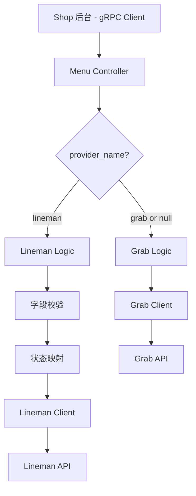

# Menu Provider 多平台支持与 Lineman 状态同步 设计文档

> 本文档定义 Menu Provider 多平台支持与 Lineman 状态同步功能的技术设计和实现方案。

## 📋 概述

本功能在现有的 Grab 菜单更新协议基础上，增加多平台支持能力。通过在 Protobuf 中增加 `provider_name` 字段标识平台，实现针对不同平台的差异化处理逻辑。核心设计包括：状态映射转换、字段白名单校验、平台路由分发、以及 Lineman API 客户端实现。

**设计目标**：
- 向后兼容：未指定 `provider_name` 时默认使用 Grab 逻辑
- 可扩展性：为后续接入 FoodPanda、ShopeeFood 等平台预留架构
- 职责清晰：Controller → Logic → Client 分层明确
- 错误明确：返回清晰的错误信息，便于调试和监控

---

## 🎯 规范对齐

### Go BMP 规范 (ttpos-bmp/.cursor/rules/go-rules.mdc)

本设计遵循 GoFrame 2.x 框架规范：

- **Controller 层**：负责参数接收、平台路由分发、响应返回
- **Logic 层**：负责业务逻辑，包括状态映射、字段校验
- **Client 层**：负责第三方 API 调用（Lineman、Grab）
- **禁止修改自动生成的代码**：dao/entity/do/ 目录不可手动修改
- **gRPC 服务注册**：服务启动时自动注册到 Nacos

### Protobuf 规范 (ttpos-bmp/.cursor/rules/proto-rules.mdc)

- 字段序号不能冲突（使用序号 9）
- 使用 `optional` 修饰可选字段
- 注释完整且清晰（中文注释）
- 修改后执行 `make proto` 重新生成代码

### API 设计规范 (.cursor/rules/api.mdc)

- 遵循 Lineman API 规范
- HTTP 请求使用 JSON 格式
- 响应格式统一：`{status, code, message}`
- 错误码明确且可追溯

---

## 🔄 代码复用分析

### 可复用的现有组件

- **Grab Menu Client**: `ttpos-bmp/app/ttpos-takeout/internal/client/grab/menu_client.go`
  - 复用 HTTP 客户端配置（认证、超时、重试）
  - 参考请求构造和响应解析逻辑

- **Lineman Menu Sync Client**: `ttpos-bmp/app/ttpos-takeout/internal/client/lineman/menu_sync_client.go`
  - 复用 Lineman 认证逻辑（OAuth 2.0 Token 获取）
  - 复用 HTTP Client 配置

- **Menu Controller**: `ttpos-bmp/app/ttpos-takeout/internal/controller/rpc/menu/menu.go`
  - 在现有 `UpdateMenuItem` 方法中增加平台路由逻辑
  - 保持现有 Grab 处理逻辑不变

### 集成点

- **Protobuf 协议**: `ttpos-bmp/app/ttpos-takeout/manifest/protobuf/menu/menu.proto`
  - 扩展 `UpdateMenuItemReq` 消息，增加 `provider_name` 字段
  - 保持现有字段不变，确保向后兼容

- **Menu Logic**: `ttpos-bmp/app/ttpos-takeout/internal/logic/channel_menu/channel_menu.go`
  - 新增 Lineman 专用处理逻辑
  - 与现有 Grab 逻辑并行，互不影响

- **Lineman Service**: `ttpos-bmp/app/ttpos-takeout/internal/service/lineman.go`
  - 注册新的 Lineman 状态更新服务接口

---

## 🏗️ 架构设计

### 分层设计原则

**GoFrame 分层架构**:

```
Controller 层 (RPC/HTTP)
  ↓ 调用
Logic 层 (业务逻辑)
  ↓ 调用
Client 层 (第三方 API)
  ↓ 调用
External API (Lineman/Grab)
```

**依赖规则**:

- ✅ Controller 依赖 Logic
- ✅ Logic 依赖 Client
- ❌ 禁止跨层调用
- ❌ 禁止下层依赖上层

### 架构图



### 模块划分

#### ttpos-takeout 模块结构

```
ttpos-bmp/app/ttpos-takeout/
├── manifest/
│   └── protobuf/
│       └── menu/
│           └── menu.proto                    # Protobuf 定义（新增 provider_name）
├── api/
│   └── menu/
│       └── menu.pb.go                        # 生成的 Go 代码（自动生成 ❌ 禁止修改）
├── internal/
│   ├── controller/
│   │   └── rpc/
│   │       └── menu/
│   │           └── menu.go                   # Menu Controller（增加平台路由）
│   ├── logic/
│   │   ├── lineman/
│   │   │   ├── menu_status.go               # Lineman 状态映射逻辑（新增）
│   │   │   └── menu_sync.go                 # 现有 Lineman Menu Sync
│   │   └── channel_menu/
│   │       └── channel_menu.go              # 通用菜单逻辑
│   ├── client/
│   │   ├── lineman/
│   │   │   ├── menu_status_client.go        # Lineman 状态更新客户端（新增）
│   │   │   └── menu_sync_client.go          # 现有 Lineman Menu Sync Client
│   │   └── grab/
│   │       └── menu_client.go               # 现有 Grab Client
│   └── service/
│       └── lineman.go                       # Lineman Service 接口
```

---

## 📊 数据模型

### Protobuf 定义

#### UpdateMenuItemReq 扩展

```protobuf
// 更新菜单项请求
message UpdateMenuItemReq {
  string merchant_id = 1;                         // Grab MerchantID (必填)
  string item_id = 2;                             // 商品ID (partner item id, 必填)
  optional int64 price = 3;                       // 价格 (minor unit，单位：分)
  optional string available_status = 4;           // 可用状态: AVAILABLE, UNAVAILABLE, UNAVAILABLEHIDE, SOLD_OUT_TODAY
  optional int64 max_stock = 5;                   // 库存数量
  repeated AdvancedPricing advanced_pricings = 6; // 高级定价配置
  repeated Purchasability purchasabilities = 7;   // 购买能力配置
  string request_id = 8;                          // 请求 ID (可选，用于追踪)
  optional string provider_name = 9;              // 平台名称: grab (默认), lineman，为未来平台预留扩展
}
```

**字段说明**:

| 字段 | 类型 | 必填 | 默认值 | 说明 |
|------|------|------|--------|------|
| provider_name | string | 否 | "grab" | 平台标识，支持 grab、lineman |
| available_status | string | 否 | - | 商品状态，新增支持 SOLD_OUT_TODAY |

### DTO 定义

#### Lineman 状态映射 DTO

```go
// ttpos-bmp/app/ttpos-takeout/internal/model/dto/lineman/menu_status.go
package lineman

// MenuStatusUpdateReq Lineman 菜单状态更新请求
type MenuStatusUpdateReq struct {
	MenuItems []MenuItem `json:"menuItems"`
}

// MenuItem 菜单项
type MenuItem struct {
	ID         string `json:"id"`         // Partner Item ID
	MenuStatus string `json:"menuStatus"` // AVAILABLE, SUSPENDED, SOLD_OUT_TODAY
}

// MenuStatusUpdateResp Lineman 菜单状态更新响应
type MenuStatusUpdateResp struct {
	Status  string `json:"status"`  // ok, fail
	Code    string `json:"code"`    // SUCCESS, ERROR
	Message string `json:"message"` // 响应消息
}
```

---

## 🔌 API 设计

### gRPC API

#### UpdateMenuItem (扩展)

**Protobuf 定义**: 见上文 `UpdateMenuItemReq`

**调用流程**:

1. Shop 后台调用 `UpdateMenuItem` gRPC 接口
2. Controller 接收请求，解析 `provider_name`
3. 根据 `provider_name` 路由到对应平台 Logic
4. Logic 处理业务逻辑（状态映射、字段校验）
5. Client 调用第三方 API
6. 返回统一响应

### Lineman REST API

#### PUT /v1/partners/{partnerId}/stores/{storeId}/menu/items/status

**请求**:

- **URL**: `https://partner-api.lineman.io/v1/partners/{partnerId}/stores/{storeId}/menu/items/status`
- **Method**: `PUT`
- **Headers**:
  ```json
  {
    "Authorization": "Bearer {access_token}",
    "Content-Type": "application/json"
  }
  ```
- **Body**:
  ```json
  {
    "menuItems": [
      {
        "id": "partner-item-id",
        "menuStatus": "SUSPENDED"
      }
    ]
  }
  ```

**响应**:

```json
{
  "status": "ok",
  "code": "SUCCESS",
  "message": "Menu status updated"
}
```

**错误响应**:

```json
{
  "status": "fail",
  "code": "INVALID_REQUEST",
  "message": "Invalid menu status"
}
```

**参考文档**: [Google Sheets - Lineman API定义及TTPOS 映射](https://docs.google.com/spreadsheets/d/1CKRl7tRLtp6dCAcXQqWhPvS_0M378-vdKpucR6ZtNbg/edit?gid=585076633#gid=585076633)

---

## 🧩 组件和接口

### Controller 层

#### Menu Controller (扩展)

```go
// ttpos-bmp/app/ttpos-takeout/internal/controller/rpc/menu/menu.go
func (c *MenuController) UpdateMenuItem(ctx context.Context, req *menu.UpdateMenuItemReq) (*menu.UpdateMenuItemResp, error) {
    // 1. 获取 provider_name，默认为 grab
    providerName := "grab"
    if req.ProviderName != nil && *req.ProviderName != "" {
        providerName = *req.ProviderName
    }

    // 2. 根据平台路由到对应 Logic
    switch providerName {
    case "grab":
        return c.handleGrabUpdate(ctx, req)
    case "lineman":
        return c.handleLinemanUpdate(ctx, req)
    default:
        return nil, gerror.Newf("不支持的平台: %s", providerName)
    }
}

// handleGrabUpdate Grab 平台处理（保持现有逻辑）
func (c *MenuController) handleGrabUpdate(ctx context.Context, req *menu.UpdateMenuItemReq) (*menu.UpdateMenuItemResp, error) {
    // 现有 Grab 逻辑，不做修改
    // ...
}

// handleLinemanUpdate Lineman 平台处理（新增）
func (c *MenuController) handleLinemanUpdate(ctx context.Context, req *menu.UpdateMenuItemReq) (*menu.UpdateMenuItemResp, error) {
    // 1. 字段校验
    if err := c.validateLinemanRequest(req); err != nil {
        return nil, err
    }

    // 2. 状态映射
    linemanStatus, err := c.mapToLinemanStatus(req.AvailableStatus)
    if err != nil {
        return nil, err
    }

    // 3. 调用 Lineman Logic
    err = c.linemanLogic.UpdateMenuStatus(ctx, &lineman_dto.MenuStatusUpdateReq{
        MenuItems: []lineman_dto.MenuItem{
            {
                ID:         req.ItemId,
                MenuStatus: linemanStatus,
            },
        },
    })
    if err != nil {
        return nil, err
    }

    // 4. 返回响应
    return &menu.UpdateMenuItemResp{
        MerchantId: req.MerchantId,
        RecordId:   req.ItemId,
        RecordType: "ITEM",
    }, nil
}

// validateLinemanRequest 校验 Lineman 请求（仅允许 available_status）
func (c *MenuController) validateLinemanRequest(req *menu.UpdateMenuItemReq) error {
    if req.Price != nil {
        return gerror.New("Lineman 平台仅支持更新 available_status 字段，不支持 price 字段")
    }
    if req.MaxStock != nil {
        return gerror.New("Lineman 平台仅支持更新 available_status 字段，不支持 max_stock 字段")
    }
    if len(req.AdvancedPricings) > 0 {
        return gerror.New("Lineman 平台仅支持更新 available_status 字段，不支持 advanced_pricings 字段")
    }
    if len(req.Purchasabilities) > 0 {
        return gerror.New("Lineman 平台仅支持更新 available_status 字段，不支持 purchasabilities 字段")
    }
    if req.AvailableStatus == nil || *req.AvailableStatus == "" {
        return gerror.New("available_status 字段为必填")
    }
    return nil
}

// mapToLinemanStatus 映射状态到 Lineman
func (c *MenuController) mapToLinemanStatus(status *string) (string, error) {
    if status == nil {
        return "", gerror.New("available_status 不能为空")
    }

    switch *status {
    case "AVAILABLE":
        return "AVAILABLE", nil
    case "UNAVAILABLE":
        return "SUSPENDED", nil
    case "SOLD_OUT_TODAY":
        return "SOLD_OUT_TODAY", nil
    case "UNAVAILABLEHIDE":
        return "", gerror.New("Lineman 平台不支持 UNAVAILABLEHIDE 状态")
    default:
        return "", gerror.Newf("不支持的状态: %s", *status)
    }
}
```

### Logic 层

#### Lineman Menu Status Logic (新增)

```go
// ttpos-bmp/app/ttpos-takeout/internal/logic/lineman/menu_status.go
package lineman

import (
    "context"
    "github.com/gogf/gf/v2/errors/gerror"
    "ttpos-bmp/app/ttpos-takeout/internal/client/lineman"
    "ttpos-bmp/app/ttpos-takeout/internal/model/dto/lineman"
)

type MenuStatusLogic struct {
    linemanClient *lineman.MenuStatusClient
}

func NewMenuStatusLogic(linemanClient *lineman.MenuStatusClient) *MenuStatusLogic {
    return &MenuStatusLogic{
        linemanClient: linemanClient,
    }
}

// UpdateMenuStatus 更新菜单状态
func (l *MenuStatusLogic) UpdateMenuStatus(ctx context.Context, req *lineman_dto.MenuStatusUpdateReq) error {
    // 1. 参数校验
    if len(req.MenuItems) == 0 {
        return gerror.New("menuItems 不能为空")
    }
    if len(req.MenuItems) > 100 {
        return gerror.New("menuItems 最多支持 100 个商品")
    }

    // 2. 调用 Lineman Client
    resp, err := l.linemanClient.UpdateMenuStatus(ctx, req)
    if err != nil {
        return gerror.Wrap(err, "调用 Lineman API 失败")
    }

    // 3. 检查响应
    if resp.Status != "ok" {
        return gerror.Newf("Lineman API 返回错误: %s - %s", resp.Code, resp.Message)
    }

    return nil
}

// MapStatusToLineman 状态映射
func MapStatusToLineman(ttposStatus string) (string, error) {
    switch ttposStatus {
    case "AVAILABLE":
        return "AVAILABLE", nil
    case "UNAVAILABLE":
        return "SUSPENDED", nil
    case "SOLD_OUT_TODAY":
        return "SOLD_OUT_TODAY", nil
    case "UNAVAILABLEHIDE":
        return "", gerror.New("Lineman 不支持 UNAVAILABLEHIDE 状态")
    default:
        return "", gerror.Newf("未知状态: %s", ttposStatus)
    }
}
```

### Client 层

#### Lineman Menu Status Client (新增)

```go
// ttpos-bmp/app/ttpos-takeout/internal/client/lineman/menu_status_client.go
package lineman

import (
    "context"
    "encoding/json"
    "fmt"
    "github.com/gogf/gf/v2/errors/gerror"
    "github.com/gogf/gf/v2/frame/g"
    "github.com/gogf/gf/v2/net/ghttp"
    "ttpos-bmp/app/ttpos-takeout/internal/model/dto/lineman"
)

type MenuStatusClient struct {
    baseURL      string
    authClient   *AuthClient // 复用现有的认证客户端
    httpClient   *ghttp.Client
}

func NewMenuStatusClient(baseURL string, authClient *AuthClient) *MenuStatusClient {
    return &MenuStatusClient{
        baseURL:    baseURL,
        authClient: authClient,
        httpClient: g.Client(),
    }
}

// UpdateMenuStatus 更新菜单状态
func (c *MenuStatusClient) UpdateMenuStatus(ctx context.Context, req *lineman_dto.MenuStatusUpdateReq) (*lineman_dto.MenuStatusUpdateResp, error) {
    // 1. 获取 Access Token
    token, err := c.authClient.GetAccessToken(ctx)
    if err != nil {
        return nil, gerror.Wrap(err, "获取 Access Token 失败")
    }

    // 2. 构造请求 URL
    // TODO: 从配置中获取 partnerId 和 storeId
    url := fmt.Sprintf("%s/v1/partners/%s/stores/%s/menu/items/status", 
        c.baseURL, "{partnerId}", "{storeId}")

    // 3. 发送 HTTP 请求
    resp, err := c.httpClient.
        Header("Authorization", fmt.Sprintf("Bearer %s", token)).
        Header("Content-Type", "application/json").
        Put(ctx, url, req)
    if err != nil {
        return nil, gerror.Wrap(err, "HTTP 请求失败")
    }
    defer resp.Close()

    // 4. 解析响应
    var apiResp lineman_dto.MenuStatusUpdateResp
    if err := json.Unmarshal(resp.ReadAll(), &apiResp); err != nil {
        return nil, gerror.Wrap(err, "解析响应失败")
    }

    // 5. 记录日志
    g.Log().Infof(ctx, "Lineman UpdateMenuStatus response: %+v", apiResp)

    // 6. 检查 HTTP 状态码
    if resp.StatusCode != 200 {
        return nil, gerror.Newf("HTTP 请求失败: %d - %s", resp.StatusCode, apiResp.Message)
    }

    return &apiResp, nil
}
```

---

## 🔒 安全设计

### 身份验证

- **Lineman OAuth 2.0**: 复用现有的 `AuthClient` 获取 Access Token
- **Token 缓存**: Access Token 缓存到 Redis，避免频繁请求
- **Token 刷新**: Token 过期前自动刷新

### 权限控制

- **Shop 后台鉴权**: 调用 gRPC 前验证商户权限
- **API 权限**: Lineman API 由 Partner ID 控制权限

### 数据安全

- **敏感数据保护**: Access Token 不记录到日志
- **参数校验**: 严格校验请求参数，防止注入攻击
- **HTTPS**: 所有 Lineman API 调用使用 HTTPS

---

## 🚨 错误处理

### 错误场景

#### 场景 1: 平台不支持

- **触发条件**: `provider_name` 为不支持的值（如 `foodpanda`）
- **处理方式**: 返回错误 `不支持的平台: {provider_name}`
- **用户影响**: Shop 后台显示错误提示
- **代码示例**:
  ```go
  default:
      return nil, gerror.Newf("不支持的平台: %s", providerName)
  ```

#### 场景 2: Lineman 字段校验失败

- **触发条件**: Lineman 请求包含不支持的字段（如 `price`）
- **处理方式**: 返回错误 `Lineman 平台仅支持更新 available_status 字段，不支持 {field} 字段`
- **用户影响**: Shop 后台显示错误提示，提示用户只能修改状态
- **代码示例**:
  ```go
  if req.Price != nil {
      return gerror.New("Lineman 平台仅支持更新 available_status 字段，不支持 price 字段")
  }
  ```

#### 场景 3: 状态映射失败

- **触发条件**: TTPOS 状态在 Lineman 平台不支持（如 `UNAVAILABLEHIDE`）
- **处理方式**: 返回错误 `Lineman 平台不支持 {status} 状态`
- **用户影响**: Shop 后台显示错误提示
- **代码示例**:
  ```go
  case "UNAVAILABLEHIDE":
      return "", gerror.New("Lineman 平台不支持 UNAVAILABLEHIDE 状态")
  ```

#### 场景 4: Lineman API 调用失败

- **触发条件**: 网络异常、认证失败、限流等
- **处理方式**: 记录错误日志，返回明确错误信息，自动重试（最多 3 次）
- **用户影响**: Shop 后台显示"同步失败，请稍后重试"
- **代码示例**:
  ```go
  if err != nil {
      g.Log().Errorf(ctx, "调用 Lineman API 失败: %v", err)
      return nil, gerror.Wrap(err, "调用 Lineman API 失败")
  }
  ```

---

## 🧪 测试策略

### 单元测试

**目标覆盖率**: ≥ 80%

**测试内容**:

1. **状态映射测试** (`menu_status_test.go`)
   - 测试所有状态映射场景（AVAILABLE, UNAVAILABLE, SOLD_OUT_TODAY）
   - 测试不支持的状态（UNAVAILABLEHIDE）
   - 测试空状态

2. **字段校验测试** (`menu_controller_test.go`)
   - 测试 Lineman 请求只包含 `available_status` 时通过
   - 测试包含 `price` 字段时返回错误
   - 测试包含 `max_stock` 字段时返回错误
   - 测试包含 `advanced_pricings` 字段时返回错误
   - 测试包含 `purchasabilities` 字段时返回错误

3. **平台路由测试** (`menu_controller_test.go`)
   - 测试 `provider_name=grab` 路由到 Grab 逻辑
   - 测试 `provider_name=lineman` 路由到 Lineman 逻辑
   - 测试未指定 `provider_name` 默认路由到 Grab
   - 测试不支持的 `provider_name` 返回错误

### API Mock 测试

**测试内容**:

1. **Lineman API Mock**
   - Mock Lineman API 成功响应（HTTP 200）
   - Mock Lineman API 失败响应（HTTP 400/500）
   - Mock 网络超时场景
   - Mock 认证失败场景

### 集成测试

**测试流程**:

1. **Grab 平台集成测试**
   - 调用 `UpdateMenuItem` gRPC 接口（`provider_name=grab`）
   - 验证 Grab API 调用成功
   - 验证响应格式正确

2. **Lineman 平台集成测试**
   - 调用 `UpdateMenuItem` gRPC 接口（`provider_name=lineman`）
   - 验证字段校验正确
   - 验证状态映射正确
   - 验证 Lineman API 调用成功
   - 验证响应格式正确

3. **向后兼容测试**
   - 使用现有 Grab 调用方测试用例
   - 验证功能未受影响

---

## 📈 性能优化

### 优化策略

1. **HTTP 连接池**:
   - 复用 HTTP Client 连接
   - 设置合理的超时时间（30 秒）

2. **并发控制**:
   - 批量更新最多支持 100 个商品
   - 使用 goroutine 并发处理（如需要）

3. **重试机制**:
   - API 调用失败时自动重试（最多 3 次）
   - 使用指数退避策略（1s, 2s, 4s）

4. **日志优化**:
   - 只记录关键信息，避免日志过多影响性能
   - 敏感信息（如 Token）不记录到日志

### 性能指标

- API 调用超时时间: 30 秒
- 重试次数: 最多 3 次
- 批量更新上限: 100 个商品
- 并发能力: 100+ QPS

---

## 📚 实现清单

### Phase 1: Protobuf 扩展和代码生成

- [ ] 修改 `menu.proto`，增加 `provider_name` 字段
- [ ] 执行 `make proto` 重新生成代码
- [ ] 验证生成的代码无误

### Phase 2: 核心逻辑实现

- [ ] 实现状态映射函数 (`MapStatusToLineman`)
- [ ] 实现字段校验函数 (`validateLinemanRequest`)
- [ ] 实现 Lineman Menu Status Logic
- [ ] 实现 Lineman Menu Status Client

### Phase 3: Controller 集成

- [ ] 在 Menu Controller 中增加平台路由逻辑
- [ ] 实现 `handleLinemanUpdate` 方法
- [ ] 保持 Grab 逻辑不变（向后兼容）

### Phase 4: 测试

- [ ] 单元测试（状态映射、字段校验、路由分发）
- [ ] API Mock 测试
- [ ] 集成测试（Grab 和 Lineman）
- [ ] 向后兼容测试

**详细任务**: 参见 `tasks.md`

---

## Graphiti & 活动日志

- Related Episode: `[待补充 - 开发完成后记录技术决策和踩坑经验]`
- 模板：`docs/agent/templates/graphiti-episode.md`
- 活动日志：`docs/team/activities/{YYYY-MM}/{YYYY-MM-DD}.md`
- 在技术方案评审、关键架构决策或踩坑总结后，立即补充 Episode 并在设计文档尾部互链。

---

**版本**: v1.0.0  
**创建日期**: 2026-01-13  
**作者**: rikugun  
**审核者**: 待审核
