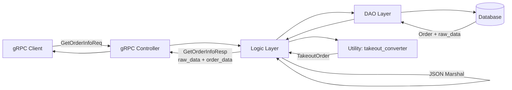

# 统一外卖订单数据结构字段 设计文档

> 本文档定义在 GetOrderInfo 接口中增加 order_data 字段的技术设计和实现方案。

## 📋 概述

本需求通过在 `GetOrderInfoResp` Protobuf 消息中增加 `order_data` 字段，返回经过 `takeout_converter.go` 转换后的统一 `TakeoutOrder` JSON 格式。核心目标是降低前端开发复杂度，集中管理不同外卖平台（Grab、Lineman）的数据转换逻辑。

**设计原则**：
- 向后兼容：保留现有 `raw_data` 字段
- 优雅降级：转换失败不影响接口返回
- 性能优先：转换耗时 < 50ms
- 可扩展：支持未来新平台接入

---

## 🎯 规范对齐

### Go BMP 规范 (go-bmp.mdc)

本需求涉及 GoFrame 微服务开发，严格遵循以下规范：

- **禁止修改 dao/entity/do/ 目录**：自动生成的代码不得手动修改
- **使用 GoFrame 2.x**：利用 GoFrame 的 gRPC 支持
- **遵循项目结构**：代码放置在正确的目录层级
- **使用 g.Log()**：统一的日志记录方式
- **不使用 panic**：所有错误通过 error 返回

### API 设计规范 (api.mdc)

- **gRPC 接口设计**：遵循 Protobuf 命名规范
- **响应格式统一**：所有字段有明确的类型和注释
- **向后兼容**：新增字段不影响现有调用方
- **错误处理**：转换失败返回空字符串，记录日志

---

## 🔄 代码复用分析

### 可复用的现有组件

- **TakeoutOrder 统一模型**: `ttpos-api/ttpos-takeout/message/takeout_order.go`
  - 已完整定义，包含 Grab 和 Lineman 所有字段
  - 无需修改，直接使用

- **Grab 转换器**: `ttpos-bmp/app/ttpos-takeout/utility/takeout_converter.go` 中的 `ConvertGrabToTakeoutOrder`
  - 已实现并测试通过
  - 直接调用即可

- **Lineman 转换器**: `ttpos-bmp/app/ttpos-takeout/utility/takeout_converter.go` 中的 `ConvertLinemanToTakeoutOrder`
  - 已实现并测试通过
  - 直接调用即可

### 集成点

- **GetOrderInfo 接口**：位于 `ttpos-bmp/app/ttpos-takeout/internal/logic/order/`
  - 现有逻辑：查询订单，返回 `raw_data`
  - 新增逻辑：调用 converter，序列化为 JSON，填充 `order_data`

- **Protobuf 定义**：`ttpos-bmp/app/ttpos-takeout/manifest/protobuf/order/order.proto`
  - 修改 `GetOrderInfoResp` 消息
  - 增加 `string order_data = 6;` 字段

---

## 🏗️ 架构设计

### 分层设计原则

**GoFrame 架构**:

```
gRPC Controller (API 层)
  ↓
Logic 层 (业务逻辑)
  ↓
Utility 层 (数据转换)
  ↓
DAO 层 (数据访问)
```

**依赖规则**:
- ✅ Logic 可以调用 Utility
- ✅ Logic 可以调用 DAO
- ❌ Utility 不依赖 DAO
- ✅ 转换逻辑独立于业务逻辑

### 数据流图



### 模块划分

#### ttpos-takeout 微服务模块

- **Protobuf 定义**: `manifest/protobuf/order/order.proto`
  - 定义 gRPC 接口和消息结构
  
- **gRPC Controller**: `internal/controller/rpc/order_controller.go`
  - 处理 gRPC 请求（现有，无需修改）
  
- **Logic 层**: `internal/logic/order/order.go`
  - 实现 GetOrderInfo 业务逻辑
  - **修改点**：增加数据转换和 JSON 序列化

- **Utility 层**: `utility/takeout_converter.go`
  - 数据转换工具（现有，无需修改）
  
- **DAO 层**: `internal/dao/order.go`
  - 数据访问（现有，无需修改）

---

## 🗄️ 数据库设计

**本需求不涉及数据库变更**

---

## 📊 数据模型

### Protobuf 定义修改

**修改文件**: `ttpos-bmp/app/ttpos-takeout/manifest/protobuf/order/order.proto`

**修改前**:
```protobuf
message GetOrderInfoResp {
  string shop_uuid = 1;     // TTPOS店铺UUID
  string order_status = 2;  // 订单状态
  string order_type = 3;    // 订单类型
  string raw_data = 4;      // 原始JSON数据
  string provider_name = 5; // 渠道名称: grab, foodpanda, lineman
}
```

**修改后**:
```protobuf
message GetOrderInfoResp {
  string shop_uuid = 1;     // TTPOS店铺UUID
  string order_status = 2;  // 订单状态
  string order_type = 3;    // 订单类型
  string raw_data = 4;      // 原始JSON数据
  string provider_name = 5; // 渠道名称: grab, foodpanda, lineman
  string order_data = 6;    // 转换后的统一订单数据（TakeoutOrder JSON）
}
```

### TakeoutOrder 模型

**定义文件**: `ttpos-api/ttpos-takeout/message/takeout_order.go`

**核心结构**（现有，无需修改）:
```go
type TakeoutOrder struct {
    // 基础字段（Grab 和 Lineman 通用）
    OrderID          string             `json:"orderID"`
    ShortOrderNumber string             `json:"shortOrderNumber"`
    MerchantID       string             `json:"merchantID"`
    PartnerMerchantID string            `json:"partnerMerchantID,omitempty"`
    PaymentType      string             `json:"paymentType"`
    OrderTime        string             `json:"orderTime"`
    Items            []TakeoutOrderItem `json:"items"`
    Price            TakeoutOrderPrice  `json:"price"`
    
    // Grab 特有字段 (omitempty)
    Cutlery         *bool                    `json:"cutlery,omitempty"`
    OrderState      *string                  `json:"orderState,omitempty"`
    // ... 更多字段见 takeout_order.go
    
    // 扩展字段（Lineman 等其他平台需要）
    AdditionalProperties []TakeoutAdditionalProperty `json:"additionalProperties,omitempty"`
}
```

---

## 🔌 API 设计

### gRPC API

#### Protobuf 定义

**Service**: 无需修改（使用现有 OrderService）

**Request**: 无需修改（使用现有 GetOrderInfoReq）

**Response**: 修改 `GetOrderInfoResp`（增加 `order_data` 字段）

#### 字段说明

| 字段 | 类型 | 说明 | 修改 |
|------|------|------|------|
| shop_uuid | string | TTPOS店铺UUID | 现有 |
| order_status | string | 订单状态 | 现有 |
| order_type | string | 订单类型 | 现有 |
| raw_data | string | 原始JSON数据（Grab/Lineman 原始格式） | 现有 |
| provider_name | string | 渠道名称: grab, lineman | 现有 |
| order_data | string | 转换后的统一订单数据（TakeoutOrder JSON） | **新增** |

#### 数据示例

**Grab raw_data** (现有):
```json
{
  "orderID": "123456",
  "shortOrderNumber": "GRAB-001",
  "merchantID": "merchant-123",
  "paymentType": "CASHLESS"
}
```

**新增 order_data** (TakeoutOrder JSON):
```json
{
  "orderID": "123456",
  "shortOrderNumber": "GRAB-001",
  "merchantID": "merchant-123",
  "paymentType": "CASHLESS",
  "items": [...],
  "price": {...}
}
```

---

## 🧩 组件和接口

### Logic 层实现

#### 修改文件

`ttpos-bmp/app/ttpos-takeout/internal/logic/order/order.go`

#### 实现伪代码

```go
package order

import (
    "context"
    "encoding/json"
    "github.com/gogf/gf/v2/frame/g"
    "ttpos-bmp/app/ttpos-takeout/api/order/v1"
    "ttpos-bmp/app/ttpos-takeout/utility"
    "ttpos-api/ttpos-takeout/message"
)

type sOrder struct {
    // 现有字段
}

// GetOrderInfo 获取订单信息
func (s *sOrder) GetOrderInfo(ctx context.Context, req *v1.GetOrderInfoReq) (*v1.GetOrderInfoResp, error) {
    // 1. 查询订单（现有逻辑）
    order, err := s.dao.GetOrder(ctx, req.OrderId)
    if err != nil {
        return nil, err
    }
    
    // 2. 转换为 TakeoutOrder（新增逻辑）
    var orderData string
    var takeoutOrder *message.TakeoutOrder
    
    switch order.ProviderName {
    case "grab":
        takeoutOrder, err = utility.ConvertGrabToTakeoutOrder(order.RawData)
    case "lineman":
        takeoutOrder, err = utility.ConvertLinemanToTakeoutOrder(order.RawData)
    default:
        g.Log().Warningf(ctx, "unsupported provider: %s, orderId=%s", 
            order.ProviderName, req.OrderId)
    }
    
    if err != nil {
        // 转换失败，记录日志但不影响返回
        g.Log().Errorf(ctx, "failed to convert order data, orderId=%s, provider=%s, error=%v", 
            req.OrderId, order.ProviderName, err)
        orderData = "" // 返回空字符串
    } else if takeoutOrder != nil {
        // 3. 序列化为 JSON（新增逻辑）
        jsonBytes, marshalErr := json.Marshal(takeoutOrder)
        if marshalErr != nil {
            g.Log().Errorf(ctx, "failed to marshal order data, orderId=%s, error=%v", 
                req.OrderId, marshalErr)
            orderData = ""
        } else {
            orderData = string(jsonBytes)
        }
    }
    
    // 4. 返回响应（修改：增加 order_data 字段）
    return &v1.GetOrderInfoResp{
        ShopUuid:     order.ShopUuid,
        OrderStatus:  order.Status,
        OrderType:    order.Type,
        RawData:      order.RawData,    // 现有字段
        ProviderName: order.ProviderName,
        OrderData:    orderData,         // 新增字段
    }, nil
}
```

### Utility 层（无需修改）

#### ConvertGrabToTakeoutOrder

**文件**: `ttpos-bmp/app/ttpos-takeout/utility/takeout_converter.go`

**签名**:
```go
func ConvertGrabToTakeoutOrder(rawData string) (*message.TakeoutOrder, error)
```

**功能**: 将 Grab 原始 JSON 转换为 TakeoutOrder 结构

**状态**: ✅ 已实现并测试通过

#### ConvertLinemanToTakeoutOrder

**文件**: `ttpos-bmp/app/ttpos-takeout/utility/takeout_converter.go`

**签名**:
```go
func ConvertLinemanToTakeoutOrder(rawData string) (*message.TakeoutOrder, error)
```

**功能**: 将 Lineman 原始 JSON 转换为 TakeoutOrder 结构

**状态**: ✅ 已实现并测试通过

---

## 🚨 错误处理

### 场景 1: 转换失败（平台数据格式错误）

- **处理方式**: 记录错误日志，返回空字符串
- **用户影响**: `order_data` 为空，但 `raw_data` 仍正常返回
- **代码示例**:
  ```go
  if err != nil {
      g.Log().Errorf(ctx, "failed to convert order data, orderId=%s, provider=%s, error=%v", 
          req.OrderId, order.ProviderName, err)
      orderData = ""
  }
  ```

### 场景 2: JSON 序列化失败

- **处理方式**: 记录错误日志，返回空字符串
- **用户影响**: `order_data` 为空，但 `raw_data` 仍正常返回
- **代码示例**:
  ```go
  jsonBytes, marshalErr := json.Marshal(takeoutOrder)
  if marshalErr != nil {
      g.Log().Errorf(ctx, "failed to marshal order data, orderId=%s, error=%v", 
          req.OrderId, marshalErr)
      orderData = ""
  }
  ```

### 场景 3: 不支持的平台

- **处理方式**: 记录警告日志，返回空字符串
- **用户影响**: `order_data` 为空，但 `raw_data` 仍正常返回
- **代码示例**:
  ```go
  default:
      g.Log().Warningf(ctx, "unsupported provider: %s, orderId=%s", 
          order.ProviderName, req.OrderId)
  ```

---

## 🔒 安全设计

### 数据安全

- **敏感信息保护**: `order_data` 包含完整订单信息，需要与 `raw_data` 同等的访问控制
- **JSON 序列化安全**: 使用标准库 `encoding/json`，防止注入攻击
- **日志脱敏**: 错误日志不包含敏感用户数据（如电话号码、地址）

### 错误信息安全

- **不暴露内部错误**: 转换失败只返回空字符串，不暴露详细错误信息
- **日志记录**: 详细错误信息记录在服务端日志，便于排查问题

---

## 🧪 测试策略

### 单元测试

**目标覆盖率**: Converter 100%（高风险转换逻辑）

**测试内容**:

1. **Grab 订单转换测试**
   - 测试文件: `utility/takeout_converter_test.go`
   - 测试用例: 完整订单、缺失字段、null 值

2. **Lineman 订单转换测试**
   - 测试文件: `utility/takeout_converter_test.go`
   - 测试用例: 完整订单、缺失字段、null 值

3. **数据一致性测试**
   - 验证 `order_data` 核心字段与 `raw_data` 一致
   - 验证 JSON 格式可正确反序列化

**示例**:
```go
func TestConvertGrabToTakeoutOrder(t *testing.T) {
    rawData := `{"orderID":"123","shortOrderNumber":"GRAB-001",...}`
    order, err := ConvertGrabToTakeoutOrder(rawData)
    assert.NoError(t, err)
    assert.Equal(t, "123", order.OrderID)
    assert.Equal(t, "GRAB-001", order.ShortOrderNumber)
}
```

### 集成测试

**测试内容**:

1. **GetOrderInfo 接口测试**
   - Grab 订单：验证 `order_data` 正确返回
   - Lineman 订单：验证 `order_data` 正确返回
   - 转换失败：验证 `order_data` 为空，接口仍正常返回

2. **性能测试**
   - 单次调用响应时间 < 50ms
   - 并发 100 次调用无明显性能下降

### 性能测试

**性能指标**:
- 数据转换耗时: < 50ms (P99)
- JSON 序列化耗时: < 10ms
- 接口响应时间增加: < 20ms

**测试工具**: Go Benchmark

**示例**:
```go
func BenchmarkConvertGrabToTakeoutOrder(b *testing.B) {
    rawData := `...` // 测试数据
    for i := 0; i < b.N; i++ {
        ConvertGrabToTakeoutOrder(rawData)
    }
}
```

---

## 📈 性能优化

### 优化策略

1. **避免重复转换**:
   - 现阶段：每次调用都执行转换
   - 后期优化：考虑缓存转换结果（如性能不达标）

2. **高效序列化**:
   - 使用标准库 `encoding/json`
   - 如性能不足，可考虑 `jsoniter`

3. **监控和日志**:
   - 添加性能监控日志，记录转换耗时
   - 便于后续性能分析和优化

### 性能指标

- 数据转换: < 50ms (P99)
- JSON 序列化: < 10ms
- 接口响应时间增加: < 20ms
- gRPC 压缩: GoFrame 默认支持

---

## 📚 实现清单

### Phase 1: Protobuf 定义扩展

- [ ] 修改 `order.proto` 增加 `order_data` 字段
- [ ] 重新生成 Go 代码：`make proto`
- [ ] 验证编译通过

### Phase 2: Logic 层实现

- [ ] 修改 `GetOrderInfo` 方法
- [ ] 导入 `utility` 包
- [ ] 添加数据转换逻辑
- [ ] 添加 JSON 序列化逻辑
- [ ] 添加错误处理和日志记录

### Phase 3: 测试

- [ ] 编写/更新单元测试
- [ ] 编写集成测试
- [ ] 执行性能测试
- [ ] 验证所有测试通过

### Phase 4: 文档更新

- [ ] 更新 `ttpos-api/ttpos-takeout/message/README.md`
- [ ] 更新 API 文档（如有）

**详细任务**: 参见 `tasks.md`

---

## Graphiti & 活动日志

- Related Episode: `[待补充 - 外卖订单统一模型设计经验]`
- 模板：`docs/agent/templates/graphiti-episode.md`
- 活动日志：`docs/team/activities/rikugun/2026-01/2026-01-12.md`
- 在技术方案评审、关键架构决策或踩坑总结后，立即补充 Episode 并在设计文档尾部互链。

---

**版本**: v1.0.0  
**创建日期**: 2026-01-12  
**作者**: rikugun  
**审核者**: rikugun
