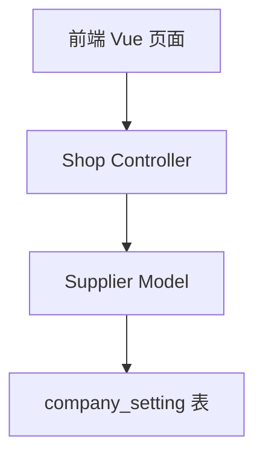

# 云平台商家管理增加桌台地图和数据管理开关 设计文档

> 本文档定义云平台商家管理增加桌台地图和数据管理开关的技术设计和实现方案。

## 📋 概述

在云平台的商家管理页面（添加/编辑商家）中新增两个功能开关："桌台地图"和"数据管理"。两个开关默认关闭，管理员可以根据需要开启或关闭。**开关位置：放在"高级票据打印"选项后面。** 本功能仅包含云平台管理端的开关配置功能，不包含桌台地图和数据管理功能本身的实现。

---

## 🎯 规范对齐

### PHP 规范 (php.mdc)

- 遵循 MVC 分层
- Controller 不写业务逻辑
- 使用验证器验证参数
- 使用现有的 Supplier Model

### API 设计规范 (api.mdc)

- URL 使用 snake_case
- 响应格式统一：`{code, message, data{}}`
- data 字段必须是对象

### 数据库规范 (database.mdc)

- 必需字段完整
- 时间字段使用 int
- 字段命名使用 snake_case
- 参考现有的 `is_open_advanced_ticket_print` 字段实现

---

## 🔄 代码复用分析

### 可复用的现有组件

- **商家管理 Controller**: `admin/app/admin/controller/Shop.php` - 已有商家管理实现，可扩展
- **商家 Model**: `admin/app/admin/model/supplier/Supplier.php` - 已有商家信息保存逻辑
- **商家编辑页面**: `admin/views/admin/src/pages/merchant/components/dialog-edit.vue` - 已有高级票据开关实现，可参考
- **类似功能**: `is_open_advanced_ticket_print`（高级票据打印开关）- 已有类似实现，可参考

### 集成点

- **商家管理 API**: `/api/admin/shop/edit` - 扩展现有接口
- **设置存储**: `company_setting` 表，新增两个字段
- **前端页面**: `dialog-edit.vue` - 在高级票据后面添加两个开关

---

## 🏗️ 架构设计

### 分层设计原则

**PHP MVC 三层架构**:

```
Controller 层 (Shop.php)
  ↓ 调用
Model 层 (Supplier.php)
  ↓ 操作
Database (company_setting 表)
```

**依赖规则**:

- ✅ Controller 调用 Model
- ✅ Model 操作数据库
- ❌ Controller 不直接操作数据库

### 架构图



### 模块划分

#### PHP Admin 模块

- **Controller 层**: `admin/app/admin/controller/Shop.php` - 商家管理控制器
- **Model 层**: `admin/app/admin/model/supplier/Supplier.php` - 商家模型
- **Model 层**: `admin/app/admin/model/app/App.php` - 商家列表查询模型

#### Vue 前端模块

- **Pages**: `admin/views/admin/src/pages/merchant/components/dialog-edit.vue` - 商家编辑对话框

---

## 🗄️ 数据库设计

### 数据表设计

#### 表: `company_setting`（已存在，需要新增字段）

```sql
-- 新增字段：桌台地图开关
ALTER TABLE `company_setting` 
ADD COLUMN `is_open_table_map` INT(11) NOT NULL DEFAULT 0 COMMENT '是否开启桌台地图: 0不开启, 1开启' 
AFTER `is_open_advanced_ticket_print`;

-- 新增字段：数据管理开关
ALTER TABLE `company_setting` 
ADD COLUMN `is_open_data_management` INT(11) NOT NULL DEFAULT 0 COMMENT '是否开启数据管理: 0不开启, 1开启' 
AFTER `is_open_table_map`;
```

**字段说明**:

| 字段 | 类型 | 说明 | 约束 |
|------|------|------|------|
| is_open_table_map | int(11) | 是否开启桌台地图 | DEFAULT 0, 0-否, 1-是 |
| is_open_data_management | int(11) | 是否开启数据管理 | DEFAULT 0, 0-否, 1-是 |

**索引设计**:

- 无需新增索引（使用现有索引）

**迁移文件**: `admin/database/migrations/{YYYYMMDDHHMMSS}_add_table_map_and_data_management_fields_to_company_setting.php`

**参考**: `admin/database/migrations/20251022094844_add_is_open_advanced_ticket_print_field_to_company_setting.php`

---

## 📊 数据模型

### PHP Model

#### Supplier Model 扩展

```php
// admin/app/admin/model/supplier/Supplier.php
public function add($data, $app_id)
{
    // ... 现有代码 ...
    $data['is_open_advanced_ticket_print'] = $data['is_open_advanced_ticket_print'] ?? 0;
    // 新增字段处理
    $data['is_open_table_map'] = $data['is_open_table_map'] ?? 0;
    $data['is_open_data_management'] = $data['is_open_data_management'] ?? 0;
    $this->save($data);
    // ... 现有代码 ...
}
```

#### App Model 扩展（列表查询）

```php
// admin/app/admin/model/app/App.php
public function getList($param)
{
    $field = [
        // ... 现有字段 ...
        "su.is_open_advanced_ticket_print",
        // 新增字段
        "su.is_open_table_map",
        "su.is_open_data_management",
        // ... 现有字段 ...
    ];
    // ... 现有代码 ...
}
```

---

## 🔌 API 设计

### RESTful API

#### API: 获取商家信息（编辑时）

**请求**:

- **URL**: `/api/admin/shop/edit`
- **Method**: `GET`
- **Headers**:
  ```json
  {
    "Authorization": "Bearer {token}",
    "Content-Type": "application/json"
  }
  ```
- **Query**: `app_id={app_id}`

**响应**:

```json
{
  "code": 1,
  "message": "success",
  "data": {
    "model": {
      "app_id": 123,
      "name": "商家名称",
      "is_open_advanced_ticket_print": 0,
      "is_open_table_map": 0,
      "is_open_data_management": 0,
      // ... 其他字段 ...
    }
  }
}
```

#### API: 保存商家信息

**请求**:

- **URL**: `/api/admin/shop/edit`
- **Method**: `POST`
- **Headers**:
  ```json
  {
    "Authorization": "Bearer {token}",
    "Content-Type": "application/json"
  }
  ```
- **Body**:
  ```json
  {
    "app_id": 123,
    "name": "商家名称",
    "is_open_advanced_ticket_print": 0,
    "is_open_table_map": 1,
    "is_open_data_management": 0,
    // ... 其他字段 ...
  }
  ```

**响应**:

```json
{
  "code": 1,
  "message": "修改成功",
  "data": {
    "app_id": 123
  }
}
```

**错误响应**:

```json
{
  "code": 0,
  "message": "错误信息",
  "data": {}
}
```

---

## 🧩 组件和接口

### Controller 层

#### Shop Controller（无需修改）

使用现有的 `edit()` 方法，Model 层会自动处理新字段。

### Model 层

#### Supplier Model 扩展

```php
// admin/app/admin/model/supplier/Supplier.php
public function add($data, $app_id)
{
    // ... 现有代码 ...
    $data['is_open_advanced_ticket_print'] = $data['is_open_advanced_ticket_print'] ?? 0;
    // 新增：处理桌台地图和数据管理开关
    $data['is_open_table_map'] = $data['is_open_table_map'] ?? 0;
    $data['is_open_data_management'] = $data['is_open_data_management'] ?? 0;
    $this->save($data);
    // ... 现有代码 ...
}

public function edit($data)
{
    // ... 现有代码 ...
    // 新增字段会自动保存（如果 Model 字段定义中包含）
    // ... 现有代码 ...
}
```

#### App Model 扩展（列表查询）

```php
// admin/app/admin/model/app/App.php
public function getList($param)
{
    $field = [
        // ... 现有字段 ...
        "su.is_open_advanced_ticket_print",
        // 新增字段
        "su.is_open_table_map",
        "su.is_open_data_management",
        // ... 现有字段 ...
    ];
    // ... 现有代码 ...
}
```

### 前端组件

#### 商家编辑对话框扩展

```vue
<!-- admin/views/admin/src/pages/merchant/components/dialog-edit.vue -->
<template>
  <el-form>
    <!-- ... 现有表单项 ... -->
    
    <!-- 高级票据打印 -->
    <el-form-item :label="$t('高级票据打印')" prop="is_open_advanced_ticket_print">
      <el-radio-group v-model="formData.is_open_advanced_ticket_print">
        <el-radio :value="1">{{ $t('开启') }}</el-radio>
        <el-radio :value="0">{{ $t('关闭') }}</el-radio>
      </el-radio-group>
    </el-form-item>
    
    <!-- 新增：桌台地图 -->
    <el-form-item :label="$t('桌台地图')" prop="is_open_table_map">
      <el-radio-group v-model="formData.is_open_table_map">
        <el-radio :value="1">{{ $t('开启') }}</el-radio>
        <el-radio :value="0">{{ $t('关闭') }}</el-radio>
      </el-radio-group>
    </el-form-item>
    
    <!-- 新增：数据管理 -->
    <el-form-item :label="$t('数据管理')" prop="is_open_data_management">
      <el-radio-group v-model="formData.is_open_data_management">
        <el-radio :value="1">{{ $t('开启') }}</el-radio>
        <el-radio :value="0">{{ $t('关闭') }}</el-radio>
      </el-radio-group>
    </el-form-item>
    
    <!-- ... 其他表单项 ... -->
  </el-form>
</template>

<script setup lang="ts">
const formData = reactive({
  // ... 现有字段 ...
  is_open_advanced_ticket_print: 0,
  // 新增字段
  is_open_table_map: 0,
  is_open_data_management: 0,
  // ... 其他字段 ...
});

const formRules = reactive({
  // ... 现有规则 ...
  is_open_advanced_ticket_print: [{ required: true, message: $t('请选择'), trigger: 'blur' }],
  // 新增规则
  is_open_table_map: [{ required: true, message: $t('请选择'), trigger: 'blur' }],
  is_open_data_management: [{ required: true, message: $t('请选择'), trigger: 'blur' }],
});
</script>
```

---

## ⚡ 缓存设计

### Redis 缓存

**缓存策略**:

- 无需新增缓存逻辑（使用现有的商家信息缓存机制）

---

## 🚨 错误处理

### 错误场景

#### 场景 1: 商家信息保存失败

- **处理方式**: 返回错误提示
- **用户影响**: 显示"修改失败"提示
- **代码示例**:
  ```php
  if (!$model->edit($this->postData())) {
      return $this->renderError($model->getError() ?: '修改失败');
  }
  ```

#### 场景 2: 字段验证失败

- **处理方式**: 前端表单验证，后端参数验证
- **用户影响**: 显示验证错误提示
- **代码示例**:
  ```php
  $validate = new AppValidate();
  $param = $validate->goCheck('edit');
  ```

---

## 🔒 安全设计

### 身份验证

- **JWT Token**: 所有 API 需要 Token 验证
- **权限验证**: 仅云平台管理员可以修改商家信息

### 权限控制

- **RBAC**: 基于角色的访问控制
- **API 权限**: 检查用户是否为云平台管理员

### 数据安全

- **参数验证**: 使用验证器验证参数
- **SQL 注入防护**: 使用参数化查询（ThinkPHP ORM）
- **XSS 防护**: 前端输入校验

---

## 🧪 测试策略

### 单元测试

**测试内容**:

- Model 数据保存和读取
- 字段默认值处理

**示例**:

```php
// admin/app/admin/model/supplier/SupplierTest.php
public function testAddShopWithTableMapAndDataManagement()
{
    $data = [
        'name' => '测试商家',
        'is_open_table_map' => 1,
        'is_open_data_management' => 0,
    ];
    
    $model = new Supplier();
    $result = $model->add($data, 1);
    $this->assertTrue($result);
}
```

### API 测试

**测试内容**:

- API 接口调用
- 参数验证
- 响应格式
- 错误处理

### 集成测试

**测试流程**:

- 端到端商家信息保存和读取
- 开关状态持久化

---

## 📈 性能优化

### 优化策略

1. **数据库优化**:
   - 使用现有索引
   - 避免不必要的查询

### 性能指标

- 商家编辑页面加载时间: < 500ms
- 商家信息保存响应时间: < 200ms

---

## 🌐 浏览器兼容性

### 前端兼容性（Vue）

- Chrome 90+
- Safari 14+
- Firefox 88+
- Edge 90+

### 响应式设计

- 桌面端: 1920x1080

---

## 📚 实现清单

### Phase 1: 数据库迁移

- [ ] 创建数据库迁移文件
- [ ] 执行数据库迁移
- [ ] 更新 Seeds 文件（如需要）

### Phase 2: 后端实现

- [ ] 扩展 Supplier Model，添加新字段处理
- [ ] 扩展 App Model，添加新字段查询
- [ ] 更新验证器（如需要）

### Phase 3: 前端实现

- [ ] 扩展商家编辑页面，添加两个开关
- [ ] 添加多语言支持
- [ ] 实现开关状态保存和读取

### Phase 4: 测试

- [ ] 单元测试
- [ ] API 测试
- [ ] 集成测试
- [ ] 浏览器兼容性测试

**详细任务**: 参见 `tasks.md`

---

## Graphiti & 活动日志

- Related Episode: `[待补充]`
- 模板：`docs/agent/templates/graphiti-episode.md`
- 活动日志：`docs/team/activities/{YYYY-MM}/{YYYY-MM-DD}.md`
- 在技术方案评审、关键架构决策或踩坑总结后，立即补充 Episode 并在设计文档尾部互链。

---

**版本**: v1.0.0  
**创建日期**: 2025-11-19  
**作者**: 开发组  
**审核者**: {审核者}

