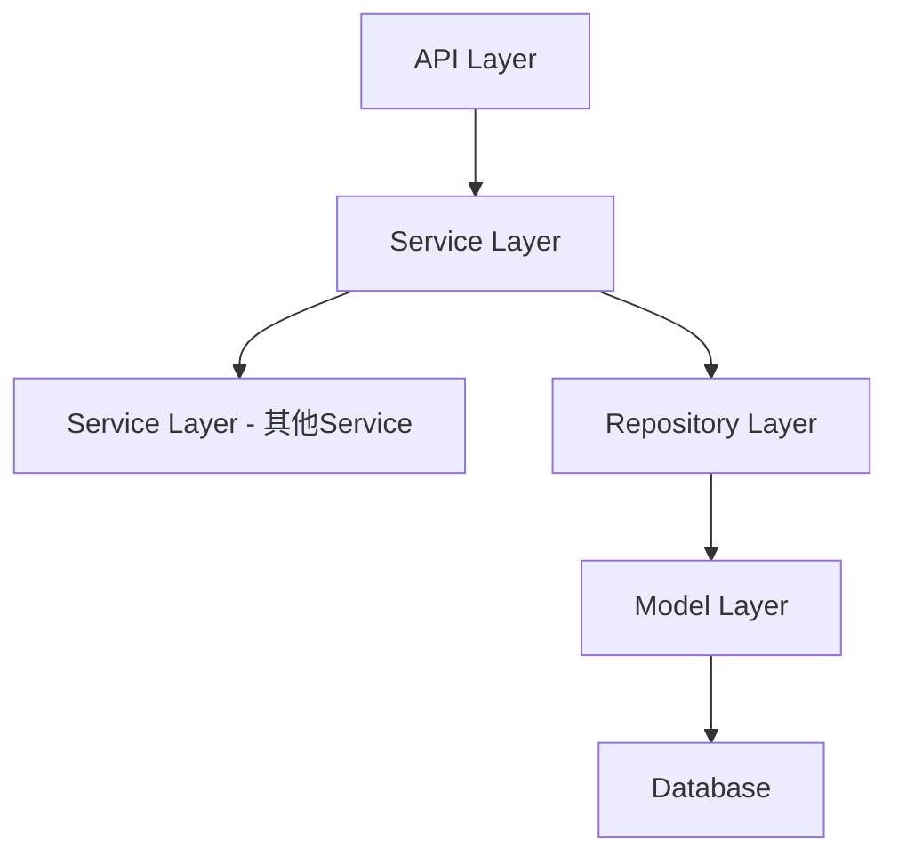

# 套餐分组类型增强功能（必选和默认选中）设计文档

> 本文档定义 套餐分组类型增强功能（必选和默认选中） 的技术设计和实现方案。

## 📋 概述

在套餐分组类型和加价功能的基础上，增加**必选**和**默认选中**两个属性。该功能主要涉及数据库表结构扩展、API 接口参数扩展、数据模型更新和业务逻辑验证。该功能参考现有套餐功能的实现方式，复用现有的套餐创建、编辑和查询流程。

---

## 🎯 规范对齐

### Go Main 规范 (go-main.mdc)

- Service 只依赖其他 Service 接口
- Repository 只持有 db 实例
- URL 使用 snake_case
- data 字段必须是对象
- 不使用 panic，返回 error

### API 设计规范 (api.mdc)

- URL 使用 snake_case
- 响应格式统一
- data 不能为 null 或数组

### 数据库规范 (database.mdc)

- 必需字段完整
- 时间字段使用 int
- 金额字段使用 decimal(20,8) 或 decimal(10,2)
- 迁移前检查字段是否存在

---

## 🔄 代码复用分析

### 可复用的现有组件

- **套餐创建接口**: `main/app/api/v1/shop/shop_product.go:ProductShopAdd()` - 创建套餐，可扩展必选和默认选中字段
- **套餐编辑接口**: `main/app/api/v1/shop/shop_product.go:ProductShopEdit()` - 编辑套餐，可扩展必选和默认选中字段
- **商品详情接口**: `main/app/api/v1/shop/shop_product.go:ProductShopDetail()` - 查询商品详情，可扩展返回必选和默认选中字段
- **商品列表接口**: `main/app/service/product.go:ProductSearch()` - 查询商品列表，可扩展返回必选和默认选中字段
- **套餐 Service**: `main/app/service/product.go` - 套餐业务逻辑，可扩展必选和默认选中验证
- **套餐 Model**: `main/app/model/product_package_group_item.go` - 数据模型，可扩展字段

### 集成点

- **套餐分组商品表**: 增加必选和默认选中字段
- **API 请求参数**: 扩展 DTO 结构体
- **API 响应数据**: 扩展响应结构体
- **业务逻辑验证**: 增加必选和默认选中验证

---

## 🏗️ 架构设计

### 分层设计原则

**Go Main 三层架构**:

```
API 层 (Controller/API)
  ↓ 依赖
业务层 (Service)
  ↓ 依赖
数据层 (Repository/Model)
```

### 架构图



### 模块划分

#### Go Main 模块

- **API 层**: `main/app/api/v1/shop/shop_product.go` - 路由处理、参数校验
- **Service 层**: `main/app/service/product.go` - 业务逻辑、事务管理
- **Repository 层**: `main/app/repository/product_package_group.go` - 数据访问、数据库操作
- **Model 层**: `main/app/model/product_package_group_item.go` - 数据模型
- **DTO 层**: `main/app/dto/req/product.go`, `main/app/dto/resp/product_resp/product.go` - 数据传输对象

#### PHP Admin 模块

- **Model 层**: `admin/app/common/model/product/ProductPackageGroupItem.php` - 数据模型
- **迁移文件**: `admin/database/migrations/` - 数据库迁移

---

## 🗄️ 数据库设计

### 数据表设计

#### 修改表: ttpos_product_package_group_item

**新增字段**:

```sql
ALTER TABLE `ttpos_product_package_group_item` 
ADD COLUMN `is_required` INT(10) NOT NULL DEFAULT 0 COMMENT '必选 0-不必选 1-必选' AFTER `add_price`,
ADD COLUMN `is_default` INT(10) NOT NULL DEFAULT 0 COMMENT '默认选中 0-默认不选中 1-默认选中' AFTER `is_required`;
```

**字段说明**:
| 字段 | 类型 | 说明 | 约束 |
|------|------|------|------|
| is_required | INT(10) | 必选（0-不必选，1-必选） | DEFAULT 0 |
| is_default | INT(10) | 默认选中（0-不默认选中，1-默认选中） | DEFAULT 0 |

**实现说明**: 
- 实际实现中使用 `INT(10)` 类型（与迁移文件一致）
- 迁移文件: `admin/database/migrations/20251125112939_add_is_required_and_is_default_to_product_package_group_item_table.php`
- 种子文件: `admin/database/seeds/shop_01.sql` 已同步更新

**字段规则**:
- 固定分组时，`is_required` 和 `is_default` 必须为0
- 可选分组时，可以设置 `is_required` 和 `is_default`
- 必选数量不能大于可选数量
- 默认数量不能大于可选数量

**索引设计**:
- 无需新增索引（现有索引已足够）

### 数据库迁移

**迁移脚本**:

```bash
# 创建迁移文件
cd admin
php think migrate:create AddIsRequiredAndIsDefaultToPackageGroupItem

# 执行迁移
php think migrate:run
```

**迁移文件内容**:

```php
<?php
// admin/database/migrations/{YYYYMMDDHHMMSS}_add_is_required_and_is_default_to_package_group_item.php

use think\migration\Migrator;
use think\migration\db\Column;

class AddIsRequiredAndIsDefaultToPackageGroupItem extends Migrator
{
    public function up()
    {
        // 检查字段是否存在，避免重复添加
        $table = $this->table('product_package_group_item');
        
        if (!$table->hasColumn('is_required')) {
            $table->addColumn('is_required', 'tinyint', [
                'default' => 0,
                'comment' => '必选 0-不必选 1-必选',
                'after' => 'add_price'
            ]);
        }
        
        if (!$table->hasColumn('is_default')) {
            $table->addColumn('is_default', 'tinyint', [
                'default' => 0,
                'comment' => '默认选中 0-默认不选中 1-默认选中',
                'after' => 'is_required'
            ]);
        }
        
        $table->update();

        // 更新现有数据：设置默认值
        $this->execute("UPDATE `ttpos_product_package_group_item` SET `is_required` = 0, `is_default` = 0 WHERE `is_required` IS NULL OR `is_default` IS NULL");
    }

    public function down()
    {
        $table = $this->table('product_package_group_item');
        
        if ($table->hasColumn('is_required')) {
            $table->removeColumn('is_required');
        }
        
        if ($table->hasColumn('is_default')) {
            $table->removeColumn('is_default');
        }
        
        $table->update();
    }
}
```

---

## 📡 API 设计

### 1. 商家管理端接口

#### 1.1 创建套餐接口

**接口地址**: `POST /api/v1/shop/product/add`

**请求参数扩展**:

```go
// ProductShopAddPackageGroupProductReq 套餐分组商品添加请求
type ProductShopAddPackageGroupProductReq struct {
	BomUuid   uint64  `json:"bom_uuid" binding:"required"`  // 商品BOM UUID
	Num       float64 `json:"num" binding:"required,min=0"`  // 商品数量
	Sort      int     `json:"sort" binding:"required"`       // 商品排序
	AddPrice  float64 `json:"add_price"`                    // 加价金额，默认0
	IsRequired int    `json:"is_required"`                  // ⭐ 新增：必选 0-不必选 1-必选
	IsDefault  int    `json:"is_default"`                    // ⭐ 新增：默认选中 0-默认不选中 1-默认选中
}
```

**参数验证**:
- `is_required`: 必须为 0 或 1
- `is_default`: 必须为 0 或 1
- 固定分组时，`is_required` 和 `is_default` 必须为0
- 可选分组时，必选数量不能大于可选数量
- 可选分组时，默认数量不能大于可选数量

#### 1.2 编辑套餐接口

**接口地址**: `POST /api/v1/shop/product/edit`

**请求参数扩展**:

```go
// ProductShopEditPackageGroupProductReq 套餐分组商品编辑请求
type ProductShopEditPackageGroupProductReq struct {
	BomUuid    uint64  `json:"bom_uuid" binding:"required"`  // 商品BOM UUID
	Num        float64 `json:"num" binding:"required,min=0"`  // 商品数量
	Sort       int     `json:"sort" binding:"required"`       // 商品排序
	AddPrice   float64 `json:"add_price"`                    // 加价金额，默认0
	IsRequired int     `json:"is_required"`                  // ⭐ 新增：必选 0-不必选 1-必选
	IsDefault  int     `json:"is_default"`                   // ⭐ 新增：默认选中 0-默认不选中 1-默认选中
}
```

#### 1.3 商品详情接口

**接口地址**: `GET /api/v1/shop/product/detail`

**响应数据扩展**:

在套餐分组商品的响应中返回 `is_required` 和 `is_default` 字段。

**实现说明**:
- 扩展了 `ProductPackageSubProduct` 结构体，添加了 `IsRequired` 和 `IsDefault` 字段
- 在 `GetRespPackageSubProductGroupList()` 方法中返回这些字段
- 响应路径: `PackageSubProductGroups.List[].Products.List[].IsRequired` 和 `IsDefault`

### 2. 收银端接口

#### 2.1 商品列表接口

**接口地址**: `GET /api/v1/{terminal}/product/list`

**响应数据扩展**:

```go
// PackageProductDetail 套餐商品详情
type PackageProductDetail struct {
	Detail     Product `json:"detail"`      // 商品详情
	Num        float64 `json:"num"`        // 商品数量，分组中item的数量
	AddPrice   float64 `json:"add_price"`  // 加价金额
	IsRequired int     `json:"is_required"` // ⭐ 新增：必选 0-不必选 1-必选
	IsDefault  int     `json:"is_default"`  // ⭐ 新增：默认选中 0-默认不选中 1-默认选中
	CanEdit    bool    `json:"can_edit"`    // 是否可以编辑
}
```

**响应格式示例**:

```json
{
  "code": 1,
  "message": "success",
  "data": {
    "list": [
      {
        "uuid": 123456,
        "product_type": 1,
        "package_group_list": {
          "list": [
            {
              "uuid": 789012,
              "group_type": 1,
              "optional_count": 2,
              "products": {
                "list": [
                  {
                    "detail": {...},
                    "num": 1,
                    "add_price": 5.00,
                    "is_required": 1,    // ⭐ 新增：必选
                    "is_default": 0,     // ⭐ 新增：默认选中
                    "can_edit": true
                  }
                ]
              }
            }
          ]
        }
      }
    ]
  }
}
```

---

## 💻 代码实现

### 1. Model 层扩展

#### 1.1 Go Model

**文件**: `main/app/model/product_package_group_item.go`

```go
// ProductPackageGroupItem 商品套餐组商品模型 `ttpos_product_package_group_item`
type ProductPackageGroupItem struct {
	BaseModel
	ProductPackageGroupUuid uint64  `json:"product_package_group_uuid" gorm:"index:idx_product_package_group_uuid;not null;default:0;comment:商品套餐组ID"`
	RelatedUuid             uint64  `json:"related_uuid" gorm:"index:idx_related_uuid;not null;default:0;comment:关联商品UUID, product_package_uuid"`
	ProductBomUuid          uint64  `json:"product_bom_uuid" gorm:"index:idx_product_bom_uuid;not null;default:0;comment:商品BOM UUID,商品规格uuid"`
	Num                     float64 `json:"num" gorm:"type:decimal(12,4);not null;default:0;comment:数量"`
	Sort                    int     `json:"sort" gorm:"index:idx_sort;not null;default:0;comment:排序"`
	AddPrice                float64 `json:"add_price" gorm:"type:decimal(22,4);not null;default:0.00;comment:加价金额，表示该商品需要加价多少钱"`
	IsRequired              int     `json:"is_required" gorm:"type:int(10);not null;default:0;comment:必选 0-不必选 1-必选"` // ⭐ 新增
	IsDefault               int     `json:"is_default" gorm:"type:int(10);not null;default:0;comment:默认选中 0-默认不选中 1-默认选中"` // ⭐ 新增

	ProductBom          *ProductBom          `gorm:"foreignKey:product_bom_uuid;references:uuid"`
	ProductPackage      *ProductPackage      `gorm:"foreignKey:related_uuid;references:uuid"`
	ProductPackageGroup *ProductPackageGroup `gorm:"foreignKey:product_package_group_uuid;references:uuid"`
}
```

#### 1.2 PHP Model

**文件**: `admin/app/common/model/product/ProductPackageGroupItem.php`

```php
protected $field = [
    'uuid',
    'product_package_group_uuid',
    'related_uuid',
    'product_bom_uuid',
    'num',
    'sort',
    'add_price',
    'is_required',  // ⭐ 新增
    'is_default',   // ⭐ 新增
    'create_time',
    'update_time',
    'delete_time',
];
```

**说明**: PHP Model 已更新，添加了 `is_required` 和 `is_default` 字段到 `$field` 数组中。

### 2. DTO 层扩展

#### 2.1 Request DTO

**文件**: `main/app/dto/req/product.go`

```go
// ProductShopAddPackageGroupProductReq 套餐分组商品添加请求
type ProductShopAddPackageGroupProductReq struct {
	BomUuid    uint64  `json:"bom_uuid" binding:"required"`  // 商品BOM UUID
	Num        float64 `json:"num" binding:"required,min=0"`  // 商品数量
	Sort       int     `json:"sort" binding:"required"`       // 商品排序
	AddPrice   float64 `json:"add_price"`                    // 加价金额，默认0
	IsRequired int     `json:"is_required"`                  // ⭐ 新增：必选 0-不必选 1-必选
	IsDefault  int     `json:"is_default"`                   // ⭐ 新增：默认选中 0-默认不选中 1-默认选中
}

// ProductShopEditPackageGroupProductReq 套餐分组商品编辑请求
type ProductShopEditPackageGroupProductReq struct {
	BomUuid    uint64  `json:"bom_uuid" binding:"required"`  // 商品BOM UUID
	Num        float64 `json:"num" binding:"required,min=0"`  // 商品数量
	Sort       int     `json:"sort" binding:"required"`       // 商品排序
	AddPrice   float64 `json:"add_price"`                    // 加价金额，默认0
	IsRequired int     `json:"is_required"`                 // ⭐ 新增：必选 0-不必选 1-必选
	IsDefault  int     `json:"is_default"`                   // ⭐ 新增：默认选中 0-默认不选中 1-默认选中
}
```

#### 2.2 Response DTO

**文件**: `main/app/dto/resp/product_resp/product.go`

```go
// PackageProductDetail 套餐商品详情
type PackageProductDetail struct {
	Detail     Product `json:"detail"`      // 商品详情
	Num        float64 `json:"num"`         // 商品数量，分组中item的数量
	AddPrice   float64 `json:"add_price"`   // 加价金额
	IsRequired int     `json:"is_required"` // ⭐ 新增：必选 0-不必选 1-必选
	IsDefault  int     `json:"is_default"`  // ⭐ 新增：默认选中 0-默认不选中 1-默认选中
	CanEdit    bool    `json:"can_edit"`    // 是否可以编辑
}
```

### 3. Service 层扩展

#### 3.1 业务逻辑验证

**文件**: `main/app/service/product_check.go`

在套餐创建和编辑时，增加必选和默认选中的验证逻辑：

**实现位置**: `CheckProductPackage` 函数中

**验证逻辑**:
1. 验证 `is_required` 和 `is_default` 字段值必须为 0 或 1
2. 固定分组时，验证 `is_required` 和 `is_default` 必须为0
3. 可选分组时，统计必选数量和默认数量
4. 验证必选数量不能大于可选数量
5. 验证默认数量不能大于可选数量

**关键代码片段**:
```go
// 验证必选和默认选中字段
if product.IsRequired != 0 && product.IsRequired != 1 {
    return nil, errors.New("必选字段必须为0（不必选）或1（必选）")
}
if product.IsDefault != 0 && product.IsDefault != 1 {
    return nil, errors.New("默认选中字段必须为0（不默认选中）或1（默认选中）")
}
// 固定分组时，必选和默认选中必须为0
if group.GroupType == 0 {
    if product.IsRequired != 0 {
        return nil, errors.New("固定分组的必选必须为0")
    }
    if product.IsDefault != 0 {
        return nil, errors.New("固定分组的默认选中必须为0")
    }
}
// 验证必选数量不能大于可选数量
if requiredCount > group.OptionalCount {
    return nil, errors.New("必选数量不能大于可选数量")
}
// 验证默认数量不能大于可选数量
if defaultCount > group.OptionalCount {
    return nil, errors.New("默认数量不能大于可选数量")
}
```

#### 3.2 商品列表接口扩展

**文件**: `main/app/service/product.go`

在构建 `PackageProductDetail` 时，增加 `is_required` 和 `is_default` 字段：

**实现位置**: `FormatProducts` 函数中

**关键代码片段**:
```go
productDetail := product_resp.PackageProductDetail{
    Detail: product_resp.Product{...},
    Num:        item.Num,
    AddPrice:   item.AddPrice,
    IsRequired: item.IsRequired, // ⭐ 已实现
    IsDefault:  item.IsDefault,  // ⭐ 已实现
}
productDetail.CanEdit = productDetail.GetCanEdit()
```

#### 3.3 商品详情接口扩展

**文件**: `main/app/model/product.go`

在 `GetRespPackageSubProductGroupList()` 方法中，返回 `is_required` 和 `is_default` 字段：

**关键代码片段**:
```go
products = append(products, product_resp.ProductPackageSubProduct{
    Uuid:             product.Uuid,
    BomUuid:          product.ProductBomUuid,
    ProductUuid:      product.ProductPackage.Uuid,
    LocaleName:       product.ProductPackage.MultiLanguageName.GetNames(),
    FlavorLocaleName: product.ProductBom.ProductFlavor.MultiLanguageName.GetNames(),
    Num:              product.Num,
    Price:            product.ProductBom.Price,
    IsRequired:       product.IsRequired, // ⭐ 已实现
    IsDefault:        product.IsDefault,  // ⭐ 已实现
})
```

#### 3.4 套餐创建和编辑逻辑扩展

**文件**: `main/app/service/product.go`

在 `SaveProductPackageGroup` 函数中，保存和更新 `is_required` 和 `is_default` 字段：

**关键代码片段**:
```go
// 创建新商品时
productPackageGroupRepo.CreateProductPackageGroupItem(&model.ProductPackageGroupItem{
    // ... 其他字段 ...
    AddPrice:   item.AddPrice,
    IsRequired: item.IsRequired, // ⭐ 已实现
    IsDefault:  item.IsDefault,  // ⭐ 已实现
})

// 更新现有商品时
productPackageGroupRepo.UpdateProductPackageGroupItem(map[string]any{
    // ... 其他字段 ...
    "add_price":   item.AddPrice,
    "is_required": item.IsRequired, // ⭐ 已实现
    "is_default":  item.IsDefault,  // ⭐ 已实现
}, commonRepo.WhereByUuid(item.Uuid))
```

---

## 🔒 业务规则

### 1. 必选规则

- 必选商品必须选择才能下单
- 必选商品在顾客选择时自动选中且不可取消
- 必选商品必须保持至少1份（减最后一份时提示："必选商品不可删除"）
- 必选数量不能大于可选数量
- 固定分组时，`is_required` 必须为0

### 2. 默认选中规则

- 默认选中商品在用户选购时默认选中，但可以取消
- 用户可以自由增加或减少默认选中商品的数量
- 默认数量不能大于可选数量
- 固定分组时，`is_default` 必须为0

### 3. 验证规则

- 创建/编辑套餐时，验证必选数量 <= 可选数量
- 创建/编辑套餐时，验证默认数量 <= 可选数量
- 创建/编辑套餐时，验证固定分组的必选和默认选中必须为0
- 验证失败时返回明确的错误提示

---

## 🧪 测试策略

### 单元测试

- [ ] Model 字段映射测试
- [ ] DTO 字段序列化/反序列化测试
- [ ] 业务逻辑验证测试

### 集成测试

- [ ] 创建套餐接口测试（包含必选和默认选中字段）
- [ ] 编辑套餐接口测试（包含必选和默认选中字段）
- [ ] 商品详情查询接口测试（返回必选和默认选中字段）
- [ ] 商品列表接口测试（返回必选和默认选中字段）
- [ ] 数据库迁移测试

### 端到端测试

- [ ] 创建包含必选商品的套餐
- [ ] 创建包含默认选中商品的套餐
- [ ] 编辑套餐必选和默认选中属性
- [ ] 验证前端选择界面的必选和默认选中交互

---

## ✅ 实现状态

### 已完成的功能

1. ✅ **数据库迁移文件**: 已创建迁移文件和种子文件
   - 迁移文件: `admin/database/migrations/20251125112939_add_is_required_and_is_default_to_product_package_group_item_table.php`
   - 种子文件: `admin/database/seeds/shop_01.sql` 已同步更新

2. ✅ **Go Model**: `ProductPackageGroupItem` 已添加 `IsRequired` 和 `IsDefault` 字段
   - 文件: `main/app/model/product_package_group_item.go`
   - 字段类型: `int`，gorm 标签: `type:int(10)`

3. ✅ **PHP Model**: `ProductPackageGroupItem` 已添加字段到 `$field` 数组
   - 文件: `admin/app/common/model/product/ProductPackageGroupItem.php`

4. ✅ **Request DTO**: 
   - `ProductShopAddPackageGroupProductReq` 已扩展
   - `ProductShopEditPackageGroupProductReq` 已扩展
   - 文件: `main/app/dto/req/product.go`

5. ✅ **Response DTO**: 
   - `PackageProductDetail` 已扩展（商品列表接口）
   - `ProductPackageSubProduct` 已扩展（商品详情接口）
   - 文件: `main/app/dto/resp/product_resp/product.go`

6. ✅ **Service 层**: 
   - 套餐创建逻辑: `SaveProductPackageGroup` 函数中已保存必选和默认选中字段
   - 套餐编辑逻辑: `SaveProductPackageGroup` 函数中已更新必选和默认选中字段
   - 商品列表查询: `FormatProducts` 函数中已返回必选和默认选中字段
   - 商品详情查询: `GetRespPackageSubProductGroupList` 方法中已返回必选和默认选中字段
   - 同步功能: `SyncProduct` 函数中已同步必选和默认选中字段

7. ✅ **业务逻辑验证**: 
   - 文件: `main/app/service/product_check.go`
   - 函数: `CheckProductPackage`
   - 验证内容:
     - 字段值验证（0或1）
     - 固定分组限制（必选和默认选中必须为0）
     - 必选数量验证（不能大于可选数量）
     - 默认数量验证（不能大于可选数量）

8. ✅ **API 层**: 
   - 创建套餐接口: 通过 Service 层调用验证逻辑
   - 编辑套餐接口: 通过 Service 层调用验证逻辑
   - 商品详情接口: 已返回必选和默认选中字段
   - 商品列表接口: 已返回必选和默认选中字段

### 待完成的任务

1. ⏳ **数据库迁移执行**: 需要手动执行迁移命令
   ```bash
   cd admin && php think migrate:run
   ```

2. ⏳ **测试任务**: Phase 5 的单元测试、集成测试和端到端测试
   - 单元测试: Model 字段映射测试
   - 集成测试: API 接口测试
   - 端到端测试: 完整流程测试

### 实现说明

- **验证逻辑位置**: 业务逻辑验证在 `main/app/service/product_check.go:CheckProductPackage()` 函数中实现，API 层通过 Service 层调用验证，符合 Go Main 三层架构规范
- **字段类型**: 数据库使用 `INT(10)` 类型（与迁移文件一致），Go Model 使用 `int` 类型
- **向后兼容**: 所有新增字段都有默认值（0），现有数据不受影响
- **代码复用**: 复用了现有的套餐创建、编辑和查询流程，最小化代码变更

---

**版本**: v1.0.0  
**创建日期**: 2025-11-25  
**最后更新**: 2025-11-25  
**维护者**: 开发组

