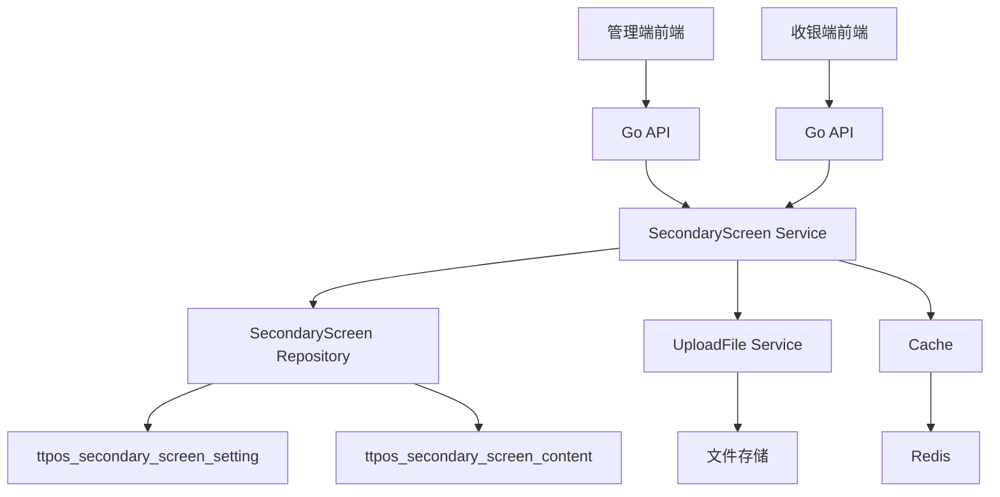

# 副屏设置接口开发 设计文档

> 本文档定义副屏设置接口开发的技术设计和实现方案。

## 📋 概述

**当前状态**：收银端设置中已有未点餐时的副屏轮播图设置（`cashier.carousel`），但缺少轮播间隔设置，以及点餐时的设置（展示模式和轮播间隔）。

**本次开发**：在现有收银机设置基础上扩展，添加：
1. 未点餐时的轮播间隔设置（`no_order_carousel_interval`）
2. 点餐时的展示模式设置（`order_display_mode`）
3. 点餐时的轮播间隔设置（`order_carousel_interval`）

**实现方式**：扩展现有的 `setting` 表中 `cashier` 配置的 JSON 字段，以及 `CashierResp` 结构体。

**本次开发仅限接口处理，前端不需要处理。**

---

## 🎯 规范对齐

### Go Main 规范 (go-main.mdc)

- Service 只依赖其他 Service 接口
- Repository 只持有 db 实例
- URL 使用 snake_case
- data 字段必须是对象
- 不使用 panic，返回 error

### API 设计规范 (api.mdc)

- URL 使用 snake_case
- 响应格式统一：`{code, message, data{}}`
- data 字段必须是对象

### 数据库规范 (database.mdc)

- 必须包含: `id`, `uuid`, `create_time`, `update_time`, `delete_time`
- 时间字段使用 int 类型，\_time 结尾，默认值 0
- UUID 字段使用 bigint unsigned
- 表名使用 ttpos\_ 前缀
- 字段名使用 snake_case

---

## 🔄 代码复用分析

### 可复用的现有组件

- **收银机设置服务**: `main/app/service/setting/setting.go` - `GetCashierSetting` 方法，已存在
- **收银机设置 API**: `admin/app/shop/controller/setting/Terminal.php` - 收银机设置保存接口，已存在
- **收银机设置模型**: `main/app/dto/resp/setting/cashier_setting.go` - `CashierResp` 结构体，需要扩展
- **设置存储**: `setting` 表，key 为 `cashier`，values 为 JSON 格式，已存在

### 集成点

- **设置存储**: 扩展现有的 `setting` 表 `cashier` 配置的 JSON 字段
- **设置接口**: 扩展现有的收银机设置保存和查询接口
- **数据结构**: 扩展 `CashierResp` 结构体，添加新字段

---

## 🏗️ 架构设计

### 分层设计原则

**Go Main 三层架构**:

```
API 层 (secondary_screen_api.go)
  ↓ 依赖
Service 层 (secondary_screen_service.go)
  ↓ 依赖
Repository 层 (secondary_screen_repo.go)
  ↓ 操作
Database (ttpos_secondary_screen_setting, ttpos_secondary_screen_content)
```

**依赖规则**:

- ✅ API 调用 Service，Service 调用 Repository
- ✅ Service 可以依赖其他 Service 接口（如 IUploadFileSrv）
- ✅ Repository 只持有 db 实例
- ❌ Service 不能直接依赖 Repository

### 架构图



### 模块划分

#### Go Main 模块

- **API 层**: `main/app/api/v1/shop/secondary_screen_api.go` - 副屏设置 API
- **Service 层**: `main/app/service/secondary_screen/secondary_screen_service.go` - 副屏设置 Service
- **Repository 层**: `main/app/repository/secondary_screen_repo.go` - 副屏设置 Repository
- **Model 层**: `main/app/model/secondary_screen_setting.go`, `main/app/model/secondary_screen_content.go` - 数据模型
- **DTO 层**: `main/app/dto/req/secondary_screen_req.go`, `main/app/dto/resp/secondary_screen_resp.go` - 请求/响应 DTO

---

## 🗄️ 数据库设计

### 扩展现有设置表

**说明**: 不需要创建新表，只需扩展现有的 `setting` 表中 `cashier` 配置的 JSON 字段。

#### 现有表结构: `ttpos_setting`

```sql
-- 表结构（已存在）
CREATE TABLE `setting` (
    `key` varchar(50) NOT NULL COMMENT '设置项标示',
    `describe` varchar(255) DEFAULT NULL COMMENT '设置项描述',
    `values` text COMMENT '设置内容（JSON格式）',
    `app_id` int(11) DEFAULT NULL COMMENT '应用ID',
    `create_time` int(10) DEFAULT NULL COMMENT '创建时间',
    `update_time` int(10) DEFAULT NULL COMMENT '更新时间',
    `delete_time` int(10) DEFAULT 0 COMMENT '删除时间',
    PRIMARY KEY (`key`)
) ENGINE=InnoDB DEFAULT CHARSET=utf8mb4 COMMENT='设置表';
```

#### 扩展 `cashier` 配置 JSON 字段

**当前 `cashier.values` JSON 结构**（已存在）:
```json
{
  "carousel": [],  // 轮播内容（未点餐时）
  "is_auto_send": "0",
  "order_method": {...},
  ...
}
```

**扩展后的 `cashier.values` JSON 结构**:
```json
{
  "carousel": [],  // 轮播内容（未点餐时，已存在，最多15个）
  "no_order_carousel_interval": 10,  // 未点餐时轮播间隔（新增，默认10秒）
  "order_display_mode": "carousel",  // 点餐时展示模式（新增，默认carousel）
  "order_carousel_interval": 10,  // 点餐时轮播间隔（新增，默认10秒）
  "is_auto_send": "0",
  "order_method": {...},
  ...
}
```

**新增字段说明**:
| 字段 | 类型 | 说明 | 默认值 | 约束 |
|------|------|------|--------|------|
| no_order_carousel_interval | int | 未点餐时轮播间隔(秒) | 10 | 范围10-120 |
| order_display_mode | string | 点餐时展示模式 | "carousel" | carousel/order/order_carousel |
| order_carousel_interval | int | 点餐时轮播间隔(秒) | 10 | 范围10-120 |

**轮播内容数量限制**:
- 轮播内容（`carousel`）最多支持15个图片或视频
- 保存时进行数量验证，超过15个返回错误提示

**说明**:
- 不需要数据库迁移脚本
- 只需要在代码中扩展 JSON 解析和保存逻辑
- 向后兼容：未配置新字段时使用默认值

---

## 📊 数据模型

### 扩展 CashierResp 结构体

**现有结构体**: `main/app/dto/resp/setting/cashier_setting.go`

**扩展后的结构体**:

```go
// main/app/dto/resp/setting/cashier_setting.go
type CashierResp struct {
    Carousel               []CarouselItem     `json:"carousel"`                   // 上传后的轮播内容url（图片 + 视频）- 已存在
    NoOrderCarouselInterval int              `json:"no_order_carousel_interval"` // 未点餐时轮播间隔(秒) - 新增
    OrderDisplayMode       string            `json:"order_display_mode"`         // 点餐时展示模式 - 新增
    OrderCarouselInterval  int               `json:"order_carousel_interval"`    // 点餐时轮播间隔(秒) - 新增
    // ... 其他现有字段
    IsAutoSend             string             `json:"is_auto_send"`
    OrderMethod            OrderMethod        `json:"order_method"`
    // ...
}
```

**新增字段说明**:
| 字段 | 类型 | JSON字段 | 说明 | 默认值 |
|------|------|----------|------|--------|
| NoOrderCarouselInterval | int | no_order_carousel_interval | 未点餐时轮播间隔(秒) | 10 |
| OrderDisplayMode | string | order_display_mode | 点餐时展示模式 | "carousel" |
| OrderCarouselInterval | int | order_carousel_interval | 点餐时轮播间隔(秒) | 10 |

### DTO 扩展

**说明**: 不需要创建新的 DTO，只需要扩展现有的收银机设置请求和响应结构。

#### PHP 请求扩展

在 `admin/app/shop/controller/setting/Terminal.php` 的保存接口中，扩展请求参数：

```php
// 新增请求参数（在现有 carousel 等参数基础上扩展）
    $no_order_carousel_interval = $data['no_order_carousel_interval'] ?? 10;  // 未点餐时轮播间隔
$order_display_mode = $data['order_display_mode'] ?? 'carousel';  // 点餐时展示模式
    $order_carousel_interval = $data['order_carousel_interval'] ?? 10;  // 点餐时轮播间隔

// 轮播内容数量限制：最多15个
$carousels = $data['carousel'] ?? [];
if (count($carousels) > 15) {
    return $this->renderError('轮播内容最多15个');
}

// 参数验证
if ($no_order_carousel_interval < 10 || $no_order_carousel_interval > 120) {
    return $this->renderError('未点餐时轮播间隔必须在10-120秒之间');
}
if (!in_array($order_display_mode, ['carousel', 'order', 'order_carousel'])) {
    return $this->renderError('点餐时展示模式无效');
}
if ($order_carousel_interval < 10 || $order_carousel_interval > 120) {
    return $this->renderError('点餐时轮播间隔必须在10-120秒之间');
}

// 保存到设置数组
$arr = [
    'carousel' => $carousels,  // 已存在
    'no_order_carousel_interval' => $no_order_carousel_interval,  // 新增
    'order_display_mode' => $order_display_mode,  // 新增
    'order_carousel_interval' => $order_carousel_interval,  // 新增
    // ... 其他现有字段
];
```

---

## 🔌 API 设计

### 扩展现有接口

**说明**: 不需要创建新接口，只需要扩展现有的收银机设置接口。

#### API 1: 扩展收银机设置保存接口（PHP）

**现有接口**: `admin/app/shop/controller/setting/Terminal.php` - `save()` 方法

**扩展请求参数**:

- **URL**: `/index.php/shop/setting.Terminal/save`（现有接口）
- **Method**: `POST`
- **Body**（在现有参数基础上扩展）:
  ```json
  {
    "carousel": [...],  // 已存在
      "no_order_carousel_interval": 10,  // 新增：未点餐时轮播间隔
    "order_display_mode": "carousel",  // 新增：点餐时展示模式
      "order_carousel_interval": 10,  // 新增：点餐时轮播间隔
    // ... 其他现有参数
  }
  ```

**响应**（保持不变）:
```json
{
  "code": 1,
  "message": "操作成功",
  "data": {}
}
```

#### API 2: 扩展收银机设置查询接口（Go）

**现有接口**: `main/app/service/setting/setting.go` - `GetCashierSetting()` 方法

**扩展响应**:

- **URL**: 通过现有收银机设置接口获取（如 `/api/v1/cashier/setting`）
- **Method**: `GET`
- **响应**（在现有响应基础上扩展）:
  ```json
  {
    "code": 1,
    "message": "success",
    "data": {
      "carousel": [...],  // 已存在
      "no_order_carousel_interval": 10,  // 新增
      "order_display_mode": "carousel",  // 新增
      "order_carousel_interval": 10,  // 新增
      // ... 其他现有字段
    }
  }
  ```

---

## 🧩 组件和接口

### Service 层扩展

#### 扩展 GetCashierSetting 方法

**现有方法**: `main/app/service/setting/setting.go` - `GetCashierSetting()`

**扩展实现**:

```go
// main/app/service/setting/setting.go
func (s *Srv) GetCashierSetting(ctx context.Context, languageList []dto.LanguageItem) (setting.Cashier, error) {
    // ... 现有代码 ...
    
    // 解析 JSON
    err = json.Unmarshal(modifiedJSON, &cashier)
    if err != nil {
        // ... 错误处理 ...
    }
    
    // 扩展：解析新增字段，设置默认值
    if cashier.NoOrderCarouselInterval == 0 {
        cashier.NoOrderCarouselInterval = 10  // 默认值
    }
    if cashier.OrderDisplayMode == "" {
        cashier.OrderDisplayMode = "carousel"  // 默认值
    }
    if cashier.OrderCarouselInterval == 0 {
        cashier.OrderCarouselInterval = 10  // 默认值
    }
    
    // ... 现有代码（处理 carousel 等）...
    
    return defaultCashier, nil
}
```

### PHP Controller 层扩展

#### 扩展 Terminal Controller

**现有文件**: `admin/app/shop/controller/setting/Terminal.php`

**扩展 save() 方法**:

```php
public function save()
{
    $data = $this->request->post();
    
    // ... 现有参数验证和处理 ...
    
    // 扩展：新增字段处理
    $no_order_carousel_interval = $data['no_order_carousel_interval'] ?? 10;
    $order_display_mode = $data['order_display_mode'] ?? 'carousel';
    $order_carousel_interval = $data['order_carousel_interval'] ?? 10;
    
    // 轮播内容数量限制：最多15个
    $carousels = $data['carousel'] ?? [];
    if (count($carousels) > 15) {
        return $this->renderError('轮播内容最多15个');
    }
    
    // 参数验证
    if ($no_order_carousel_interval < 10 || $no_order_carousel_interval > 120) {
        return $this->renderError('未点餐时轮播间隔必须在10-120秒之间');
    }
    if (!in_array($order_display_mode, ['carousel', 'order', 'order_carousel'])) {
        return $this->renderError('点餐时展示模式无效');
    }
    if ($order_carousel_interval < 10 || $order_carousel_interval > 120) {
        return $this->renderError('点餐时轮播间隔必须在10-120秒之间');
    }
    
    // 保存到设置数组
    $arr = [
        'carousel' => $carousels,  // 已存在
        'no_order_carousel_interval' => $no_order_carousel_interval,  // 新增
        'order_display_mode' => $order_display_mode,  // 新增
        'order_carousel_interval' => $order_carousel_interval,  // 新增
        // ... 其他现有字段 ...
    ];
    
    // 调用现有保存方法
    if ($model->edit(SettingEnum::CASHIER, $arr, $shop_supplier_id)) {
        return $this->renderSuccess('操作成功');
    }
    return $this->renderError('操作失败');
}
```

---

## ⚡ 缓存设计

### Redis 缓存

**缓存策略**:

- **Key 命名**: `ttpos:secondary_screen:setting:{company_uuid}`
- **过期时间**: 5 分钟
- **更新策略**: Cache-Aside Pattern（配置变更时清除缓存）

**示例**:

```go
// 读取缓存
cacheKey := fmt.Sprintf("ttpos:secondary_screen:setting:%d", companyUuid)
if cached, ok := cache.Global.Get(cacheKey); ok {
    return cached.(*dto_resp.SecondaryScreenSettingDetailResp), nil
}

// 查询数据库
setting, err := repo.GetByCompanyUuid(companyUuid)
// ...

// 写入缓存
cache.Global.Set(cacheKey, resp, 5*time.Minute)

// 清除缓存（配置变更时）
cache.Global.Del(cacheKey)
```

---

## 🚨 错误处理

### 错误场景

#### 场景 1: 文件上传失败

- **处理方式**: 返回错误信息，记录日志
- **用户影响**: 提示"文件上传失败，请重试"
- **代码示例**:
  ```go
  if err != nil {
      logger.Logger.Error("文件上传失败", zap.Error(err))
      return nil, errors.WithMessage(err, "文件上传失败")
  }
  ```

#### 场景 2: 配置不存在

- **处理方式**: 返回默认配置
- **用户影响**: 使用默认显示模式（轮播内容）

---

## 🔒 安全设计

### 身份验证

- **JWT Token**: 所有 API 需要 Token 验证
- **权限检查**: 检查用户是否有权限操作该门店的配置

### 数据安全

- **文件上传校验**: 格式和大小校验
- **SQL 注入防护**: 使用参数化查询

---

## 🧪 测试策略

### 单元测试

**目标覆盖率**:

- main/app/service: 70%+
- main/app/repository: 80%+

**测试内容**:

- Service 业务逻辑
- Repository 数据访问
- DTO 数据转换

### API 测试

**测试内容**:

- API 接口调用
- 参数验证
- 响应格式
- 错误处理

---

## 📈 性能优化

### 优化策略

1. **使用现有缓存**:
   - 收银机设置已有缓存机制，新增字段自动包含
   - 配置变更时自动清除相关缓存

2. **JSON 解析优化**:
   - 使用高效的 JSON 解析库
   - 避免重复解析

### 性能指标

- 本地响应时间: < 200ms（与现有接口一致）
- JSON 解析时间: < 10ms
- 向后兼容：不影响现有接口性能

---

## 📚 实现清单

### Phase 1: 数据结构扩展

- [ ] 扩展 `CashierResp` 结构体（`main/app/dto/resp/setting/cashier_setting.go`）
  - 添加 `NoOrderCarouselInterval int`
  - 添加 `OrderDisplayMode string`
  - 添加 `OrderCarouselInterval int`
- [ ] 扩展 PHP 设置默认值（`admin/app/common/model/settings/Setting.php`）
  - 在 `cashier` 默认值中添加新字段

### Phase 2: Go Service 扩展

- [ ] 扩展 `GetCashierSetting` 方法（`main/app/service/setting/setting.go`）
  - 解析 JSON 中的新字段
  - 设置默认值（未配置时）
  - 返回扩展后的结构体

### Phase 3: PHP Controller 扩展

- [ ] 扩展 `Terminal::save()` 方法（`admin/app/shop/controller/setting/Terminal.php`）
  - 接收新字段参数
  - 参数验证（范围、枚举值）
  - 保存到设置 JSON

### Phase 4: 测试

- [ ] 单元测试（Go Service）
- [ ] API 测试（PHP Controller）
- [ ] 集成测试（端到端流程）
- [ ] 向后兼容测试（确保现有功能不受影响）

**详细任务**: 参见 `tasks.md`

---

## Graphiti & 活动日志

- Related Episode: `[待补充]`
- 模板：`docs/agent/templates/graphiti-episode.md`
- 活动日志：`docs/team/activities/{YYYY-MM}/{YYYY-MM-DD}.md`
- 在技术方案评审、关键架构决策或踩坑总结后，立即补充 Episode 并在设计文档尾部互链。

---

**版本**: v1.0.0  
**创建日期**: 2025-11-20  
**作者**: 曾振华  
**审核者**: {待审核}

