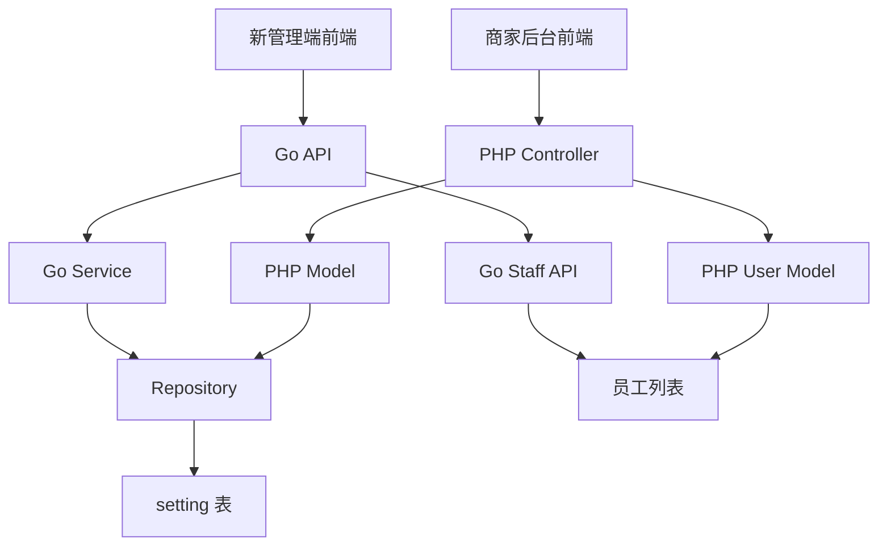

# 商家后台业务设置增加敏感操作设置 设计文档

> 本文档定义商家后台业务设置增加敏感操作设置的技术设计和实现方案。

## 📋 概述

在业务设置中新增"敏感操作设置"模块，支持配置折扣和退款操作是否需要权限密码验证，以及选择授权验证人。**本功能需要在两个终端实现：1) 新管理端（Go项目的shop目录：`main/app/api/v1/shop/`）- 仅实现后端接口，无前端；2) (旧)商家后台（PHP项目的admin/shop目录：`admin/app/shop/`）- 实现后端接口和Vue前端。** 本功能仅包含业务设置页面的配置功能，密码验证逻辑将在其他任务中实现。

---

## 🎯 规范对齐

### Go Main 规范 (go-main.mdc)

- Service 只依赖其他 Service 接口
- Repository 只持有 db 实例
- URL 使用 snake_case
- data 字段必须是对象
- 不使用 panic，返回 error

### PHP 规范 (php.mdc)

- 遵循 MVC 分层
- Controller 不写业务逻辑
- 使用验证器验证参数
- 使用现有的 Setting 模型

### API 设计规范 (api.mdc)

- URL 使用 snake_case
- 响应格式统一：`{code, message, data{}}`
- data 字段必须是对象

### 数据库规范 (database.mdc)

- 使用现有的 `setting` 表
- values 字段使用 JSON 格式存储
- 遵循现有业务设置的存储方式

---

## 🔄 代码复用分析

### 可复用的现有组件

- **Go新管理端业务设置 API**: `main/app/api/v1/shop/shop_setting.go` - 已有业务设置实现，可扩展
- **Go新管理端业务设置 Service**: `main/app/service/setting/setting.go` - 已有业务设置处理逻辑
- **PHP商家后台业务设置 Controller**: `admin/app/shop/controller/setting/Business.php` - 已有业务设置实现，可扩展
- **PHP商家后台 Setting 模型**: `admin/app/shop/model/settings/Setting.php` - 设置保存和读取逻辑
- **员工列表获取**:
  - Go: `main/app/api/v1/shop/shop_staff.go` - 员工列表 API
  - PHP: `admin/app/shop/model/auth/User.php` - `getBaseList()` 方法获取员工列表
- **类似功能**: `is_need_password`（取消订单/退菜权限设置）- 已有类似实现，可参考

### 集成点

- **Go新管理端业务设置 API**: `/shop/setting/business` - 扩展现有接口
- **PHP商家后台业务设置 API**: `/index.php/shop/setting.Business/index` - 扩展现有接口
- **设置存储**: `setting` 表，key 为 `business`，values 为 JSON
- **员工选择**: 复用现有的员工选择组件（前端）

---

## 🏗️ 架构设计

### 分层设计原则

**Go Main 三层架构**:

```
API 层 (shop_setting.go)
  ↓ 依赖
Service 层 (setting.go)
  ↓ 依赖
Repository 层
  ↓ 操作
Database (setting 表)
```

**PHP MVC 三层架构**:

```
Controller 层 (Business.php)
  ↓ 调用
Model 层 (Setting.php)
  ↓ 操作
Database (setting 表)
```

**依赖规则**:

- ✅ Go: API 调用 Service，Service 调用 Repository
- ✅ PHP: Controller 调用 Model
- ✅ Model/Repository 操作数据库
- ❌ Controller/API 不直接操作数据库

### 架构图



### 模块划分

#### Go Main 模块

- **API 层**: `main/app/api/v1/shop/shop_setting.go` - 业务设置 API
- **Service 层**: `main/app/service/setting/setting.go` - 业务设置 Service
- **Repository 层**: `main/app/repository/setting.go` - 设置 Repository

#### PHP Admin 模块

- **Controller 层**: `admin/app/shop/controller/setting/Business.php` - 业务设置控制器
- **Model 层**: `admin/app/shop/model/settings/Setting.php` - 设置模型
- **Model 层**: `admin/app/shop/model/auth/User.php` - 员工模型（获取员工列表）

#### Vue 前端模块（仅商家后台）

- **商家后台**: `admin/views/shop/pages/setting/business/` - 业务设置页面
- **Components**: `admin/views/shop/components/` - 可复用组件（员工选择器）
- **API封装**: `admin/views/shop/src/api/setting.js` - 业务设置API封装

**注意**: 新管理端无前端，仅提供后端接口。

---

## 🗄️ 数据库设计

### 数据表设计

#### 使用现有表: `setting`

```sql
-- 表结构（已存在）
CREATE TABLE `setting` (
    `key` varchar(50) NOT NULL COMMENT '设置键',
    `describe` varchar(255) DEFAULT NULL COMMENT '描述',
    `values` text COMMENT '设置值（JSON格式）',
    `app_id` int(11) DEFAULT NULL COMMENT '应用ID',
    `create_time` int(11) DEFAULT 0 COMMENT '创建时间',
    `update_time` int(11) DEFAULT 0 COMMENT '更新时间',
    PRIMARY KEY (`key`, `app_id`)
) ENGINE=InnoDB DEFAULT CHARSET=utf8mb4 COMMENT='系统设置表';
```

**存储格式**:

```json
{
  "zeroing_method": 0,
  "checkout_zeroing_method": 0,
  "gift_method": 10,
  "free_method": 10,
  "no_clear_table": 0,
  "is_need_password": 1,
  "dish_card_style": 0,
  "discount_method": 10,
  "is_invoice": 0,
  "opening_hours": "08:00-22:00",
  "delivery_price_ratio": 100,
  "start_serial_no": "0001",
  // 新增字段
  "discount_need_password": 1,              // 折扣操作是否需要密码 0-否 1-是
  "discount_authorized_staff_ids": [1, 2, 3], // 折扣操作授权员工ID列表
  "refund_need_password": 1,               // 退款操作是否需要密码 0-否 1-是
  "refund_authorized_staff_ids": [1, 2, 3]    // 退款操作授权员工ID列表
}
```

**字段说明**:

| 字段 | 类型 | 说明 | 约束 |
|------|------|------|------|
| discount_need_password | int | 折扣操作是否需要密码 | 0-否, 1-是 |
| discount_authorized_staff_ids | array | 折扣操作授权员工ID列表 | JSON 数组 |
| refund_need_password | int | 退款操作是否需要密码 | 0-否, 1-是 |
| refund_authorized_staff_ids | array | 退款操作授权员工ID列表 | JSON 数组 |

**索引设计**:

- 主键索引: `PRIMARY KEY (key, app_id)`
- 无需新增索引（使用现有索引）

**迁移文件**: 无需创建迁移文件（使用现有表结构）

---

## 📊 数据模型

### Go DTO 定义

```go
// main/app/dto/req/base.go
type UpdateBusinessSetting struct {
    // ... 现有字段 ...
    IsNeedPassword string `json:"is_need_password" binding:"required,oneof=0 1"`
    
    // 新增字段
    DiscountNeedPassword      string   `json:"discount_need_password" binding:"omitempty,oneof=0 1"`           // 折扣操作是否需要密码 0-否 1-是
    DiscountAuthorizedStaffIds []uint64 `json:"discount_authorized_staff_ids"`                                 // 折扣操作授权员工ID列表
    RefundNeedPassword        string   `json:"refund_need_password" binding:"omitempty,oneof=0 1"`             // 退款操作是否需要密码 0-否 1-是
    RefundAuthorizedStaffIds  []uint64 `json:"refund_authorized_staff_ids"`                                     // 退款操作授权员工ID列表
}
```

### Go Service 层

**获取设置**:

```go
// main/app/service/setting/setting.go
// GetBusinessSetting 方法会自动返回新增字段（如果已保存）
businessSetting, err := s.GetBusinessSetting(ctx)
discountNeedPassword := businessSetting.DiscountNeedPassword
discountAuthorizedStaffIds := businessSetting.DiscountAuthorizedStaffIds
refundNeedPassword := businessSetting.RefundNeedPassword
refundAuthorizedStaffIds := businessSetting.RefundAuthorizedStaffIds
```

**保存设置**:

```go
// main/app/service/setting/setting.go
// EditBusinessSetting 方法会自动处理新增字段（通过 copier.CopyWithOption）
businessSettingReq := req.UpdateBusinessSetting{
    // ... 现有字段 ...
    DiscountNeedPassword:      "1",
    DiscountAuthorizedStaffIds: []uint64{1, 2, 3},
    RefundNeedPassword:        "1",
    RefundAuthorizedStaffIds:  []uint64{1, 2, 3},
}
err := s.EditBusinessSetting(ctx, businessSettingReq)
```

### PHP Model

使用现有的 `Setting` 模型，无需新增模型。

**获取设置**:

```php
// admin/app/shop/controller/setting/Business.php
$setting = SettingModel::getItem(SettingEnum::BUSINESS);
$discountNeedPassword = $setting['discount_need_password'] ?? 0;
$discountAuthorizedStaffIds = $setting['discount_authorized_staff_ids'] ?? [];
$refundNeedPassword = $setting['refund_need_password'] ?? 0;
$refundAuthorizedStaffIds = $setting['refund_authorized_staff_ids'] ?? [];
```

**保存设置**:

```php
// admin/app/shop/controller/setting/Business.php
$data = [
    'discount_need_password' => $request->param('discount_need_password', 0),
    'discount_authorized_staff_ids' => $request->param('discount_authorized_staff_ids', []),
    'refund_need_password' => $request->param('refund_need_password', 0),
    'refund_authorized_staff_ids' => $request->param('refund_authorized_staff_ids', []),
];
$model = new SettingModel;
$model->edit(SettingEnum::BUSINESS, $data);
```

---

## 🔌 API 设计

### RESTful API

#### API: 获取业务设置（Go新管理端）

**请求**:

- **URL**: `/shop/setting/business`
- **Method**: `GET`
- **Headers**:
  ```json
  {
    "Authorization": "Bearer {token}",
    "Content-Type": "application/json"
  }
  ```

**响应**:

```json
{
  "code": 1,
  "message": "success",
  "data": {
    "business": {
      "zeroing_method": "0",
      "checkout_zeroing_method": "0",
      "gift_method": "10",
      "free_method": "10",
      "no_clear_table": "0",
      "is_need_password": "1",
      "dish_card_style": "0",
      "discount_method": "10",
      "is_invoice": "0",
      "opening_hours": "08:00-22:00",
      "delivery_price_ratio": 100,
      "start_serial_no": "0001",
      "discount_need_password": "1",
      "discount_authorized_staff_ids": [1, 2, 3],
      "refund_need_password": "1",
      "refund_authorized_staff_ids": [1, 2, 3]
    }
  }
}
```

#### API: 保存业务设置（Go新管理端）

**请求**:

- **URL**: `/shop/setting/business`
- **Method**: `POST`
- **Headers**:
  ```json
  {
    "Authorization": "Bearer {token}",
    "Content-Type": "application/json"
  }
  ```
- **Body**:
  ```json
  {
    "zeroing_method": "0",
    "checkout_zeroing_method": "0",
    "gift_method": "10",
    "free_method": "10",
    "no_clear_table": "0",
    "is_need_password": "1",
    "dish_card_style": "0",
    "discount_method": "10",
    "is_invoice": "0",
    "opening_hours": "08:00-22:00",
    "delivery_price_ratio": 100,
    "start_serial_no": "0001",
    "discount_need_password": "1",
    "discount_authorized_staff_ids": [1, 2, 3],
    "refund_need_password": "1",
    "refund_authorized_staff_ids": [1, 2, 3]
  }
  ```

**响应**:

```json
{
  "code": 1,
  "message": "保存成功",
  "data": {}
}
```

#### API: 获取业务设置（PHP商家后台）

**请求**:

- **URL**: `/index.php/shop/setting.Business/index`
- **Method**: `GET`
- **Headers**:
  ```json
  {
    "Authorization": "Bearer {token}",
    "Content-Type": "application/json"
  }
  ```

**响应**:

```json
{
  "code": 1,
  "message": "success",
  "data": {
    "zeroing_method": 0,
    "checkout_zeroing_method": 0,
    "gift_method": 10,
    "free_method": 10,
    "no_clear_table": 0,
    "is_need_password": 1,
    "dish_card_style": 0,
    "discount_method": 10,
    "is_invoice": 0,
    "opening_hours": "08:00-22:00",
    "delivery_price_ratio": 100,
    "start_serial_no": "0001",
    "discount_need_password": 1,
    "discount_authorized_staff_ids": [1, 2, 3],
    "refund_need_password": 1,
    "refund_authorized_staff_ids": [1, 2, 3]
  }
}
```

#### API: 保存业务设置

**请求**:

- **URL**: `/index.php/shop/setting.Business/index`
- **Method**: `POST`
- **Headers**:
  ```json
  {
    "Authorization": "Bearer {token}",
    "Content-Type": "application/json"
  }
  ```
- **Body**:
  ```json
  {
    "zeroing_method": 0,
    "checkout_zeroing_method": 0,
    "gift_method": 10,
    "free_method": 10,
    "no_clear_table": 0,
    "is_need_password": 1,
    "dish_card_style": 0,
    "discount_method": 10,
    "is_invoice": 0,
    "opening_hours": "08:00-22:00",
    "delivery_price_ratio": 100,
    "start_serial_no": "0001",
    "discount_need_password": 1,
    "discount_authorized_staff_ids": [1, 2, 3],
    "refund_need_password": 1,
    "refund_authorized_staff_ids": [1, 2, 3]
  }
  ```

**响应**:

```json
{
  "code": 1,
  "message": "success",
  "data": {}
}
```

**错误响应**:

```json
{
  "code": 0,
  "message": "错误信息",
  "data": {}
}
```

---

## 🧩 组件和接口

### Service 层（Go）

#### Setting Service 扩展

```go
// main/app/service/setting/setting.go
func (s *Srv) EditBusinessSetting(ctx context.Context, businessSettingReq req.UpdateBusinessSetting) error {
    // ... 现有代码 ...
    
    // 更新businessSetting
    copier.CopyWithOption(&businessSetting, businessSettingReq, copier.Option{IgnoreEmpty: true})
    
    // 新增字段会自动通过 copier 复制到 businessSetting 中
    // discount_need_password, discount_authorized_staff_ids
    // refund_need_password, refund_authorized_staff_ids
    
    // ... 现有代码 ...
    
    // 保存设置到 business_setting 表
    err = s.UpdateSetting(ctx, constant.SettingBusiness, oldBusinessSetting)
    // ... 现有代码 ...
}
```

**注意**: 新增字段会自动通过 `copier.CopyWithOption` 复制，无需额外处理。

### Controller 层（PHP）

#### Business Controller 扩展

```php
// admin/app/shop/controller/setting/Business.php
public function index()
{
    if ($this->request->isGet()) {
        return $this->fetchData(SettingEnum::BUSINESS);
    }
    
    $model = new SettingModel;
    $data = $this->request->param();
    
    // 现有字段处理...
    $arr = [
        'zeroing_method' => $data['zeroing_method'] ?? 0,
        'checkout_zeroing_method' => $data['checkout_zeroing_method'] ?? 0,
        // ... 其他现有字段
        
        // 新增字段
        'discount_need_password' => $data['discount_need_password'] ?? 0,
        'discount_authorized_staff_ids' => $data['discount_authorized_staff_ids'] ?? [],
        'refund_need_password' => $data['refund_need_password'] ?? 0,
        'refund_authorized_staff_ids' => $data['refund_authorized_staff_ids'] ?? [],
    ];
    
    if ($model->edit(SettingEnum::BUSINESS, $arr)) {
        return $this->renderSuccess('保存成功');
    }
    
    return $this->renderError('保存失败');
}
```

### Model 层

使用现有的 `Setting` 模型（PHP），无需修改。

### 前端组件

#### 业务设置页面扩展

```vue
<!-- admin/views/shop/pages/setting/business/index.vue -->
<template>
  <div class="business-setting">
    <!-- 现有设置项... -->
    
    <!-- 新增：敏感操作设置 -->
    <el-card class="box-card">
      <div slot="header">
        <span>敏感操作设置</span>
      </div>
      
      <!-- 折扣操作权限设置 -->
      <el-form-item label="优惠折扣">
        <el-radio-group v-model="form.discount_need_password">
          <el-radio :label="1">需要密码</el-radio>
          <el-radio :label="0">无需密码</el-radio>
        </el-radio-group>
        <div class="form-tip">开启后，员工进行折扣操作时需输入授权员工的权限密码</div>
      </el-form-item>
      
      <el-form-item label="授权员工" v-if="form.discount_need_password === 1">
        <el-select
          v-model="form.discount_authorized_staff_ids"
          multiple
          filterable
          placeholder="请选择授权员工"
          style="width: 100%"
        >
          <el-option
            v-for="staff in staffList"
            :key="staff.uuid"
            :label="staff.real_name"
            :value="staff.uuid"
          />
        </el-select>
      </el-form-item>
      
      <!-- 退款操作权限设置 -->
      <el-form-item label="退款">
        <el-radio-group v-model="form.refund_need_password">
          <el-radio :label="1">需要密码</el-radio>
          <el-radio :label="0">无需密码</el-radio>
        </el-radio-group>
        <div class="form-tip">开启后，员工进行退款操作时需输入授权员工的权限密码</div>
      </el-form-item>
      
      <el-form-item label="授权员工" v-if="form.refund_need_password === 1">
        <el-select
          v-model="form.refund_authorized_staff_ids"
          multiple
          filterable
          placeholder="请选择授权员工"
          style="width: 100%"
        >
          <el-option
            v-for="staff in staffList"
            :key="staff.uuid"
            :label="staff.real_name"
            :value="staff.uuid"
          />
        </el-select>
      </el-form-item>
    </el-card>
  </div>
</template>

<script setup lang="ts">
import { ref, onMounted } from 'vue'
import { getBusinessSetting, saveBusinessSetting } from '@/api/setting'
import { getStaffList } from '@/api/auth'

const form = ref({
  // 现有字段...
  discount_need_password: 0,
  discount_authorized_staff_ids: [],
  refund_need_password: 0,
  refund_authorized_staff_ids: [],
})

const staffList = ref([])

onMounted(async () => {
  // 加载设置
  const setting = await getBusinessSetting()
  form.value = { ...form.value, ...setting }
  
  // 加载员工列表
  const staffs = await getStaffList()
  staffList.value = staffs
})

const handleSave = async () => {
  await saveBusinessSetting(form.value)
}
</script>
```

---

## ⚡ 缓存设计

### Redis 缓存

**缓存策略**:

- **Key 命名**: `setting:company_id:{app_id}`（已存在）
- **过期时间**: 无过期时间（手动清除）
- **更新策略**: 保存设置时清除缓存

**缓存清除**:

```php
// admin/app/shop/model/settings/Setting.php
// 在 edit() 方法中已有缓存清除逻辑
$key = sprintf("setting:company_id:%d", $appId);
if (Cache::has($key)) {
    Cache::delete($key);
}
```

---

## 🚨 错误处理

### 错误场景

#### 场景 1: 设置保存失败

- **处理方式**: 返回错误提示
- **用户影响**: 显示"保存失败"提示
- **代码示例**:
  ```php
  if (!$model->edit(SettingEnum::BUSINESS, $arr)) {
      return $this->renderError('保存失败');
  }
  ```

#### 场景 2: 员工ID不存在

- **处理方式**: 前端验证，后端过滤无效ID
- **用户影响**: 仅保存有效的员工ID
- **代码示例**:
  ```php
  // 验证员工ID是否存在
  $validStaffIds = [];
  foreach ($data['discount_authorized_staff_ids'] as $staffId) {
      if (User::where('uuid', $staffId)->count() > 0) {
          $validStaffIds[] = $staffId;
      }
  }
  $arr['discount_authorized_staff_ids'] = $validStaffIds;
  ```

---

## 🔒 安全设计

### 身份验证

- **JWT Token**: 所有 API 需要 Token 验证
- **权限验证**: 仅门店管理员可以修改设置

### 权限控制

- **RBAC**: 基于角色的访问控制
- **API 权限**: 检查用户是否为门店管理员

### 数据安全

- **参数验证**: 使用验证器验证参数
- **SQL 注入防护**: 使用参数化查询（ThinkPHP ORM）
- **XSS 防护**: 前端输入校验

---

## 🧪 测试策略

### 单元测试

**测试内容**:

- Controller 参数验证
- Model 数据保存和读取
- 设置合并逻辑

**示例**:

```php
// admin/app/shop/controller/setting/BusinessTest.php
public function testSaveSensitiveOperationSettings()
{
    $data = [
        'discount_need_password' => 1,
        'discount_authorized_staff_ids' => [1, 2, 3],
        'refund_need_password' => 1,
        'refund_authorized_staff_ids' => [1, 2, 3],
    ];
    
    $response = $this->post('/shop/setting.Business/index', $data);
    $response->assertStatus(200);
    $response->assertJson(['code' => 1]);
}
```

### API 测试

**测试内容**:

- API 接口调用
- 参数验证
- 响应格式
- 错误处理

### 集成测试

**测试流程**:

- 端到端设置保存和读取
- 员工列表加载
- 设置持久化

---

## 📈 性能优化

### 优化策略

1. **缓存优化**:
   - 设置数据缓存到 Redis
   - 员工列表缓存（如需要）

2. **数据库优化**:
   - 使用现有索引
   - 避免不必要的查询

### 性能指标

- 设置页面加载时间: < 500ms
- 设置保存响应时间: < 200ms
- 员工列表加载时间: < 300ms

---

## 🌐 浏览器兼容性

### 前端兼容性（Vue）

- Chrome 90+
- Safari 14+
- Firefox 88+
- Edge 90+

### 响应式设计

- 桌面端: 1920x1080
- 平板端: 1024x768

---

## 📚 实现清单

### Phase 1: 后端实现

- [ ] 扩展 Business Controller，添加新字段处理
- [ ] 更新设置保存逻辑，支持新字段
- [ ] 添加参数验证

### Phase 2: 前端实现

- [ ] 扩展业务设置页面，添加敏感操作设置区域
- [ ] 实现折扣/退款权限开关
- [ ] 实现授权员工选择器（多选）
- [ ] 加载员工列表
- [ ] 实现设置保存

### Phase 3: 测试

- [ ] 单元测试
- [ ] API 测试
- [ ] 集成测试
- [ ] 浏览器兼容性测试

**详细任务**: 参见 `tasks.md`

---

## Graphiti & 活动日志

- Related Episode: `[待补充]`
- 模板：`docs/agent/templates/graphiti-episode.md`
- 活动日志：`docs/team/activities/{YYYY-MM}/{YYYY-MM-DD}.md`
- 在技术方案评审、关键架构决策或踩坑总结后，立即补充 Episode 并在设计文档尾部互链。

---

**版本**: v1.0.0  
**创建日期**: 2025-11-19  
**作者**: 开发组  
**审核者**: {审核者}

