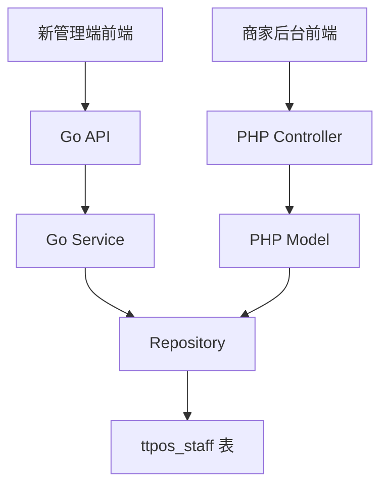

# 员工账号增加权限密码 设计文档

> 本文档定义员工账号增加权限密码的技术设计和实现方案。

## 📋 概述

在员工账号管理中新增"权限密码"字段，支持为每个员工设置权限密码。权限密码默认值为 666888，密码必须为 4-8 位数字，系统在设置密码时进行校验。**本功能需要在两个终端实现：1) 新管理端（Go项目的shop目录：`main/app/api/v1/shop/`）；2) (旧)商家后台（PHP项目的admin/shop目录：`admin/app/shop/`）。** 本功能仅包含员工账号的权限密码设置功能，不包含密码验证逻辑的实现。

---

## 🎯 规范对齐

### Go Main 规范 (go-main.mdc)

- Service 只依赖其他 Service 接口
- Repository 只持有 db 实例
- URL 使用 snake_case
- data 字段必须是对象
- 不使用 panic，返回 error
- 密码加密使用 `utils.EncryptPassword()` 函数

### PHP 规范 (php.mdc)

- 遵循 MVC 分层
- Controller 不写业务逻辑
- 使用验证器验证参数
- 密码加密使用 `salt_hash()` 函数

### API 设计规范 (api.mdc)

- URL 使用 snake_case
- 响应格式统一：`{code, message, data{}}`
- data 不能为 null 或数组

### 数据库规范 (database.mdc)

- 必需字段完整
- 时间字段使用 int
- 字段命名使用 snake_case
- 密码字段使用 varchar(255) 存储加密后的值

---

## 🔄 代码复用分析

### 可复用的现有组件

- **Go员工管理 API**: `main/app/api/v1/shop/shop_staff.go` - 已有员工管理实现，可扩展
- **Go员工 Service**: `main/app/service/staff.go` - 已有登录密码处理逻辑，可参考
- **Go员工 Model**: `main/app/model/staff.go` - 已有 password 字段，可参考
- **PHP员工 Model**: `admin/app/shop/model/auth/User.php` - 已有登录密码处理逻辑，可参考
- **密码加密函数**:
  - Go: `main/pkg/utils/encrypt.go` - `EncryptPassword()` 函数
  - PHP: `salt_hash()` 函数（与登录密码加密方式一致）

### 集成点

- **Go新管理端 API**: `/shop/staff/add`, `/shop/staff/update` - 扩展现有接口
- **PHP商家后台**: `admin/app/shop/model/auth/User.php` - `add()` 和 `edit()` 方法
- **设置存储**: `ttpos_staff` 表，新增 `permission_password` 字段

---

## 🏗️ 架构设计

### 分层设计原则

**Go Main 三层架构**:

```
API 层 (shop_staff.go)
  ↓ 依赖
Service 层 (staff.go)
  ↓ 依赖
Repository 层 (staff.go)
  ↓ 操作
Database (ttpos_staff 表)
```

**PHP MVC 三层架构**:

```
Controller 层
  ↓ 调用
Model 层 (User.php)
  ↓ 操作
Database (ttpos_staff 表)
```

### 架构图



### 模块划分

#### Go Main 模块

- **API 层**: `main/app/api/v1/shop/shop_staff.go` - 员工管理 API
- **Service 层**: `main/app/service/staff.go` - 员工业务逻辑
- **Repository 层**: `main/app/repository/staff.go` - 数据访问
- **Model 层**: `main/app/model/staff.go` - 数据模型
- **DTO 层**: `main/app/dto/req/staff.go` - 请求参数

#### PHP Admin 模块

- **Model 层**: `admin/app/shop/model/auth/User.php` - 员工模型
- **Controller 层**: `admin/app/shop/controller/` - 员工控制器（如需要）

#### Vue 前端模块

- **新管理端**: `admin/views/admin/src/pages/` - 员工管理页面（如适用）
- **商家后台**: `admin/views/shop/src/pages/` - 员工管理页面

---

## 🗄️ 数据库设计

### 数据表设计

#### 表: `ttpos_staff`（已存在，需要新增字段）

```sql
-- 新增字段：权限密码
ALTER TABLE `ttpos_staff` 
ADD COLUMN `permission_password` VARCHAR(255) NOT NULL DEFAULT '' COMMENT '权限密码（加密存储）' 
AFTER `password`;
```

**字段说明**:

| 字段 | 类型 | 说明 | 约束 |
|------|------|------|------|
| permission_password | varchar(255) | 权限密码（加密存储） | DEFAULT '' |

**索引设计**:

- 无需新增索引（使用现有索引）

**迁移文件**: `admin/database/migrations/{YYYYMMDDHHMMSS}_add_permission_password_field_to_staff_table.php`

**参考**: 现有的 `password` 字段实现方式

---

## 📊 数据模型

### Go Model

```go
// main/app/model/staff.go
type Staff struct {
    BaseModel
    CompanyUuid         uint64 `gorm:"column:company_uuid;type:bigint(20) unsigned;default:0;comment:集团ID;NOT NULL" json:"company_uuid"`
    Username            string `gorm:"column:username;type:varchar(255);comment:用户名;NOT NULL" json:"username"`
    Password            string `gorm:"column:password;type:varchar(255);comment:登录密码;NOT NULL" json:"password"`
    PermissionPassword  string `gorm:"column:permission_password;type:varchar(255);comment:权限密码（加密存储）;NOT NULL" json:"-"` // 不返回给前端
    Phone               string `gorm:"column:phone;type:varchar(20);comment:手机号" json:"phone"`
    // ... 其他字段 ...
}
```

### DTO 定义

#### Request DTO

```go
// main/app/dto/req/staff.go
type AddStaffReq struct {
    RealName           string   `json:"real_name" binding:"required,max=100"`
    Username          string   `json:"username" binding:"required,max=64,email"`
    Phone             string   `json:"phone" binding:"required,max=20"`
    Roles             []uint64 `json:"roles" binding:"required"`
    Password          string   `json:"password" binding:"required,strong_password"`
    ConfirmPassword   string   `json:"confirm_password" binding:"required,eqfield=Password"`
    PermissionPassword string  `json:"permission_password" binding:"required,permission_password"` // 新增字段，必填
}

type UpdateStaffReq struct {
    Uuid              uint64   `json:"uuid" binding:"required"`
    RealName          string   `json:"real_name" binding:"required,max=100"`
    Username          string   `json:"username" binding:"required,max=64,email"`
    Phone             string   `json:"phone" binding:"required,max=20"`
    Roles             []uint64 `json:"roles"`
    Password          string   `json:"password" binding:"omitempty,strong_password"`
    ConfirmPassword   string   `json:"confirm_password" binding:"omitempty,eqfield=Password"`
    PermissionPassword string  `json:"permission_password" binding:"omitempty,permission_password"` // 新增字段
}
```

**自定义验证规则**: 需要创建 `permission_password` 验证器，验证 4-8 位数字

---

## 🔌 API 设计

### RESTful API

#### API: 添加员工（Go新管理端）

**请求**:

- **URL**: `/shop/staff/add`
- **Method**: `POST`
- **Headers**:
  ```json
  {
    "Authorization": "Bearer {token}",
    "Content-Type": "application/json"
  }
  ```
- **Body**:
  ```json
  {
    "real_name": "张三",
    "username": "zhangsan@example.com",
    "phone": "13800138000",
    "roles": [1, 2],
    "password": "Password123!",
    "confirm_password": "Password123!",
    "permission_password": "666888"
  }
  ```

**响应**:

```json
{
  "code": 1,
  "message": "success",
  "data": {}
}
```

#### API: 编辑员工（Go新管理端）

**请求**:

- **URL**: `/shop/staff/update`
- **Method**: `POST`
- **Body**:
  ```json
  {
    "uuid": 123456,
    "real_name": "张三",
    "username": "zhangsan@example.com",
    "phone": "13800138000",
    "roles": [1, 2],
    "permission_password": "123456"
  }
  ```

**响应**:

```json
{
  "code": 1,
  "message": "success",
  "data": {}
}
```

**注意**: 权限密码不在响应中返回，编辑时也不返回密码字段。

---

## 🧩 组件和接口

### Service 层（Go）

#### Staff Service 扩展

```go
// main/app/service/staff.go
func (s *staffSrv) AddStaff(ctx context.Context, addReq req.AddStaffReq) (error, []string) {
    // ... 现有代码 ...
    
    staff := model.Staff{
        CompanyUuid:        ctx.GetCompanyUuid(),
        Username:           addReq.Username,
        RealName:           addReq.RealName,
        Phone:              addReq.Phone,
        Password:           utils.EncryptPassword(addReq.Password),
        PermissionPassword: utils.EncryptPassword(addReq.PermissionPassword), // 新增：加密权限密码（必填）
        IsDisable:          0,
        IsSuper:            0,
    }
    
    // 注意：权限密码在 DTO 中已设置为必填，如果为空会在验证阶段返回错误
    
    // ... 现有代码 ...
}

func (s *staffSrv) UpdateStaff(ctx context.Context, updateReq req.UpdateStaffReq) (error, []string) {
    // ... 现有代码 ...
    
    update := map[string]any{
        "username":  updateReq.Username,
        "real_name": updateReq.RealName,
        "phone":     updateReq.Phone,
    }
    
    if updateReq.Password != "" {
        update["password"] = utils.EncryptPassword(updateReq.Password)
        update["password_change_time"] = time.Now().Unix()
    }
    
    // 新增：处理权限密码（仅在设置了权限密码时更新，如未设置则不修改原权限密码）
    if updateReq.PermissionPassword != "" {
        update["permission_password"] = utils.EncryptPassword(updateReq.PermissionPassword)
    }
    // 注意：如果 updateReq.PermissionPassword 为空，则不添加到 update map 中，保持原值不变
    
    // ... 现有代码 ...
}
```

### Model 层（PHP）

#### User Model 扩展

```php
// admin/app/shop/model/auth/User.php
public function add($data, $user)
{
    // ... 现有代码 ...
    
    $arr = [
        'uuid' => createUuid(),
        'phone' => trim($data['phone']),
        'username' => trim($data['user_name']),
        'password' => salt_hash($data['password']),
        'real_name' => trim($data['real_name']),
        'user_type' => $user['user_type'],
        'company_uuid' => $appId,
        // 新增：权限密码
        'permission_password' => salt_hash($data['permission_password']), // 必填，已在验证阶段检查
    ];
    
    // ... 现有代码 ...
}

public function edit($data)
{
    // ... 现有代码 ...
    
    $arr = [
        'phone' => $data['phone'],
        'username' => $data['user_name'],
        'password' => salt_hash($data['password']),
        'real_name' => $data['real_name'],
    ];
    
    if (empty($data['password'])) {
        unset($arr['password']);
    } else {
        $arr['password_change_time'] = time();
    }
    
    // 新增：处理权限密码（仅在设置了权限密码时更新，如未设置则不修改原权限密码）
    if (isset($data['permission_password']) && $data['permission_password'] != '') {
        $arr['permission_password'] = salt_hash($data['permission_password']);
    }
    // 注意：如果 $data['permission_password'] 未设置或为空，则不添加到 $arr 中，保持原值不变
    
    // ... 现有代码 ...
}
```

### 前端组件

#### 员工编辑表单扩展

```vue
<!-- 新管理端或商家后台的员工编辑页面 -->
<template>
  <el-form>
    <!-- ... 现有表单项 ... -->
    
    <!-- 登录密码 -->
    <el-form-item label="登录密码" prop="password">
      <el-input v-model="formData.password" type="password" />
    </el-form-item>
    
    <!-- 新增：权限密码 -->
    <el-form-item label="权限密码" prop="permission_password">
      <el-input 
        v-model="formData.permission_password" 
        type="password"
        :placeholder="isEdit ? '留空则不修改原权限密码' : '请输入权限密码（必填）'"
        maxlength="8"
      />
      <div class="form-tip">密码必须为 4 - 8 位数字</div>
    </el-form-item>
    
    <!-- ... 其他表单项 ... -->
  </el-form>
</template>

<script setup lang="ts">
const isEdit = ref(false); // 是否为编辑模式

const formData = reactive({
  // ... 现有字段 ...
  password: '',
  // 新增字段
  permission_password: '', // 新建时必填，编辑时非必填
});

// 初始化表单数据
const initFormData = (staffData?: any) => {
  if (staffData) {
    // 编辑模式：不回显权限密码，非必填
    isEdit.value = true;
    formData.permission_password = '';
  } else {
    // 新建模式：权限密码必填
    isEdit.value = false;
    formData.permission_password = '';
  }
};

// 动态生成验证规则（根据编辑模式）
const getPermissionPasswordRules = () => {
  const rules: any[] = [];
  
  // 新建时必填
  if (!isEdit.value) {
    rules.push({ required: true, message: '权限密码不能为空', trigger: 'blur' });
  }
  
  // 格式验证
  rules.push({
    validator: (rule: any, value: string, callback: any) => {
      // 编辑模式下，如果为空则不验证格式
      if (isEdit.value && !value) {
        callback();
        return;
      }
      // 新建模式或编辑模式有值时，验证格式
      if (value && !/^\d{4,8}$/.test(value)) {
        callback(new Error('密码必须为 4 - 8 位数字'));
        return;
      }
      callback();
    },
    trigger: 'blur',
  });
  
  return rules;
};

const formRules = reactive({
  // ... 现有规则 ...
  permission_password: getPermissionPasswordRules(),
});
</script>
```

---

## ⚡ 缓存设计

### Redis 缓存

**缓存策略**:

- 无需新增缓存逻辑（使用现有的员工信息缓存机制）
- 如果员工信息有缓存，更新权限密码时需要清除缓存

---

## 🚨 错误处理

### 错误场景

#### 场景 1: 密码格式验证失败

- **处理方式**: 前端和后端都进行验证
- **用户影响**: 显示"密码必须为 4 - 8 位数字"提示
- **代码示例**:
  ```go
  // Go 自定义验证器
  if permissionPassword != "" && !regexp.MustCompile(`^\d{4,8}$`).MatchString(permissionPassword) {
      return errors.New("密码必须为 4 - 8 位数字")
  }
  ```

#### 场景 2: 员工信息保存失败

- **处理方式**: 返回错误提示
- **用户影响**: 显示"保存失败"提示

---

## 🔒 安全设计

### 密码加密

- **Go**: 使用 `utils.EncryptPassword()` 函数（MD5双重加密）
- **PHP**: 使用 `salt_hash()` 函数（与登录密码加密方式一致）
- **存储**: 加密后的密码存储在数据库中

### 密码安全

- **不返回密码**: API 响应中不包含权限密码字段
- **编辑页面**: 不显示密码明文，显示为空或占位符
- **默认值**: 新建员工时使用默认值 666888，但需要提醒用户修改

---

## 🧪 测试策略

### 单元测试

**测试内容**:

- Service 业务逻辑（密码加密、默认值处理）
- Model 数据保存和读取
- 密码格式验证

**示例**:

```go
// main/app/service/staff_test.go
func TestAddStaffWithPermissionPassword(t *testing.T) {
    req := req.AddStaffReq{
        RealName:          "测试员工",
        Username:          "test@example.com",
        Phone:             "13800138000",
        Roles:             []uint64{1},
        Password:          "Password123!",
        ConfirmPassword:   "Password123!",
        PermissionPassword: "666888",
    }
    
    err, _ := staffSrv.AddStaff(ctx, req)
    assert.NoError(t, err)
}
```

### API 测试

**测试内容**:

- API 接口调用
- 参数验证
- 密码格式验证
- 错误处理

---

## 📈 性能优化

### 优化策略

1. **数据库优化**:
   - 使用现有索引
   - 避免不必要的查询

### 性能指标

- 员工编辑页面加载时间: < 500ms
- 员工信息保存响应时间: < 200ms

---

## 🌐 浏览器兼容性

### 前端兼容性（Vue）

- Chrome 90+
- Safari 14+
- Firefox 88+
- Edge 90+

---

## 📚 实现清单

### Phase 1: 数据库迁移

- [ ] 创建数据库迁移文件
- [ ] 执行数据库迁移
- [ ] 更新 Seeds 文件（如需要）

### Phase 2: Go新管理端实现

- [ ] 扩展 Staff Model，添加权限密码字段
- [ ] 扩展 DTO，添加权限密码字段和验证规则
- [ ] 扩展 Service，添加权限密码处理逻辑
- [ ] 创建自定义验证器（4-8位数字验证）

### Phase 3: PHP商家后台实现

- [ ] 扩展 User Model，添加权限密码字段处理
- [ ] 添加权限密码验证逻辑
- [ ] 更新员工添加/编辑方法

### Phase 4: 前端实现

- [ ] 新管理端：添加权限密码输入框
- [ ] 商家后台：添加权限密码输入框
- [ ] 添加密码格式验证（前端）
- [ ] 添加多语言支持

### Phase 5: 测试

- [ ] 单元测试
- [ ] API 测试
- [ ] 集成测试
- [ ] 浏览器兼容性测试

**详细任务**: 参见 `tasks.md`

---

## Graphiti & 活动日志

- Related Episode: `[待补充]`
- 模板：`docs/agent/templates/graphiti-episode.md`
- 活动日志：`docs/team/activities/{YYYY-MM}/{YYYY-MM-DD}.md`
- 在技术方案评审、关键架构决策或踩坑总结后，立即补充 Episode 并在设计文档尾部互链。

---

**版本**: v1.0.0  
**创建日期**: 2025-11-19  
**作者**: 开发组  
**审核者**: {审核者}

