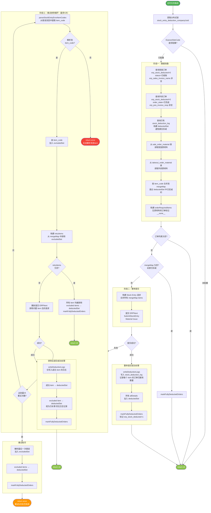
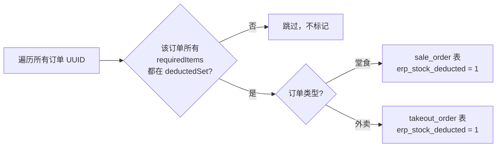
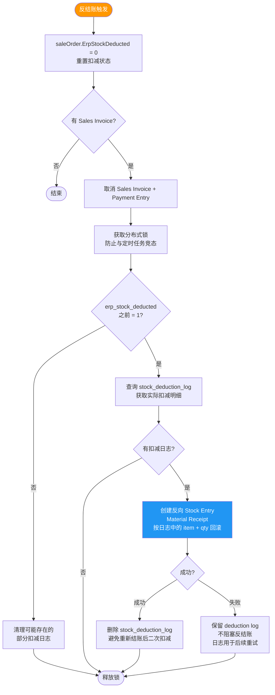
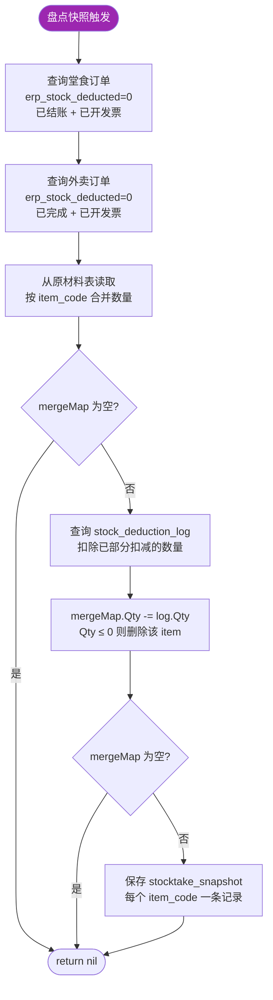

# Stock Entry 库存扣减流程

## 概览

Stock Entry 是 TTPOS 与 ERPNext 之间的库存扣减机制。每日定时任务将所有待扣减订单（堂食 + 外卖）的原材料按 `item_code` 合并，提交一次 Stock Entry（Material Issue）到 ERPNext 扣减库存。

---

## 核心数据结构

| 结构 | 说明 |
|------|------|
| `mergeMap` | `map[item_code] → {ItemCode, Qty}` — 按 item_code 合并后的待扣减数量 |
| `deductedSet` | `map["orderUuid:erpCode"] → bool` — 标记某订单的某 item 是否"已处理" |
| `orderRequiredItems` | `map[orderUuid] → map[erpCode]bool` — 每个订单需要扣减哪些 item |
| `excludedSet` | `map[item_code] → bool` — 本次提交中被排除的问题 item |
| `stock_deduction_log` | 持久化表 — 记录实际提交到 ERPNext 的 item（反结账依赖此表回滚） |

---

## 1. TriggerStockEntryDeduction 主流程



---

## 2. markFullyDeductedOrders 订单标记逻辑



**关键**：`__none__` 是无原材料订单的占位符，始终视为"已完成"，因此没有原材料的订单会直接被标记。

---

## 3. 错误解析正则

`parseStockEntryErrorItemCodes` 从 ERPNext 的错误消息中提取 item_code：

| 错误类型 | ERPNext 错误消息模式 | 正则 |
|---------|---------------------|------|
| 库存不足 | `Item Code: <strong>WPR123</strong>` | `Item Code: <strong>([^<]+)</strong>` |
| 非库存物料 | `SP123 is not a stock Item` | `(\S+) is not a stock Item` |
| 物品已禁用 | `Item WPR123 is disabled` | `Item (\S+) is disabled` |

---

## 4. deductedSet vs stock_deduction_log 的区别

这是理解整个流程的核心：

```
┌─────────────────────────────────────────────────────────────────┐
│                        deductedSet (内存)                        │
│  用途: 判断订单是否可标记 erp_stock_deducted=1                     │
│  包含: 成功扣减的 item ✅ + 被排除的 item ✅                        │
│  生命周期: 仅当次执行有效                                          │
└─────────────────────────────────────────────────────────────────┘

┌─────────────────────────────────────────────────────────────────┐
│                   stock_deduction_log (持久化)                    │
│  用途: 记录实际提交到 ERPNext 的扣减明细                             │
│  包含: 仅成功扣减的 item ✅（被排除的 ❌ 不记录）                     │
│  生命周期: 持久化，反结账时依赖此表回滚                               │
└─────────────────────────────────────────────────────────────────┘
```

**影响**：

| 场景 | deductedSet | stock_deduction_log | 订单标记 | 反结账回滚 |
|------|------------|--------------------|---------|-----------|
| item 成功扣减 | ✅ 标记 | ✅ 写入 | erp_stock_deducted=1 | 创建反向 Stock Entry 恢复库存 |
| item 被排除（disabled/not_stock/insufficient） | ✅ 标记 | ❌ 无记录 | erp_stock_deducted=1 | 不回滚（无实际扣减） |
| item 未处理（解析失败等） | ❌ 未标记 | ❌ 无记录 | 不标记，下次重试 | N/A |

---

## 5. 反结账库存恢复流程



**关键**：被排除的 item 没有 `stock_deduction_log` 记录，所以反结账时不会为它们创建反向 Stock Entry — 这是正确的行为，因为这些 item 从未实际扣减过库存。

---

## 6. GenerateStocktakeSnapshot 盘点快照流程



**与 Stock Entry 的一致性**：快照使用相同数据源（`erp_stock_deducted=0` 的订单），并扣除 `stock_deduction_log` 中已扣减的数量，确保快照反映的是"还需要扣减"的实际数量。

---

## 7. 完整生命周期示例

### 场景：3个订单，5种 item，其中 item_C 被禁用

```
订单 A: item_A(3), item_B(2), item_C(1)
订单 B: item_A(1), item_D(4)
订单 C: item_C(2), item_E(5)

合并后 mergeMap:
  item_A: 4, item_B: 2, item_C: 3, item_D: 4, item_E: 5
```

**执行过程**：

```
1. 整体提交 → ERPNext 返回 "Item item_C is disabled"
2. 解析出 item_C → excludedSet = {item_C}
3. 排除 item_C 后重试 → 提交 item_A(4), item_B(2), item_D(4), item_E(5) → 成功 ✅

4. writeDeductionLogs: 写入 item_A, item_B, item_D, item_E 的扣减日志
5. deductedSet 标记:
   - 成功: A:item_A ✅, A:item_B ✅, B:item_A ✅, B:item_D ✅, C:item_E ✅
   - 排除: A:item_C ✅, C:item_C ✅ （视为已处理）
6. markFullyDeductedOrders:
   - 订单 A: item_A ✅ item_B ✅ item_C ✅ → 全部完成 → erp_stock_deducted=1
   - 订单 B: item_A ✅ item_D ✅ → 全部完成 → erp_stock_deducted=1
   - 订单 C: item_C ✅ item_E ✅ → 全部完成 → erp_stock_deducted=1
```

**反结账订单 A**：

```
1. saleOrder.ErpStockDeducted = 0
2. 查询 stock_deduction_log → 找到 item_A(3), item_B(2)（item_C 无记录）
3. 创建反向 Stock Entry (Material Receipt): item_A(3), item_B(2)
4. item_C 不回滚 — 因为从未实际扣减过 ✅
```
