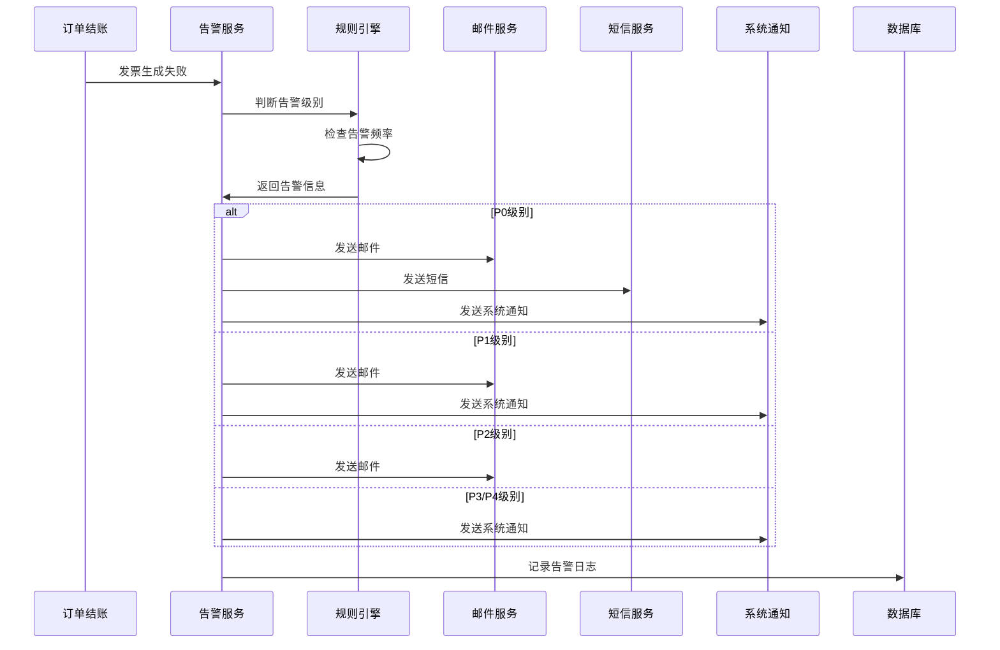
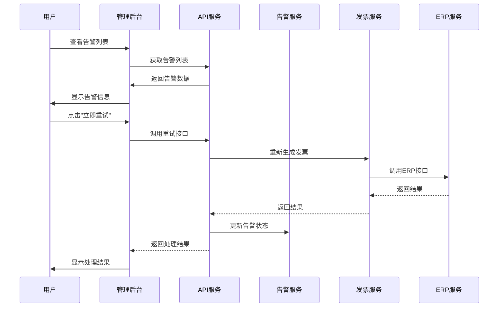

# TTPOS 侧发票生成失败通知机制链设计

## 1. 概述

### 1.1 设计目标

设计一套完整的发票生成失败通知机制，确保：
- ✅ 及时发现问题：发票生成失败后立即通知相关人员
- ✅ 避免重复告警：合理控制告警频率，避免告警疲劳
- ✅ 便于问题处理：提供清晰的错误信息和处理建议
- ✅ 可追溯可分析：记录完整的告警和处理历史

### 1.2 设计原则

1. **分层告警**：根据问题严重程度和持续时间，采用不同级别的告警
2. **多渠道通知**：邮件、系统通知、短信等多种渠道并行
3. **智能去重**：相同问题在短时间内不重复告警
4. **可操作性强**：告警中包含明确的处理建议和操作入口
5. **可追溯性**：记录完整的告警和处理链路

## 2. 通知机制链架构

### 2.1 整体架构

```
┌─────────────────────────────────────────────────────────────┐
│                    发票生成失败检测层                        │
│  ┌──────────────┐  ┌──────────────┐  ┌──────────────┐     │
│  │ 实时检测     │  │ 定时检测     │  │ 手动检测     │     │
│  │ (结账时)     │  │ (定时任务)   │  │ (管理后台)   │     │
│  └──────┬───────┘  └──────┬───────┘  └──────┬───────┘     │
└─────────┼──────────────────┼──────────────────┼────────────┘
          │                  │                  │
          └──────────────────┼──────────────────┘
                             │
          ┌──────────────────▼──────────────────┐
          │        告警规则引擎                    │
          │  ┌────────────────────────────────┐  │
          │  │ • 告警级别判断                  │  │
          │  │ • 告警频率控制                  │  │
          │  │ • 告警去重                      │  │
          │  │ • 告警升级                      │  │
          │  └────────────────────────────────┘  │
          └──────────────────┬───────────────────┘
                             │
          ┌──────────────────▼───────────────────┐
          │        通知分发层                       │
          │  ┌──────┐  ┌──────┐  ┌──────┐        │
          │  │ 邮件 │  │ 系统 │  │ 短信 │        │
          │  │ 通知 │  │ 通知 │  │ 通知 │        │
          │  └──────┘  └──────┘  └──────┘        │
          └──────────────────┬───────────────────┘
                             │
          ┌──────────────────▼───────────────────┐
          │        告警记录层                       │
          │  ┌────────────────────────────────┐  │
          │  │ • 告警日志表                    │  │
          │  │ • 告警状态跟踪                  │  │
          │  │ • 处理历史记录                  │  │
          │  └────────────────────────────────┘  │
          └──────────────────┬───────────────────┘
                             │
          ┌──────────────────▼───────────────────┐
          │        处理反馈层                       │
          │  ┌────────────────────────────────┐  │
          │  │ • 手动处理                     │  │
          │  │ • 自动重试                     │  │
          │  │ • 状态更新                     │  │
          │  └────────────────────────────────┘  │
          └───────────────────────────────────────┘
```

### 2.2 核心组件

1. **检测层**：实时检测、定时检测、手动检测
2. **规则引擎**：告警级别、频率控制、去重逻辑
3. **分发层**：多渠道通知发送
4. **记录层**：告警日志、状态跟踪
5. **处理层**：手动处理、自动重试、状态更新

## 3. 告警级别和规则

### 3.1 告警级别定义

| 级别 | 名称 | 触发条件 | 通知方式 | 通知频率 |
|------|------|----------|----------|----------|
| P0 | 紧急 | 发票生成失败 + 订单金额 > 10000 | 邮件 + 短信 + 系统通知 | 立即 + 每30分钟 |
| P1 | 重要 | 发票生成失败 + 订单金额 > 1000 | 邮件 + 系统通知 | 立即 + 每1小时 |
| P2 | 一般 | 发票生成失败 + 订单金额 <= 1000 | 邮件 | 立即 + 每2小时 |
| P3 | 提醒 | 发票长时间未生成（>1小时） | 系统通知 | 每1小时 |
| P4 | 信息 | 重试次数过多（>3次） | 系统通知 | 每次重试后 |

### 3.2 告警规则

#### 规则1：实时告警（发票生成失败时）

```go
// 触发时机：SavePosInvoice 返回错误时
// 告警级别：根据订单金额判断
// 通知频率：立即发送，24小时内最多2次

if err := s.SavePosInvoice(...); err != nil {
    alertLevel := calculateAlertLevel(order.Amount)
    s.SendAlert(ctx, order, alertLevel, err.Error())
}
```

#### 规则2：定时检测告警（发票长时间未生成）

```go
// 触发时机：定时任务每30分钟执行一次
// 检测条件：有 AsyncRecordId 但超过1小时未生成
// 告警级别：P3（提醒）

// 每30分钟检查一次
if time.Now().Unix() - order.CreateTime > 3600 {
    s.SendAlert(ctx, order, P3, "发票长时间未生成")
}
```

#### 规则3：重试次数告警

```go
// 触发时机：每次重试后检查
// 检测条件：重试次数 > 3
// 告警级别：P4（信息）

if retryCount > 3 {
    s.SendAlert(ctx, order, P4, fmt.Sprintf("重试次数过多：%d次", retryCount))
}
```

#### 规则4：告警升级

```go
// 如果P2/P3告警超过2小时未处理，升级为P1
// 如果P1告警超过4小时未处理，升级为P0

if alertLevel == P2 && time.Now().Unix() - alertTime > 7200 {
    alertLevel = P1
    s.SendAlert(ctx, order, P1, "告警升级：长时间未处理")
}
```

### 3.3 告警去重规则

```go
// 相同订单的相同类型告警，24小时内最多发送2次
// 第1次：立即发送
// 第2次：1小时后发送（如果问题仍未解决）
// 之后：不再发送（避免告警疲劳）

func ShouldSendAlert(companyUuid, orderUuid uint64, alertType int) (bool, *AlertLog) {
    lastAlert := GetLastAlert(companyUuid, orderUuid, alertType)
    if lastAlert == nil {
        return true, nil  // 首次告警
    }
    
    timeSinceLastAlert := time.Now().Unix() - lastAlert.LastAlertTime
    if lastAlert.AlertCount == 1 && timeSinceLastAlert > 3600 {
        return true, lastAlert  // 1小时后发送第2次
    }
    
    if lastAlert.AlertCount >= 2 {
        return false, lastAlert  // 已发送2次，不再发送
    }
    
    return false, lastAlert
}
```

## 4. 通知渠道设计

### 4.1 邮件通知

**适用场景**：所有级别的告警

**邮件模板设计**：

```html
<!-- 邮件主题 -->
[告警] {公司名称} - 订单 {订单号} 发票生成失败

<!-- 邮件内容 -->
<div class="alert-email">
  <h2>发票生成失败告警</h2>
  
  <div class="alert-info">
    <p><strong>告警级别：</strong>{告警级别}</p>
    <p><strong>公司名称：</strong>{公司名称}</p>
    <p><strong>订单号：</strong>{订单号}</p>
    <p><strong>订单时间：</strong>{订单时间}</p>
    <p><strong>订单金额：</strong>{订单金额}</p>
    <p><strong>错误信息：</strong>{错误信息}</p>
    <p><strong>ERP记录ID：</strong>{AsyncRecordId}</p>
  </div>
  
  <div class="action-buttons">
    <a href="{管理后台链接}/orders/{订单号}/invoice/retry">立即重试</a>
    <a href="{管理后台链接}/orders/{订单号}">查看订单</a>
    <a href="{管理后台链接}/alerts/{告警ID}">查看详情</a>
  </div>
  
  <div class="suggestions">
    <h3>处理建议：</h3>
    <ul>
      <li>检查ERP系统连接状态</li>
      <li>检查订单数据是否正确</li>
      <li>如问题持续，请联系技术支持</li>
    </ul>
  </div>
</div>
```

**实现代码**：

```go
// main/app/service/erp_invoice_alert.go
func (s *orderSrv) SendEmailAlert(ctx context.Context, alert *AlertInfo) error {
    template := s.getEmailTemplate(alert.Level)
    content := s.buildEmailContent(template, alert)
    
    sendReq := &v1.SendMessageReq{
        MessageUuid:  generateMessageUuid(),
        TemplateUuid: template.Uuid,
        MessageArgs:  content,
        MessageType:  "email",
        Recipient:    alert.Recipient,
        Subject:      alert.Subject,
        CompanyUuid:  alert.CompanyUuid,
    }
    
    return s.messageSrv.SendMessage(ctx, sendReq)
}
```

### 4.2 系统通知

**适用场景**：P0、P1、P3、P4级别告警

**通知设计**：

```go
// 系统通知数据结构
type SystemNotification struct {
    Id          uint64    `json:"id"`
    Type        string    `json:"type"`        // "invoice_failed"
    Level       int       `json:"level"`       // P0-P4
    Title       string    `json:"title"`       // "发票生成失败"
    Content     string    `json:"content"`     // 详细内容
    OrderNo     string    `json:"order_no"`    // 订单号
    OrderUuid   uint64    `json:"order_uuid"`  // 订单UUID
    ActionUrl   string    `json:"action_url"`  // 操作链接
    CreatedAt   int64     `json:"created_at"`  // 创建时间
    Read        bool      `json:"read"`        // 是否已读
    Handled     bool      `json:"handled"`     // 是否已处理
}

// 发送系统通知
func (s *orderSrv) SendSystemNotification(ctx context.Context, alert *AlertInfo) error {
    notification := &SystemNotification{
        Type:      "invoice_failed",
        Level:     alert.Level,
        Title:     alert.Title,
        Content:   alert.Content,
        OrderNo:   alert.OrderNo,
        OrderUuid: alert.OrderUuid,
        ActionUrl: fmt.Sprintf("/orders/%s/invoice/retry", alert.OrderNo),
        CreatedAt: time.Now().Unix(),
    }
    
    // 保存到数据库
    repo := repository.NewNotificationRepo(ctx.GetDB())
    notification.Id, _ = repo.Create(notification)
    
    // 通过WebSocket推送给在线用户
    websocket.PushNotification(ctx.GetCompanyUuid(), notification)
    
    return nil
}
```

**前端展示**：

```vue
<!-- 通知中心组件 -->
<template>
  <div class="notification-center">
    <div class="notification-item" 
         :class="`level-${notification.level}`"
         v-for="notification in notifications">
      <div class="notification-icon">
        <el-icon :name="getIcon(notification.level)"></el-icon>
      </div>
      <div class="notification-content">
        <div class="notification-title">{{ notification.title }}</div>
        <div class="notification-desc">{{ notification.content }}</div>
        <div class="notification-time">{{ formatTime(notification.created_at) }}</div>
      </div>
      <div class="notification-actions">
        <el-button @click="handleRetry(notification)">重试</el-button>
        <el-button @click="viewDetail(notification)">查看</el-button>
        <el-button @click="markRead(notification)">标记已读</el-button>
      </div>
    </div>
  </div>
</template>
```

### 4.3 短信通知

**适用场景**：P0级别告警（紧急）

**实现代码**：

```go
func (s *orderSrv) SendSMSAlert(ctx context.Context, alert *AlertInfo) error {
    if alert.Level != P0 {
        return nil  // 只有P0级别发送短信
    }
    
    smsReq := &sms.InvoiceAlertRequest{
        Company:    alert.CompanyName,
        OrderNo:    alert.OrderNo,
        Amount:     alert.OrderAmount,
        ErrorMsg:   alert.ErrorMessage,
    }
    
    return s.smsSrv.SendInvoiceAlertSMS(ctx, alert.RecipientPhone, smsReq)
}
```

## 5. 数据模型设计

### 5.1 告警日志表

```sql
CREATE TABLE `ttpos_erp_invoice_alert_log` (
  `id` bigint unsigned NOT NULL AUTO_INCREMENT,
  `company_uuid` bigint unsigned NOT NULL COMMENT '公司UUID',
  `sale_order_uuid` bigint unsigned NOT NULL COMMENT '销售订单UUID',
  `order_no` varchar(64) NOT NULL COMMENT '订单号',
  `alert_type` tinyint NOT NULL DEFAULT 1 COMMENT '告警类型：1-生成失败 2-长时间未生成 3-重试过多',
  `alert_level` tinyint NOT NULL DEFAULT 2 COMMENT '告警级别：0-P0紧急 1-P1重要 2-P2一般 3-P3提醒 4-P4信息',
  `error_message` text COMMENT '错误信息',
  `erp_async_record_id` varchar(255) DEFAULT '' COMMENT 'ERP异步记录ID',
  `retry_count` int NOT NULL DEFAULT 0 COMMENT '重试次数',
  `last_alert_time` bigint unsigned NOT NULL DEFAULT 0 COMMENT '上次告警时间（时间戳）',
  `alert_count` int unsigned NOT NULL DEFAULT 0 COMMENT '告警次数',
  `send_status` tinyint NOT NULL DEFAULT 0 COMMENT '发送状态：0-待发送 1-发送成功 2-发送失败',
  `email_sent` tinyint NOT NULL DEFAULT 0 COMMENT '邮件是否已发送',
  `sms_sent` tinyint NOT NULL DEFAULT 0 COMMENT '短信是否已发送',
  `notification_sent` tinyint NOT NULL DEFAULT 0 COMMENT '系统通知是否已发送',
  `recipient` varchar(255) DEFAULT '' COMMENT '收件人邮箱',
  `recipient_phone` varchar(20) DEFAULT '' COMMENT '收件人手机号',
  `message_uuid` bigint unsigned DEFAULT 0 COMMENT '消息UUID',
  `handled` tinyint NOT NULL DEFAULT 0 COMMENT '是否已处理：0-未处理 1-已处理',
  `handled_by` bigint unsigned DEFAULT 0 COMMENT '处理人UUID',
  `handled_at` bigint unsigned DEFAULT 0 COMMENT '处理时间',
  `handle_result` text COMMENT '处理结果',
  `created_at` bigint unsigned NOT NULL DEFAULT 0,
  `updated_at` bigint unsigned NOT NULL DEFAULT 0,
  PRIMARY KEY (`id`),
  KEY `idx_company_order` (`company_uuid`, `sale_order_uuid`),
  KEY `idx_order_no` (`order_no`),
  KEY `idx_alert_type_level` (`alert_type`, `alert_level`),
  KEY `idx_send_status` (`send_status`),
  KEY `idx_handled` (`handled`, `handled_at`),
  KEY `idx_last_alert_time` (`last_alert_time`)
) ENGINE=InnoDB DEFAULT CHARSET=utf8mb4 COMMENT='ERP发票告警日志表';
```

### 5.2 系统通知表

```sql
CREATE TABLE `ttpos_system_notification` (
  `id` bigint unsigned NOT NULL AUTO_INCREMENT,
  `company_uuid` bigint unsigned NOT NULL COMMENT '公司UUID',
  `user_uuid` bigint unsigned NOT NULL DEFAULT 0 COMMENT '用户UUID，0表示所有用户',
  `type` varchar(50) NOT NULL COMMENT '通知类型',
  `level` tinyint NOT NULL DEFAULT 2 COMMENT '通知级别',
  `title` varchar(255) NOT NULL COMMENT '通知标题',
  `content` text COMMENT '通知内容',
  `order_no` varchar(64) DEFAULT '' COMMENT '订单号',
  `order_uuid` bigint unsigned DEFAULT 0 COMMENT '订单UUID',
  `action_url` varchar(255) DEFAULT '' COMMENT '操作链接',
  `read` tinyint NOT NULL DEFAULT 0 COMMENT '是否已读',
  `read_at` bigint unsigned DEFAULT 0 COMMENT '阅读时间',
  `handled` tinyint NOT NULL DEFAULT 0 COMMENT '是否已处理',
  `handled_at` bigint unsigned DEFAULT 0 COMMENT '处理时间',
  `created_at` bigint unsigned NOT NULL DEFAULT 0,
  PRIMARY KEY (`id`),
  KEY `idx_company_user` (`company_uuid`, `user_uuid`),
  KEY `idx_type_level` (`type`, `level`),
  KEY `idx_read_handled` (`read`, `handled`),
  KEY `idx_created_at` (`created_at`)
) ENGINE=InnoDB DEFAULT CHARSET=utf8mb4 COMMENT='系统通知表';
```

## 6. 交互逻辑设计

### 6.1 告警触发流程



### 6.2 用户处理流程



### 6.3 前端交互设计

#### 6.3.1 告警列表页面

```vue
<template>
  <div class="invoice-alert-list">
    <!-- 筛选条件 -->
    <el-form :inline="true" class="filter-form">
      <el-form-item label="告警级别">
        <el-select v-model="filters.level" placeholder="全部">
          <el-option label="全部" value=""></el-option>
          <el-option label="P0-紧急" value="0"></el-option>
          <el-option label="P1-重要" value="1"></el-option>
          <el-option label="P2-一般" value="2"></el-option>
        </el-select>
      </el-form-item>
      <el-form-item label="处理状态">
        <el-select v-model="filters.handled" placeholder="全部">
          <el-option label="全部" value=""></el-option>
          <el-option label="未处理" value="0"></el-option>
          <el-option label="已处理" value="1"></el-option>
        </el-select>
      </el-form-item>
      <el-form-item>
        <el-button @click="loadAlerts">查询</el-button>
        <el-button @click="resetFilters">重置</el-button>
      </el-form-item>
    </el-form>

    <!-- 告警列表 -->
    <el-table :data="alerts" stripe>
      <el-table-column prop="order_no" label="订单号" width="150"></el-table-column>
      <el-table-column prop="alert_level" label="告警级别" width="100">
        <template #default="{ row }">
          <el-tag :type="getLevelTagType(row.alert_level)">
            {{ getLevelText(row.alert_level) }}
          </el-tag>
        </template>
      </el-table-column>
      <el-table-column prop="error_message" label="错误信息" show-overflow-tooltip></el-table-column>
      <el-table-column prop="alert_count" label="告警次数" width="100"></el-table-column>
      <el-table-column prop="last_alert_time" label="最后告警时间" width="180">
        <template #default="{ row }">
          {{ formatTime(row.last_alert_time) }}
        </template>
      </el-table-column>
      <el-table-column prop="handled" label="处理状态" width="100">
        <template #default="{ row }">
          <el-tag :type="row.handled ? 'success' : 'danger'">
            {{ row.handled ? '已处理' : '未处理' }}
          </el-tag>
        </template>
      </el-table-column>
      <el-table-column label="操作" width="200" fixed="right">
        <template #default="{ row }">
          <el-button size="small" @click="handleRetry(row)">立即重试</el-button>
          <el-button size="small" @click="viewDetail(row)">查看详情</el-button>
        </template>
      </el-table-column>
    </el-table>

    <!-- 分页 -->
    <el-pagination
      v-model:current-page="pagination.page"
      v-model:page-size="pagination.size"
      :total="pagination.total"
      @current-change="loadAlerts"
      layout="total, sizes, prev, pager, next, jumper">
    </el-pagination>
  </div>
</template>

<script setup>
import { ref, onMounted } from 'vue'
import { getInvoiceAlerts, retryInvoice } from '@/api/invoice-alert'

const alerts = ref([])
const filters = ref({
  level: '',
  handled: ''
})
const pagination = ref({
  page: 1,
  size: 20,
  total: 0
})

const loadAlerts = async () => {
  const res = await getInvoiceAlerts({
    ...filters.value,
    page: pagination.value.page,
    size: pagination.value.size
  })
  alerts.value = res.data.list
  pagination.value.total = res.data.total
}

const handleRetry = async (row) => {
  try {
    await retryInvoice(row.order_uuid)
    ElMessage.success('重试成功')
    loadAlerts()
  } catch (error) {
    ElMessage.error('重试失败：' + error.message)
  }
}

const viewDetail = (row) => {
  // 跳转到详情页
  router.push(`/orders/${row.order_no}/invoice-alert/${row.id}`)
}

onMounted(() => {
  loadAlerts()
})
</script>
```

#### 6.3.2 告警详情页面

```vue
<template>
  <div class="invoice-alert-detail">
    <el-card>
      <template #header>
        <div class="card-header">
          <span>告警详情</span>
          <el-tag :type="getLevelTagType(alert.alert_level)">
            {{ getLevelText(alert.alert_level) }}
          </el-tag>
        </div>
      </template>

      <el-descriptions :column="2" border>
        <el-descriptions-item label="订单号">{{ alert.order_no }}</el-descriptions-item>
        <el-descriptions-item label="告警级别">
          {{ getLevelText(alert.alert_level) }}
        </el-descriptions-item>
        <el-descriptions-item label="错误信息" :span="2">
          {{ alert.error_message }}
        </el-descriptions-item>
        <el-descriptions-item label="ERP记录ID">
          {{ alert.erp_async_record_id || '无' }}
        </el-descriptions-item>
        <el-descriptions-item label="重试次数">
          {{ alert.retry_count }}
        </el-descriptions-item>
        <el-descriptions-item label="告警次数">
          {{ alert.alert_count }}
        </el-descriptions-item>
        <el-descriptions-item label="最后告警时间">
          {{ formatTime(alert.last_alert_time) }}
        </el-descriptions-item>
        <el-descriptions-item label="处理状态">
          <el-tag :type="alert.handled ? 'success' : 'danger'">
            {{ alert.handled ? '已处理' : '未处理' }}
          </el-tag>
        </el-descriptions-item>
      </el-descriptions>

      <div class="action-buttons">
        <el-button type="primary" @click="handleRetry">立即重试</el-button>
        <el-button @click="viewOrder">查看订单</el-button>
        <el-button @click="markHandled" v-if="!alert.handled">标记已处理</el-button>
      </div>
    </el-card>

    <!-- 处理历史 -->
    <el-card style="margin-top: 20px;">
      <template #header>处理历史</template>
      <el-timeline>
        <el-timeline-item
          v-for="(item, index) in history"
          :key="index"
          :timestamp="formatTime(item.created_at)">
          {{ item.action }} - {{ item.result }}
        </el-timeline-item>
      </el-timeline>
    </el-card>
  </div>
</template>
```

## 7. API设计

### 7.1 获取告警列表

```go
// GET /api/v1/invoice-alerts
// 请求参数
type GetInvoiceAlertsReq struct {
    CompanyUuid uint64 `form:"company_uuid"`
    Level       *int   `form:"level"`        // 告警级别
    Handled     *int   `form:"handled"`      // 处理状态：0-未处理 1-已处理
    OrderNo     string `form:"order_no"`     // 订单号
    Page        int    `form:"page"`
    Size        int    `form:"size"`
}

// 响应数据
type GetInvoiceAlertsResp struct {
    List  []*InvoiceAlert `json:"list"`
    Total int64           `json:"total"`
}

type InvoiceAlert struct {
    Id              uint64 `json:"id"`
    OrderNo         string `json:"order_no"`
    OrderUuid       uint64 `json:"order_uuid"`
    AlertLevel      int    `json:"alert_level"`
    AlertType       int    `json:"alert_type"`
    ErrorMessage    string `json:"error_message"`
    AlertCount      int    `json:"alert_count"`
    RetryCount      int    `json:"retry_count"`
    LastAlertTime   int64  `json:"last_alert_time"`
    Handled         bool   `json:"handled"`
    HandledAt       int64  `json:"handled_at"`
    ErpAsyncRecordId string `json:"erp_async_record_id"`
}
```

### 7.2 重试发票生成

```go
// POST /api/v1/invoice-alerts/{order_uuid}/retry
// 请求参数
type RetryInvoiceReq struct {
    OrderUuid uint64 `json:"order_uuid" binding:"required"`
}

// 响应数据
type RetryInvoiceResp struct {
    Success bool   `json:"success"`
    Message string `json:"message"`
    AsyncRecordId string `json:"async_record_id,omitempty"`
}
```

### 7.3 标记告警已处理

```go
// POST /api/v1/invoice-alerts/{id}/handle
// 请求参数
type HandleAlertReq struct {
    AlertId     uint64 `json:"alert_id" binding:"required"`
    HandleResult string `json:"handle_result"` // 处理结果说明
}

// 响应数据
type HandleAlertResp struct {
    Success bool `json:"success"`
}
```

## 8. 实现细节

### 8.1 告警服务核心代码

```go
// main/app/service/erp_invoice_alert.go
package service

import (
    "context"
    "fmt"
    "time"
    "ttpos-server-go/app/constant"
    "ttpos-server-go/app/model"
    "ttpos-server-go/app/repository"
    "ttpos-server-go/pkg/logger"
    "go.uber.org/zap"
)

type InvoiceAlertService struct {
    dbm         *database.DBManager
    messageSrv  *message.MessageService
    smsSrv      *sms.SMSService
}

// SendAlert 发送告警
func (s *InvoiceAlertService) SendAlert(ctx context.Context, order *model.SaleOrder, alertType int, errorMsg string) error {
    // 1. 计算告警级别
    alertLevel := s.calculateAlertLevel(order, alertType, errorMsg)
    
    // 2. 检查是否需要发送告警
    shouldSend, existingLog := s.shouldSendAlert(ctx, order, alertType, alertLevel)
    if !shouldSend {
        return nil
    }
    
    // 3. 构建告警信息
    alertInfo := s.buildAlertInfo(order, alertType, alertLevel, errorMsg)
    
    // 4. 发送通知（根据级别选择渠道）
    s.sendNotifications(ctx, alertInfo, alertLevel)
    
    // 5. 记录告警日志
    s.saveAlertLog(ctx, alertInfo, existingLog)
    
    return nil
}

// calculateAlertLevel 计算告警级别
func (s *InvoiceAlertService) calculateAlertLevel(order *model.SaleOrder, alertType int, errorMsg string) int {
    // P0: 订单金额 > 10000
    if order.Amount > 10000 {
        return constant.AlertLevelP0
    }
    
    // P1: 订单金额 > 1000
    if order.Amount > 1000 {
        return constant.AlertLevelP1
    }
    
    // P2: 其他情况
    return constant.AlertLevelP2
}

// shouldSendAlert 检查是否需要发送告警
func (s *InvoiceAlertService) shouldSendAlert(ctx context.Context, order *model.SaleOrder, alertType, alertLevel int) (bool, *model.ErpInvoiceAlertLog) {
    db := ctx.GetDB()
    repo := repository.NewErpInvoiceAlertLogRepo(db)
    
    existingLog, err := repo.GetLastAlert(order.CompanyUuid, order.Uuid, alertType)
    if err != nil {
        logger.Logger.Error("查询告警记录失败", zap.Error(err))
        return true, nil
    }
    
    if existingLog == nil {
        return true, nil  // 首次告警
    }
    
    // 检查告警频率
    timeSinceLastAlert := time.Now().Unix() - existingLog.LastAlertTime
    if existingLog.AlertCount == 1 && timeSinceLastAlert > 3600 {
        return true, existingLog  // 1小时后发送第2次
    }
    
    if existingLog.AlertCount >= 2 {
        return false, existingLog  // 已发送2次，不再发送
    }
    
    return false, existingLog
}

// sendNotifications 发送通知
func (s *InvoiceAlertService) sendNotifications(ctx context.Context, alert *AlertInfo, level int) {
    // P0级别：邮件 + 短信 + 系统通知
    if level == constant.AlertLevelP0 {
        s.sendEmailAlert(ctx, alert)
        s.sendSMSAlert(ctx, alert)
        s.sendSystemNotification(ctx, alert)
        return
    }
    
    // P1级别：邮件 + 系统通知
    if level == constant.AlertLevelP1 {
        s.sendEmailAlert(ctx, alert)
        s.sendSystemNotification(ctx, alert)
        return
    }
    
    // P2级别：邮件
    if level == constant.AlertLevelP2 {
        s.sendEmailAlert(ctx, alert)
        return
    }
    
    // P3/P4级别：系统通知
    s.sendSystemNotification(ctx, alert)
}
```

## 9. 总结

### 9.1 核心特性

1. **分层告警**：根据订单金额和问题严重程度，采用不同级别的告警
2. **多渠道通知**：邮件、系统通知、短信等多种渠道并行
3. **智能去重**：相同问题24小时内最多告警2次
4. **可操作性强**：告警中包含明确的处理建议和操作入口
5. **可追溯性**：记录完整的告警和处理链路

### 9.2 实施建议

1. **第一阶段**：实现基础告警功能（邮件通知 + 告警日志）
2. **第二阶段**：添加系统通知和前端交互
3. **第三阶段**：完善告警规则和升级机制
4. **第四阶段**：添加短信通知和高级功能

### 9.3 监控指标

建议监控以下指标：
- 告警发送成功率
- 告警处理及时率
- 告警误报率
- 用户响应时间

