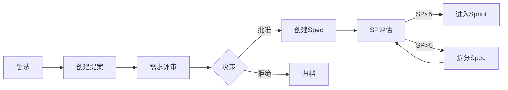

# 团队协作文档

> 团队沟通和项目管理相关文档

---

## 📂 目录结构

### [需求提案](./proposals/)

**用途：** 需求提案和评审记录  
**格式：** `{YYYY-MM-DD}-{feature-name}.md`

**提案流程：**

```
想法 → 提案 → 评审 → 决策
  ├─ 批准 → 创建 Spec → 进入开发
  └─ 拒绝 → 归档
```

**提案模板：**
参考 [提案模板](../agent/templates/proposal-template.md)

### [活动日志](./activities/)

**用途：** 团队活动记录  
**格式：** `{YYYY-MM}/{YYYY-MM-DD}.md`

**记录内容：**

- Cursor 指令调用（/propose, /create-spec 等）
- 工作流执行（功能开发、Bug 修复等）
- Graphiti 知识记录
- 重要决策和会议

**日志格式：**

```markdown
# {YYYY-MM-DD} 活动日志

| 时间  | 成员    | 活动     | 目标     | 状态 | 备注     |
| ----- | ------- | -------- | -------- | ---- | -------- |
| HH:mm | @用户名 | 活动类型 | 具体内容 | ✅   | 简短说明 |
```

### [评估报告](./reports/)

**用途：** 团队复盘、体系评估、流程改进记录  
**格式：** `{YYYY-MM-DD}-{topic}.md`

**示例：**
- [2025-11-17 文档体系评估](./reports/document-system-assessment-2025-11-17.md)

**建议流程：**
1. 在报告中总结背景、发现、建议与行动项
2. 如有复用价值，创建 Graphiti Episode 并在报告尾部互链
3. 在 `AGENT.md` / README / struct 文档中建立索引，避免孤岛

---

## 🚀 工作流程

### 需求管理流程



**关键步骤：**

1. 使用 `/propose {feature-name}` 创建提案
2. 填写提案内容（目标、价值、风险）
3. 组织需求评审会议
4. 记录评审决策
5. 批准后使用 `/create-spec story-{module}-{feature}` 创建 Spec
6. SP 评估（≤5 进入开发，>5 拆分）

### 功能开发流程

参考 [功能开发工作流](../agent/workflows/feature-development.md)

**关键节点：**

- Sprint 计划（Day 0）
- 中期检查（Day 7）
- Sprint 评审（Day 13）
- Sprint 回顾（Day 14）

---

## 📋 团队规范

### 提案规范

**提案命名：**

```yaml
格式: {YYYY-MM-DD}-{feature-name}.md
示例: 2025-11-16-quick-payment.md
存放: docs/team/proposals/
```

**提案内容：**

- 背景和动机
- 功能描述
- 用户价值
- 技术可行性
- 风险评估
- 时间预估

### Spec 规范

参考 [Spec 规范](../../.cursor/rules/specs.mdc)

**Spec 命名：**

```yaml
格式: {level}-{module}-{feature}
示例: story-order-quick-payment
存放: docs/shared/specs/
```

**Spec 内容：**

- requirements.md (需求定义)
- design.md (技术设计)
- tasks.md (任务分解)

### SP (Story Point) 规范

**评估标准：**

- **SP 1:** 简单任务，< 2 小时
- **SP 2:** 小任务，2-4 小时
- **SP 3:** 中等任务，4-8 小时（半天-1 天）
- **SP 5:** 大任务，1-2 天
- **SP > 5:** 必须拆分

**评估原则：**

- 只有 SP ≤ 5 的需求才能进 Sprint
- SP > 5 必须拆分（通常按模块拆分）
- 一个 Spec = 一个模块 + 一个功能

---

## 🔗 相关资源

### 工作流程

- [需求管理工作流](../agent/workflows/requirement-management.md)
- [功能开发工作流](../agent/workflows/feature-development.md)

### 文档模板

- [提案模板](../agent/templates/proposal-template.md)
- [需求模板](../agent/templates/requirements-template.md)
- [设计模板](../agent/templates/design-template.md)
- [任务模板](../agent/templates/tasks-template.md)

### 核心规范

- [Agent 速查表](../../AGENT.md)
- [Spec 规范](../../.cursor/rules/specs.mdc)
- [工作流导航](../../.cursor/rules/workflows.mdc)

---

## 🆘 常见问题

**Q: 如何创建需求提案？**  
A: 使用 `/propose {feature-name}` 命令，Agent 会自动创建并填充模板

**Q: 如何判断需求是否应该拆分？**  
A: SP 评估 > 5 必须拆分，通常按业务模块拆分

**Q: 如何记录活动日志？**  
A: Agent 会自动记录关键活动，开发者只需关注执行

**Q: 提案和 Spec 的区别？**  
A: 提案是初步想法，Spec 是批准后的详细设计文档

---

**最后更新:** 2025-11-16
