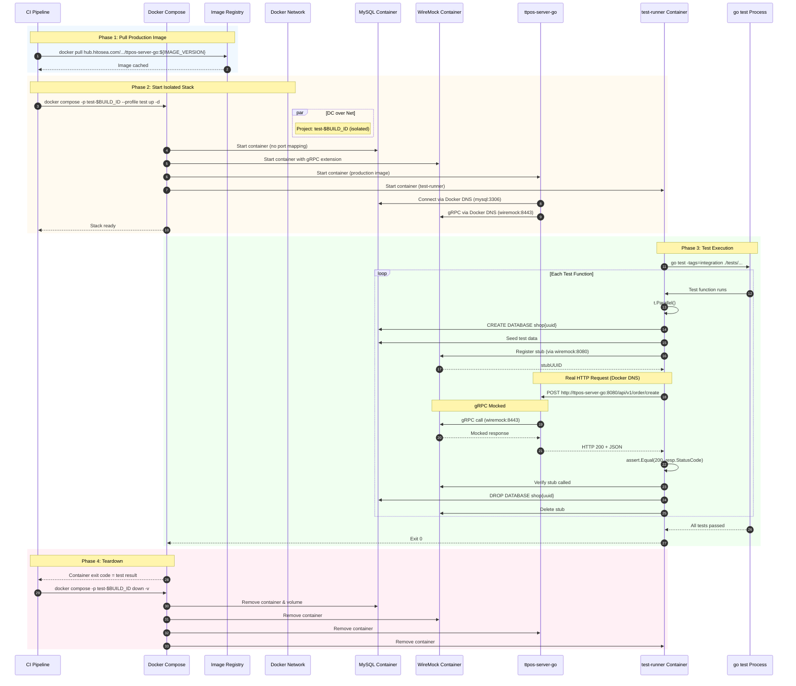
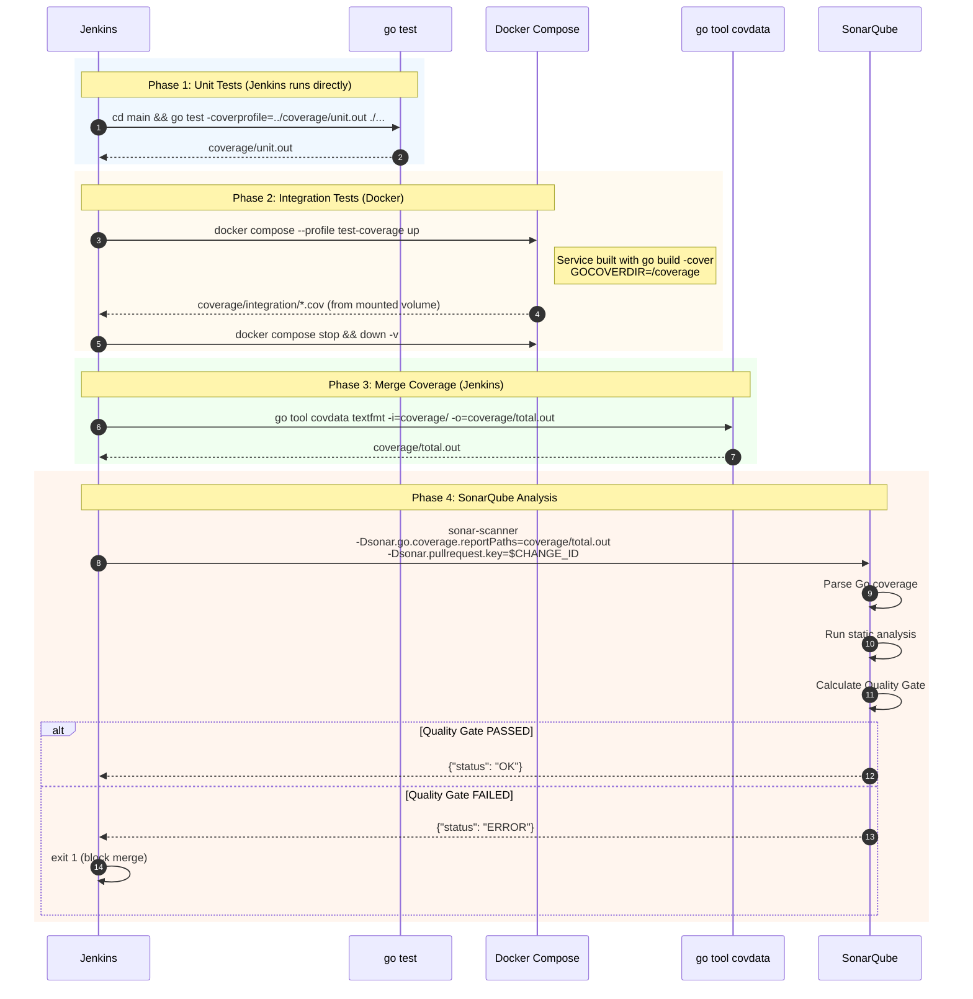

## Context

TTPOS is a multi-tenant restaurant POS backend built with Go (Gin + GORM). It communicates with BMP microservices (ERP, Takeout, Message, WebSocket) via gRPC through Nacos service discovery, and with external services (Payment, SMS, Google Cloud) via HTTP.

Current state:
- **Testing**: Only scattered unit tests using SQLite in-memory DBs via `DBManager.SetMockDB()`. No end-to-end API testing.
- **Infrastructure**: 7 docker-compose files across the repo (3 root-level for Main, 4 in ttpos-bmp/) with duplicated configs and drift risk.
- **Multi-tenancy**: Each company gets its own MySQL database (`shop{uuid}`). `DBManager` maps `companyUuid → *gorm.DB`.

The Main and BMP modules will eventually be split into separate repositories.

## Goals / Non-Goals

**Goals:**
- Validate service correctness through end-to-end HTTP API integration tests
- Enable performance bottleneck discovery via `go test -cpuprofile` and future benchmarks
- Consolidate 7 docker-compose files into 2 (one per service) with profile-based selection
- Support **parallel test runs** with complete isolation via Docker Compose project names
- Test **production images** from registry in CI (not local builds)
- Track **code coverage** across unit and integration tests with SonarQube Quality Gates

**Non-Goals:**
- Load testing or performance regression tracking (future — framework supports it via `testing.TB`)
- Testing BMP module (separate effort with own testenv/fixture layers)
- Replacing existing unit tests (integration tests complement, not replace)
- Full E2E with real BMP services (WireMock replaces all external dependencies)
- Database migration testing (tests use GORM AutoMigrate, not production migration scripts)
- Production code modifications for testability (service uses existing env var configuration)

## Integration Test Lifecycle



## Quality Gate Lifecycle



### Quality Gate Conditions

| Metric | Threshold | Description |
|--------|-----------|-------------|
| Coverage | ≥ 60% | Combined unit + integration coverage |
| New Code Coverage | ≥ 80% | Coverage on changed lines only |
| Blockers | = 0 | No new critical/blocker issues |
| Duplicated Lines | < 3% | Code duplication ratio |
| Cognitive Complexity | < 15 per function | Maintainability threshold |

### Coverage Report Flow

```
┌─────────────────────────────────────────────────────────────┐
│  Jenkins Pipeline                                            │
├─────────────────────────────────────────────────────────────┤
│                                                              │
│  ┌─────────────────┐     ┌─────────────────┐                │
│  │   Unit Tests    │     │ Integration Tests│                │
│  │  (go test)      │     │  (Docker)        │                │
│  │                 │     │                  │                │
│  │ coverage/       │     │ coverage/        │                │
│  │ unit.out        │     │ integration/     │                │
│  └────────┬────────┘     │ *.cov files      │                │
│           │              └────────┬─────────┘                │
│           │                       │                          │
│           └───────────┬───────────┘                          │
│                       ▼                                      │
│           ┌─────────────────────┐                            │
│           │  go tool covdata    │  ← Jenkins runs this       │
│           │  textfmt            │                            │
│           └──────────┬──────────┘                            │
│                      ▼                                       │
│           ┌─────────────────────┐                            │
│           │  coverage/total.out │                            │
│           └──────────┬──────────┘                            │
│                      ▼                                       │
│           ┌─────────────────────┐                            │
│           │   SonarQube Scanner │  ← Jenkins runs this       │
│           └─────────────────────┘                            │
│                                                              │
└─────────────────────────────────────────────────────────────┘
```

## Decisions

### 1. Docker Compose profiles over multiple files
**Decision**: Use Docker Compose v2 profiles (`dev`, `test`, `prod`) in a single file per service.
**Rationale**: Eliminates config drift between 7 files. Profiles are additive — `test` profile adds WireMock, `dev` adds Redis/PHP/Nginx. Each service owns its compose file, enabling clean repo split.
**Alternative rejected**: Single unified compose for everything — couples Main and BMP lifecycle.

### 2. WireMock for all external mocking (HTTP + gRPC)
**Decision**: Use WireMock 3.x with gRPC extension for both HTTP and gRPC external service mocking.
**Rationale**: Single mocking tool for all external dependencies. WireMock's Admin API enables dynamic stub registration/verification per test. gRPC extension reads proto descriptor sets.
**Alternative rejected**: Hybrid (WireMock for HTTP, bufconn for gRPC) — simpler Go code but two mocking systems to learn.
**Alternative rejected**: All Go-native (httptest + bufconn) — no WireMock features like request verification and scenario state.

### 3. Tests Run Inside Docker Container
**Decision**: Tests run inside a `test-runner` container on the same Docker network as the service. No port mapping to host.
**Rationale**: Enables true network isolation via Docker Compose project names (`-p test-$BUILD_ID`). Multiple parallel test runs with zero port conflicts. Tests hit service via Docker DNS (`http://ttpos-server-go:8080`), not localhost. Service uses production image from registry — CI tests the exact image deployed to production.
**Alternative rejected**: Tests on host with dynamic ports — complex port management, race conditions.
**Alternative rejected**: In-process Gin engine (engine.ServeHTTP) — doesn't test the real HTTP server, doesn't test production image.

### 4. Scenario-based test directory over co-located tests
**Decision**: Integration tests in `main/tests/<domain>/` organized by business domain. Tests run as HTTP clients inside a `test-runner` container.
**Rationale**: Integration tests exercise HTTP APIs across multiple service/repository layers — they don't belong to any single package. Scenario directories map naturally to business domains (order, desk, member). Tests make real HTTP requests to running service container.
**Alternative rejected**: Co-located `*_integration_test.go` — TestMain conflicts with existing unit test TestMain in same package, tests scattered across packages.

### 5. Service container configured via environment variables
**Decision**: Service container receives WireMock address via environment variables in docker-compose.yml test profile. No production code changes needed.
**Rationale**: The service already reads gRPC addresses from config/env vars. Test profile sets `GRPC_ERP_ADDR=wiremock:8443`, etc. No code changes to `cloud/nacos.go` required.
**Alternative rejected**: ServiceAddrResolver hook in Go code — unnecessary complexity when env vars suffice.

### 6. `testing.TB` interface in all fixtures
**Decision**: All fixture functions accept `testing.TB` (not `*testing.T`).
**Rationale**: `testing.TB` is the common interface for `*testing.T` and `*testing.B`. This enables future benchmark reuse of the same test setup logic without code duplication.

### 7. HTTP client tests instead of in-process Gin engine
**Decision**: Tests make real HTTP requests to running service container. No `engine.ServeHTTP()` in-process calls.
**Rationale**: Tests the real HTTP server with real network stack. Catches HTTP-level issues (headers, middleware, timeouts) that in-process calls miss. Enables testing production image from registry.
**Alternative rejected**: In-process Gin engine — faster but doesn't test real server, doesn't work with containerized service.

### 8. Coverage-enabled Docker image for integration tests
**Decision**: Build a separate Docker image with `go build -cover` for integration test coverage collection. Service writes coverage data to mounted volume via `GOCOVERDIR=/coverage`.
**Rationale**: Integration tests run against a separate service container. Standard `go test -coverprofile` only captures test code coverage, not service code coverage. Building the service with `-cover` flag and collecting data via `GOCOVERDIR` enables accurate service coverage measurement.
**Alternative rejected**: No integration test coverage — would miss significant coverage gaps in service layer code.

### 9. SonarQube for quality gates and PR decoration
**Decision**: Integrate with SonarQube Community Edition + Branch Plugin for code quality analysis and coverage tracking. CI runs on self-hosted Jenkins.
**Rationale**: SonarQube provides unified view of code quality, coverage trends, and PR decoration. Branch Plugin enables differential analysis on pull requests with GitHub status checks. Quality Gates prevent merging code that doesn't meet coverage thresholds (60%) or introduces new blockers. Jenkins SonarQube plugin provides `waitForQualityGate` for pipeline blocking.
**Alternative rejected**: GitHub Actions coverage summary only — lacks historical trends, PR decoration, and quality gate enforcement.

## Risks / Trade-offs

- **[Test-runner container image]** → Need to build and maintain a small Go image for running tests. Mitigated by using `golang:1.24-alpine` base image with test source mounted.
- **[WireMock gRPC complexity]** → Requires pre-compiled proto descriptor sets. Mitigated by Makefile target `make proto-desc` and option to git-track the `.desc` file.
- **[Service must connect to test infrastructure]** → Service container needs env vars pointing to WireMock instead of real Nacos. Mitigated by compose file environment variables in test profile.
- **[GORM model hooks]** → Some models (e.g., SaleBill) have AfterUpdate hooks that call WebSocket gRPC. Mitigated by WireMock catching all gRPC calls with a default no-op stub.
- **[Compose migration]** → Existing developers use old compose file names. Mitigated by deprecation period: keep old files with comments redirecting to new compose.
- **[One testmain per package]** → Each scenario directory needs a boilerplate `testmain_test.go`. Unavoidable Go constraint — kept to a one-liner.
- **[Coverage data from container]** → Integration test coverage requires service container to write to mounted volume. Mitigated by coverage profile in docker-compose and proper volume mounts.
- **[SonarQube Branch Plugin]** → Community Branch Plugin is third-party, not officially supported by SonarSource. Mitigated by plugin's stable release history and active maintenance.

## Migration Plan

1. Create new `docker-compose.yml` and `ttpos-bmp/docker-compose.yml` with all services ported
2. Verify all profiles work: `--profile dev`, `--profile test`, `--profile prod`, `--profile mid`
3. Add deprecation comments to old compose files pointing to new ones
4. Team adopts new commands; delete old files after 1-2 sprint cycles
5. Rollback: old compose files still exist during deprecation period

## Open Questions

- Proto descriptor compilation: should `all_services.desc` be git-tracked or built in CI?
- Which business domains to implement as first test scenarios? (Suggest: `order` and `auth` as highest value)
- Coverage threshold: what is the minimum coverage percentage for Quality Gate? (Suggest: 60% initial, increase to 80% over time)
